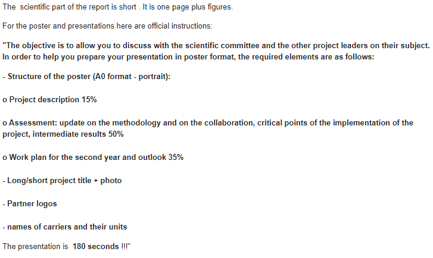

# Jan 25 Research Log

Meeting with advisors: some notes taken during the meeting:

## Experiment

Some interesting ideas to test:
1. Bright field lifetime plot -- I'm on this right now. Knowing the characteristics of velocity evolution in white light is useful when determining the effect of blue laser.
2. Is the damage from laser reversible? Laser only on for a few second every min, see the velocity evolution is close to which.
3. Large droplet has shading effect? No, cluster forms from the center of droplet and gradually expand to the edge.

## MITI report

Instructions from Eric's email:

