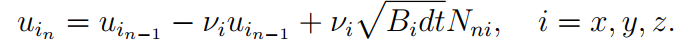
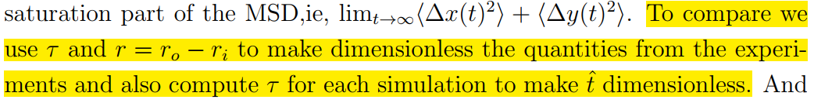
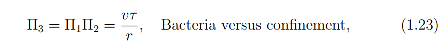
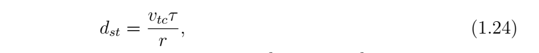

### Questions about theory and simulation

##### 1. Why do you set a correlation time $\tau$ before simulation, then use the simulation results to calculate $\tau$ again? Do you expect them to be different?

$\tau$, the time scale of active noise, lies in the heart of the theory and simulation. The following velocity updating rule in your simulation,
>

has to be designed in such a way, that velocity $u$ is exponentially correlated, $\left< u(t)u(t') \right>\propto e^{-|t-t'|/\tau}$ (although I don't know how this updating rule enforces this correlation).

Simulation returns $xyzt$ data, you use them to calculate the correlation time again:
>

Would you expect them to be different? (The only thing that can make $\tau$ different is the reflection boundary condition, and only very frequent occurance can make the difference significant enough to be noticed, IMO)

##### 2. Theoretically, would you expect $\tau$ to be a property of a bacterial suspension and independent of how you measure it?

We've been trying to measure $\tau$ in different ways, e.g. with 2-$\mu$m particles and with oil droplets as tracers. At higher concentration, we can also measure the flow persistence by PIV to get a $\tau$. Are these $\tau$'s expected to be the same (theoretically)?

Looking at the assumptions made in the simulation, any object immersed in an active bath exhibits a noisy motion with exponentially correlated velocity. Hence, I would infer that at least the tau measured from 2-$\mu$m particles should apply to oil droplets. Do you think this is a way to test the assumption?

##### 3. A similar question as Q#1, there are two quantities very similar to each other, $\Pi_3$ and $d_{st}$. The former is an input to the simulation and the latter is the result. How are they different?

>
>

Again the only thing that can distinct the two is the boundary condition.
