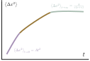
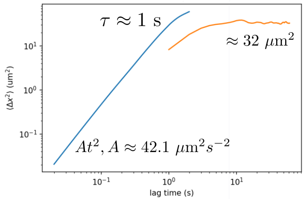

### More questions

##### 1. MSD saturation value analysis

Following the solution of the Langevin equation, which gives the saturation value of MSD as
$$
\left<\Delta x^2\right>_{t\to\infin} = \frac{A}{\gamma(\nu+\gamma)},
$$
where $A$ is the activity of the active bath, essentially $v^2$ where $v$ is the bacterial velocity. $\gamma$ is the ratio between the effective spring constant imposed by the curved surface $k$ and the drag coefficient $\Gamma$. $\nu$ is the inverse of the persistence time $\tau$.

We want to analyze the experimental data using this formula. First, we notice that this can only be valid for the scenarios where the displacements of inner droplets are tiny, i.e. $\Delta x \ll R$, where $R$ is the outer droplet radius. Because the spring force approximation is only valid in this limit. Then, according to the short time limit solution
$$
\left<\Delta x^2\right>_{t\to0} = At^2,
$$
we can calculate $A$ and $\nu$. In principle, for each experiment, we are able to fit for a $\gamma$.

The spring constant $k$ depends on the outer droplet radius. In the low bacterial concentration limit, the drag coefficient $\Gamma$ is approximately a constant. Therefore, we can calculate $\gamma=k/\Gamma$ based on these approximations.

Moreover, since $\gamma$ is not a function of bacterial concentration, the $\gamma$ fitted from same droplet size and different bacterial concentration can be used to test the hypothesis. It can also be an indicator of when the model fails.

The question is, do we have any experimental data to fit this model?

##### Test 11022021-05 data | 140/20[51]

$$
32 = \frac{42.1}{\gamma(1+\gamma)}
$$
Solve the above equation to obtain the first $\gamma$,
$$
\gamma_1 = 0.75, \gamma_2 = -1.75.
$$
I'm not sure if $\gamma$ should take positive or negative value, since the original Langevin equation in the March report has two inconsistent equations. This will be determined later.

##### Assume $\gamma(\nu+\gamma)$ a constant independent of geometry and bacterial concentration, use $A$ to rescale MSD saturation value in an attempt to collapse MSD data.

Although this assumption is apparently not true, because $\gamma$ contains the spring constant which is a function of outer radius, I still want to see if this assumption can bring MSD's from different experiments closer. This requires to measure short time MSD for all experiments. A few manual measurements are summarized below:

| Data     | Exp params     | A | MSD sat | ratio |
| :------------- | :------------- | :---- | :---- | :---- |
| 11022021-05       | 140/20[51]      | 42 | 33 | 0.78 |
| 11022021-08       | 110/20[41]      | 5.1 | X | X |  
| 11032021-01       | 129/19.2[111]      | 521.1 | 1265 | 2.43 |   
| 11032021-04       | 132.6/15.6[66]      | 90.8 | 865 | 9.53 |
| 11032021-06       | 195.1/19.2[66]      | 84.8 | 770 | 9.08 |
| 11032021-09       | 159.1/20.2[57]      | 39.8 | X | X |
| 11032021-14       | 198/16.6[89]      | 197.1 | 2140 | 10.8 |
| 11102021-09       | 89.1/20.5[15]      | 41.6 | X | X |
| 11102021-11       | 181.2/22.8[15]      | 32.3 | X | X |
| 11112021-06       | 147.1/21.1[50]      | 32.3 | X | X |
<!--  -->
