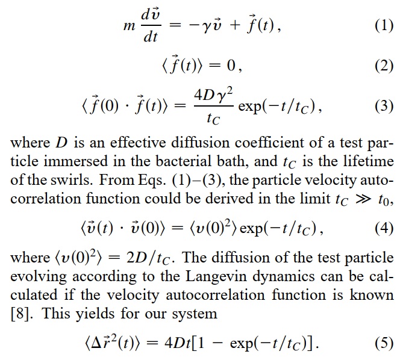
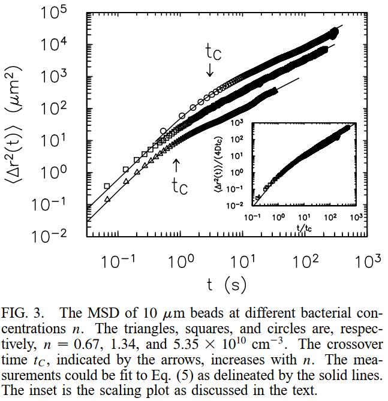
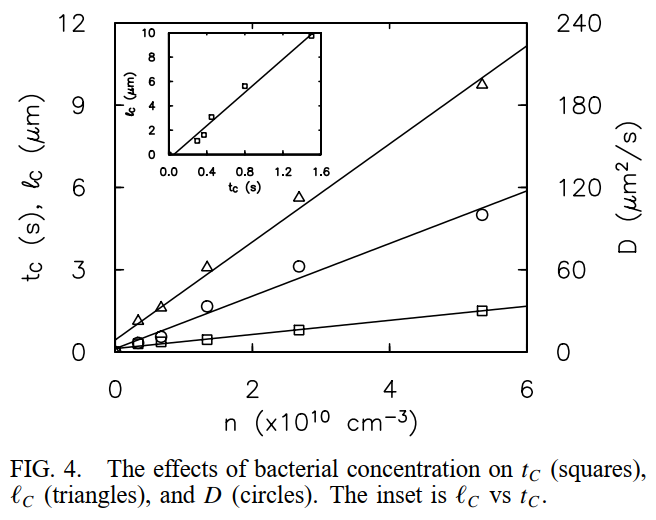

### Feb 1, 2022: understanding the theory

##### Wu and Libchaber has already used the exponentially correlated noise to model the motions of passive particles in an active bath (they coined the noise as "collisional force").

This model fits nicely to the MSD of tracer particles in bacterial bath, and gives a $t_C$ (which corresponds to the $\tau$, the correlation time or ballistic time in our notation). According to there data, $t_C$ increases with bacterial concentration.

The concentration dependence is also plotted

A linear relation is observed in for $t_C$ vs. $n$.

##### In our experiment, the system is complicated by the confinement.

Think about the simplest scenario, where a single bacterium swims in a droplet that is not much larger than the bacterium. The original run-and-tumble motion must be modified by the confinement because a single "run" is prevented by the confinement. Therefore, a new time scale of swimming should arise due to the confinement.

illustration needed, model considers confinement

##### We can probe the confinement effect by measuring $\tau$
