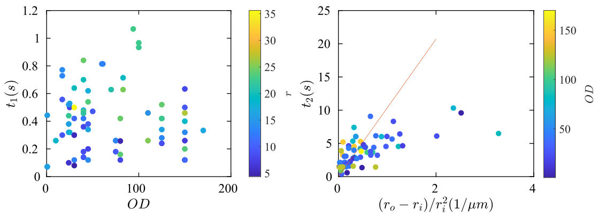

### Feb 1, 2022: understanding the theory

##### Wu and Libchaber has already used the exponentially correlated noise to model the motions of passive particles in an active bath (they coined the noise as "collisional force").

This model fits nicely to the MSD of tracer particles in bacterial bath, and gives a $t_C$ (which corresponds to the $\tau$, the correlation time or ballistic time in our notation). According to there data, $t_C$ increases with bacterial concentration.

The concentration dependence is also plotted

A linear relation is observed in for $t_C$ vs. $n$.

##### In our experiment, the system is complicated by the confinement.

Think about the simplest scenario, where a single bacterium swims in a droplet that is not much larger than the bacterium. The original run-and-tumble motion must be modified by the confinement because a single "run" is prevented by the confinement. Therefore, a new time scale of swimming should arise due to the confinement.

illustration needed, model considers confinement

##### We can probe the confinement effect by measuring $\tau$.

Below are the time scales measured from double emulsion experiments, by fitting the inner droplet trajectories to the model described [else where](..\Notes\Data-Analysis-feb2-cristian.pdf) (I put a snapshot below).

Simply speaking, $t_1$ is the persistence time and $t_2$ is the "saturation" time due to confinement.

$t_1$, which was shown by Wu and Libchaber to be nearly a linear function of bacterial concentration (OD) in bulk, does not show any outstanding trend in our data, suggesting a strong and complicated confinement effect. $t_2$, which can be predicted based on a simple "spring force" argument (first developed by Maggi et al. 2014), does not fit our data well either, although a weak tendency can be observed.

##### Current data suggest intertwined factors leading to the failure to observe the $t_C$-$n$ scaling reported by Wu and Libchaber.

1. Confinement effect on a single bacterium.

2. Buoyant force on the inner droplet dominates over the active noise.

3. Shell confinement: an extreme case where the "tracer particle" turns into an additional geometrical confinement and further compresses the living space of bacteria.

##### Noticing that large inner droplets can be a problem when using existing models, we plot $r_o/r_i(r_o-r_i)$ as the code in order to make the "big outer small inner" cases stand out.

Still no clear trend to be claimed. From these data, I also notice that we don't have many data points in the "big outer small inner" limit. This is partially due to the difficulty of tracking a tiny droplet in large space, which involves strong 3D motions.

##### Realizing that double emulsions significantly complicate the understanding of MSD, we may take a step back, using smaller and neutrally buoyant tracers to probe the confinement effect from the outer droplet first.

Preliminary data with 1-$\mu$m PS particles are shown below. The $t_1$ all fall in the range of 0.21-0.25 s, for OD up to 60 and $r_o$ up to 25 $\mu$m. This tiny difference in $t_1$ from the current experimental parameter space may raise concerns about the experimental techniques. Pushing the parameter to higher limit may reveal more interesting physics.

##### We should also carefully think what is the criteria for choosing the size of tracers.

On the one hand, we don't want to complicate the system by a very large tracer particle, as in the double emulsion experiment. On the other hand, we want the tracer particle to be large enough to "collide" with bacteria. 
