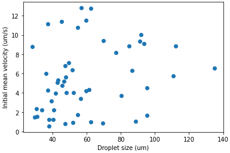
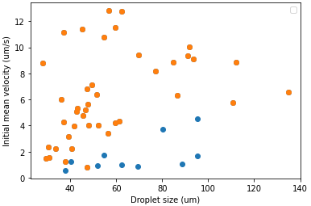
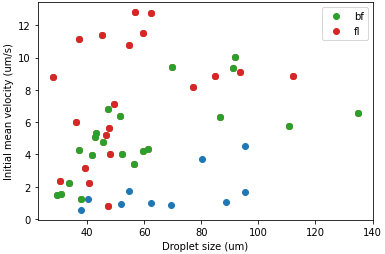
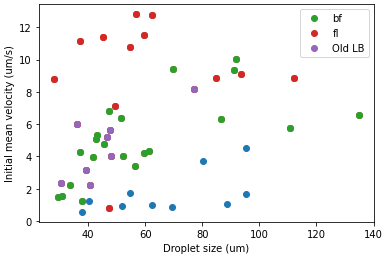
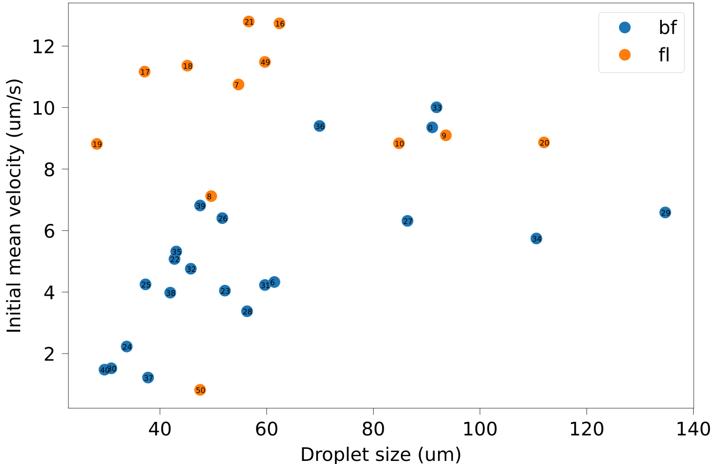
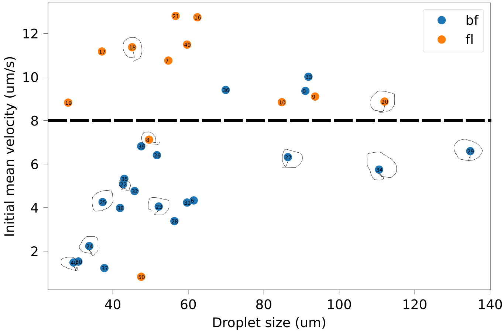
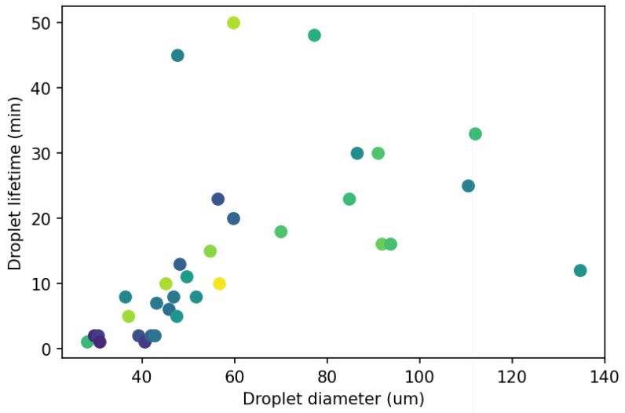
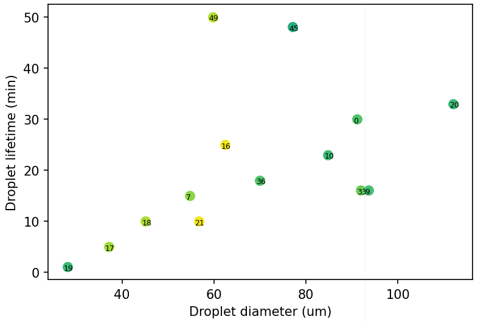
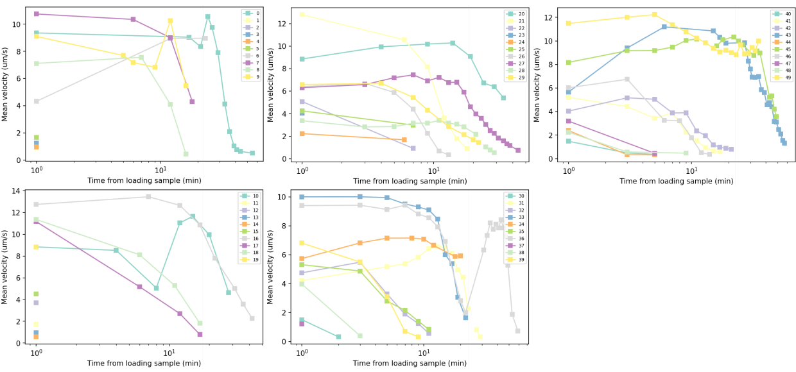

### Initial velocity analysis

##### Are the initial velocities correlated with droplet size?

We start by plotting all the data together, although we know that there are data for other tests (percoll, serine and different light exposure etc.).

##### Then let's separate the various tests

1. First, we recognize the serine and percoll tests, which typically give low motility, as denoted in orange.

2. There are images taken using both bright field and confocal, distinct them too.

3. There are also a few tests where I don't have enough LB from PMMH, so I prepared some using the very old LB powder at Gulliver, let's also separate them

4. Finally, let's make this plot higher resolution, with only interesting data with their corresponding Droplet# annotated for further analysis.

5. Due to the typical time scale of droplets (0.5 h) and the time scale of my experiment (1.5 h), I sometimes have to make more than one slides out of the same bacterial sample. Let's call them the "secondary slides". I circle out the "secondary slides" as the following.

We notice that secondary slides tend to give low initial velocities (though not all of them). Therefore, I would prefer not to use them in the final data analysis. Moreover, we notice some droplets show low velocity at the beginning of the experiment. For the final analysis, I may only include those with high enough initial velocity, say 8 $\mu$m/s, as indicated by the black dashed line in the plot above.

##### Let's look at the droplet lifetime, taking the insight of initial velocity into consideration.

But first, let's look at all available lifetime data.

_Color indicates initial velocity, more yellow means higher._

The select to plot points that has higher initial velocities.

_Lifetime of droplets for those with initial velocity higher than 8 um/s. Only 4 points are added to the data last time: 33, 36, 45, 49, among which 33 and 36 are exposed to continuous white light, while 45 and 49 are exposed to 10/120 intermittent blue laser._

New data with continuous white light exposure still fall on the same linear relation obtained previously from continuous blue laser exposure measurements. However, the two points from intermittent laser exposure measuremnts deviates significantly from the linear relation, suggesting the leading role of **LIGHT** in this aging process. The longer exposure to any light, the faster the aging process.

##### Therefore, we need to adapt our experimental protocol to this knowledge

1. Use the weakest possible light for initial observation (look for droplets)
2. Take short videos
3. Use initial mean velocity to filter out samples with low motility
4. Don't do secondary samples, since they almost always show lower motility

##### I attach some mean velocity evolution data here, because there are potentially more interesting stuff to look at.

For example, the droplet#43 shows a dramatic velocity increase over the initial 4 minutes of sample loading. In our 8 um/s filter criterion, this sample will be filtered out. However, if we wait several minutes, this sample will meet our criterion. This nonmonotonic mean velocity evolution is not yet understood.

From the data, we can pick out the most obvious nonmonotonic ones: 20, 27, 31, 34, 43, 45, 49.

| Droplet#     | Initial velocity     | Secondary? |
| :------------- | :------------- | :------------- |
| 20       | 8.86      | Yes |
| 27  |  6.31 | Yes  |
| 31  | 4.23 |  No |
| 34  | 5.74  |  Yes |
| 43  | 5.66  |  Yes |
| 45  | 8.18  |  No |
| 49  | 11.48  | No  |

The table above does not reveal the commons shared by these nonmonotonic data, unfortunately... What else might be the reason?
