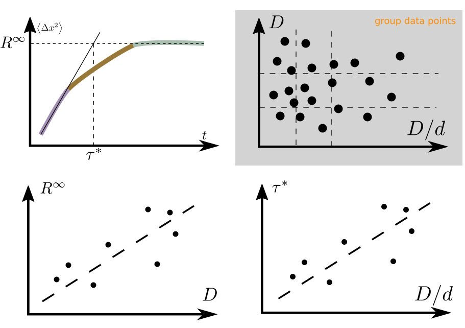
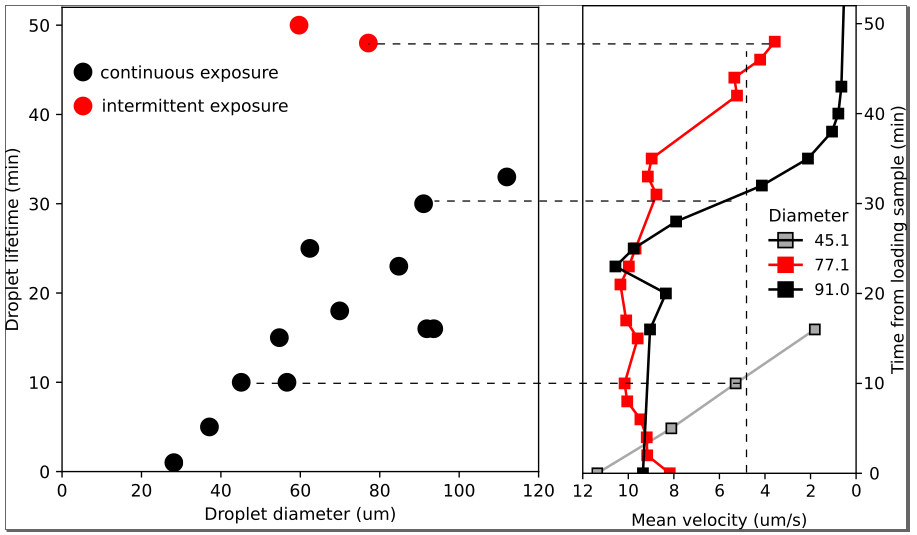

### Meeting with Eric about MITI poster

We talked about two quantitative message to deliver:

- MSD of inner droplets
- Jamming time of different light condition

##### Two draft figures are set up:





##### In addition, we discussed format things and below is the information
```nothing
Short: BACURV
Title: Collective bacterial dynamics in curved spaces
Partner logo: ESPCI,Gulliver,PMMH,ChileU(external)
carrier: me anke teresa eric
```
##### We also want to think more about the ballistic regime, since Eric is not so convinced, especially in the low concentration limit.
