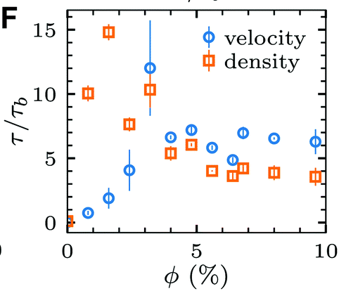

### Velocity autocorrelation

I've done this analysis in bulk ([see my 2021 paper](https://pubs.rsc.org/en/content/articlelanding/2021/SM/d1sm01183a)). The data suggest that the correlation time increases with bacterial concentration before the transition to collective motion, then show a peak near the transition concentration, and finally decays to a constant value deep inside the collective motion regime. See the plot below.

However, I notice that in a droplet this might be tricky because near the edge of a droplet, depending on the mask choice, there may be a ring of very low velocity. Such ring may affect the autocorrelation function. In this note, I use several real data to investigate how significant this effect is.

My hypothesis is that, anything measured in the outmost ring is not accurate and is subject to the influence from the image outside the droplet, which has been filtered to be black (or 0 in terms of pixel intensity). These velocity therefore contains artifact. In this note, I'm going to measure how significant this artifact is in the VACF calculation using 3 examples of very different sizes, but similar bacterial concentrations.

I hope to determine a VACF analysis protocol that takes care of the artifact by doing this test.

##### Samples: droplet#19, droplet#10, droplet#20

| Droplet# | Droplet size     | Bacterial concentration |
| :------------- | :------------- | :------------- |
| 19       | 28       |  185 |
| 10   | 85  | 197 |
| 20   |  112 | 185 |

##### Snapshots of samples

Note that we only take the first 10 s from each video, since later on the displacement of droplets may be significant.
