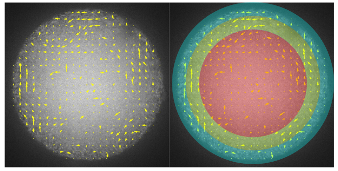

### Velocity autocorrelation

I've done this analysis in bulk ([see my 2021 paper](https://pubs.rsc.org/en/content/articlelanding/2021/SM/d1sm01183a)). The data suggest that the correlation time increases with bacterial concentration before the transition to collective motion, then show a peak near the transition concentration, and finally decays to a constant value deep inside the collective motion regime. See the plot below.


However, I notice that in a droplet this might be tricky because near the edge of a droplet, depending on the mask choice, there may be a ring of very low velocity. Such ring may affect the autocorrelation function. In this note, I use several real data to investigate how significant this effect is.

My hypothesis is that, anything measured in the outmost ring is not accurate and is subject to the influence from the image outside the droplet, which has been filtered to be black (or 0 in terms of pixel intensity). These velocity therefore contains artifact. In this note, I'm going to measure how significant this artifact is in the VACF calculation using 3 examples of very different sizes, but similar bacterial concentrations.

I hope to determine a VACF analysis protocol that takes care of the artifact by doing this test.

##### Samples: droplet#19, droplet#10, droplet#20

| Droplet# | Droplet size     | Bacterial concentration |
| :------------- | :------------- | :------------- |
| 19       | 28       |  185 |
| 10   | 85  | 197 |
| 20   |  112 | 185 |

##### Snapshots of samples

Note that we only take the first 10 s from each video, since later on the displacement of droplets may be significant.


##### Velocity autocorrelation (original mask)


We notice that the second point of the orange and green curves drops very fast and the initial curves are not smooth. This indicates that the very short time decorrelation might be due to detection error. Such error can be fixed by smoothing the velocity data with a small moving window of the same size as the abnormal fast decrease time scale (0.04 s or 3 data points in this example). Below is a zoom in of the initial decreasing part:


We use the function `scipy.ndimage.gaussian_filter` to smooth the velocity field, as illustrated below:


The key parameter is $\sigma$, which can be set seperately for each axis. In our velocity data, there are three axis corresponding to $(x, y, t)$. In order to smooth velocity data only in $t$, we set `sigma=(0,0,sigma)`, where `sigma` is the smoothing window size divided by the truncate value (3/4 in our case).

The gaussian filter is called in the code as the following:

```python
ustack = scipy.ndimage.gaussian_filter(ustack, (3/4,0,0))
```

Resulting in the VACF shown below in the left panel. To show that 3/4 is the smallest sigma that makes VACF smooth, we tested also 1/4 as the `sigma` in $t$-axis, the resulting VACF is show in the right panel below.


##### Velocity autocorrelation with different masks

If we measure the VACF in different radial positions, would we obtain different results? One the one hand, the PIV measurement near the edge may subject to large error. One the other hand, there might be intrinsic inhomogeneity in the velocity fields of bacterial droplets. The figure below illustrate how I'm going to test these hypotheses: first, I will compare the VACF measured including and excluding edge data. Then, I will systematically vary the mask size and compare VACF.



**1. Edge data**


The comparison of droplet#19 is shown below. The edge data do not seem to affect the VACF significantly. This makes sense because edge velocity is usually small in magnitude and VACF averaging is weighted by the velocity magnitude.


It can be shown that in other droplets, this is still the case.

**2. Systematically vary radial position**

Let's choose $\Delta r = 4$ $\mu$m to be the step.


As can be seen, the radial positions have very little influence on the VACF calculation. Therefore, in the future analysis of VACF, I will simply average over all the velocities inside the droplets, regardless of where the velocity is.

##### Other considerations

I demonstrated above that VACF is spatially homogeneous inside a droplet. However, we should notice that over a longer time period, **temporal inhomogeneity** may show up, since bacteria swimming speed decreases over time. For example, under proper conditions, the chaotic and rapidly changing flow we observed here, with $\tau\approx0.2$ s, may tranform into a stable vortex, whose correlation time can be significantly longer. _In my experiment, I observe stable vortices in very tiny droplets, see [video: stable vortices in tiny droplets](https://drive.google.com/file/d/1ccspRqJuq7f493OG-E2lcdN9tdmdJHC2/view?usp=sharing)._ This phenomenon has also been reported earlier by Goldstein group (Wioland et al. 2013, Lushi et al. 2014).

The temporal inhomogeneity suggests that for a long video (5 min or more), we should take small segments and measure the VACF. Time dependent correlation time $\tau$ might be observed. Moreover, it is interesting to look at the correlation between mean velocity and temporal velocity correlation.

#####


### References
Wioland, Hugo, Francis G. Woodhouse, Jörn Dunkel, John O. Kessler, and Raymond E. Goldstein. “Confinement Stabilizes a Bacterial Suspension into a Spiral Vortex.” Physical Review Letters 110, no. 26 (June 24, 2013): 268102. https://doi.org/10.1103/PhysRevLett.110.268102.

Lushi, Enkeleida, Hugo Wioland, and Raymond E. Goldstein. “Fluid Flows Created by Swimming Bacteria Drive Self-Organization in Confined Suspensions.” Proceedings of the National Academy of Sciences 111, no. 27 (July 8, 2014): 9733–38. https://doi.org/10.1073/pnas.1405698111.
