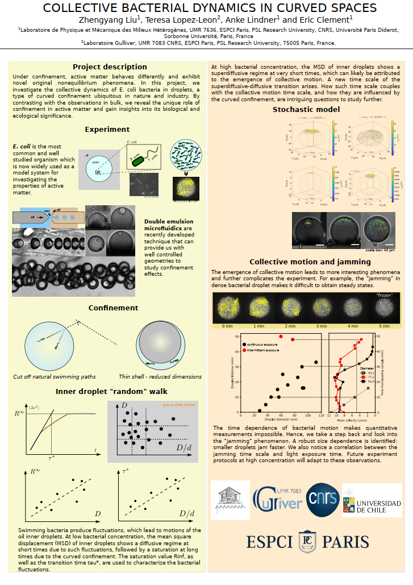

### MITI poster, next step

##### Today I made my first poster in France, to present in the MITI report. I'm happy with it, at least, it looks like a poster.

It summarizes the double emulsion experiments and hints the collective motion study. The parameter space representation Eric used yesterday was inspiring. Use it to provide better overview of the data.

In addtion, the hand data analysis is actually a very good tool. I used to avoid doing it, because of the passion to automate everything. But it turns out that not everything is worth an automation.

Third thing is the notion of "message" and "quantitative message". Although a poster contains a lot of information, there are key messages that are very short and have to be delivered. When writing papers this is the same case. Key messages should be written in the abstract.
