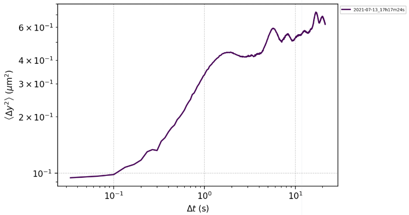
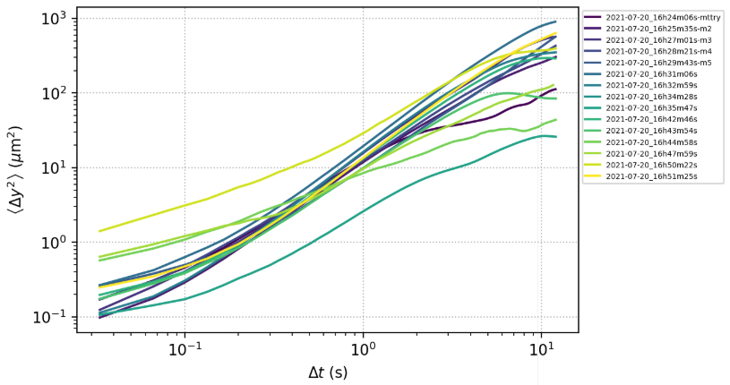
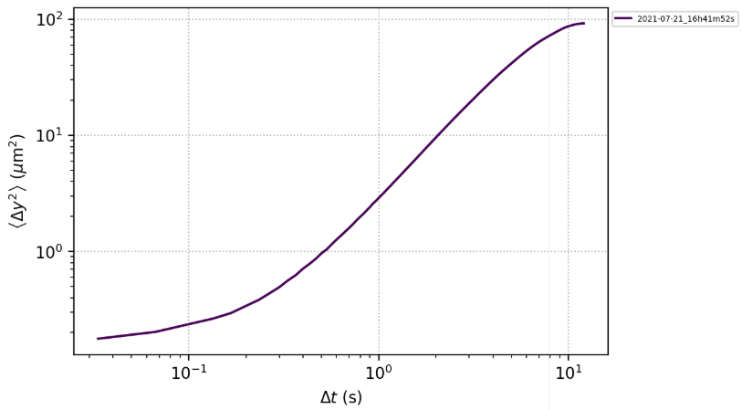
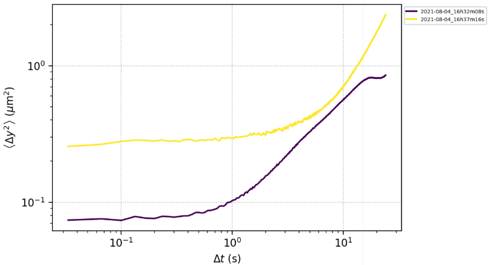
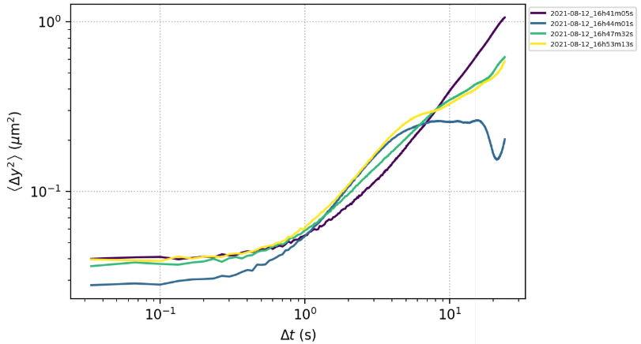
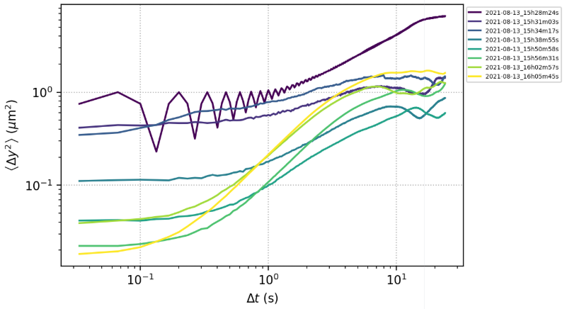
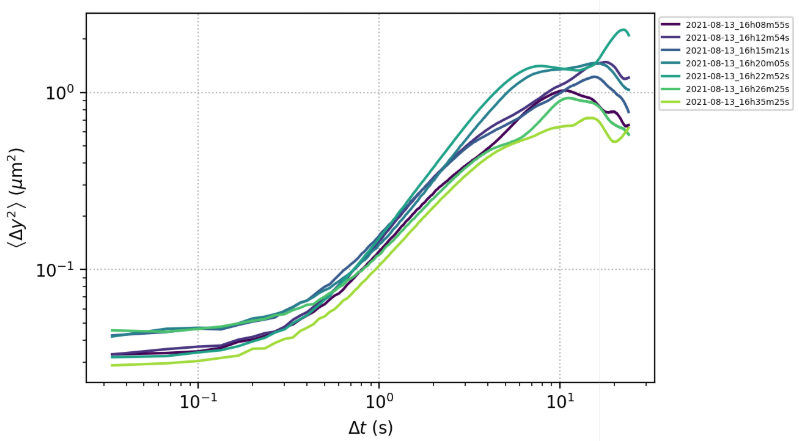

### Review old MSD data

Before working with Cristian (officially starting from Sept 6, 2021 but we only start to obtain meaningful data after Oct 26, 2021), I have made some double emulsions with the microfluidic device and managed to measure the trajectories and MSD. Those data are not ideal, because I did not realize at that time I need 10 minutes of video in order to get the saturation confidently. However, the data were still carefully obtained and analyzed so they should still be useful as a reference to compare with other data. In this note, I replot the MSD's of those old data and try to see to what extent we can reutilize those data.

##### DE#0

##### DE#1

##### DE#2

##### DE#3

##### DE#4-7

##### DE#8-15

##### DE#16-22

##### There are a few samples that show clear diffusive-saturation transition

| Date | Time     |
| :------------- | :------------- |
| 08-12     | 16:44       |
| 08-13   | 15:56  |
| 08-13   |  16:02 |
| 08-13   |  16:05 |
| 08-13   |  16:20 |
| 08-13   |  16:22 |

Others do not show clear plateau and will thus not be included in this analysis. The original log is kept in the `before10262021` sheet in `structured_log_DE.ods`.

##### NothingToSay is extremely slow... Need to archive the data on it and move on to another drive. Buy a 18 TB drive might be very necessary.
