### Review recent msd data

Cristian and I obtained more inner droplet motion data during his intern in Paris. In this note, I review these data and pick out the useful ones.

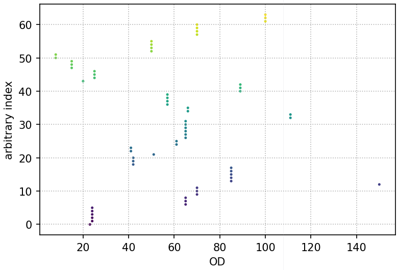

##### 50-70 contains 29 experiments, and is the densest bin with size 20

With in this OD bracket, the outer and inner droplet diameters has the following distribution:

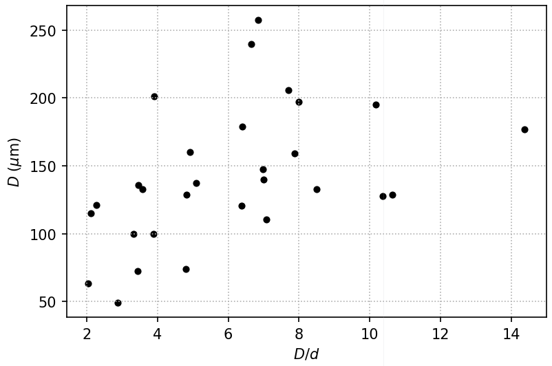

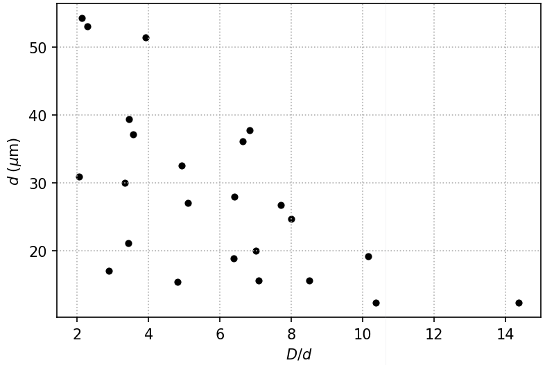

##### First, plot 5 MSD on one plot and manually measure $R^\infty$ and $\tau^*$, meantime filter out too short or too jumpy trajectories.

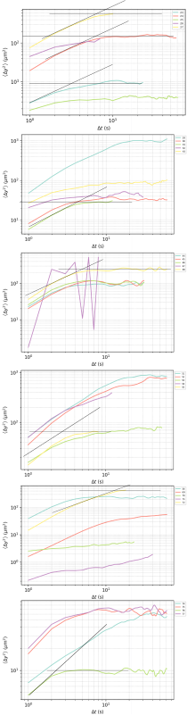

##### Plot all the MSD's in the same plot, try to rescale $\left< \Delta y^2 \right>$ with $(D-d)^2$. (unsuccessful attempt)

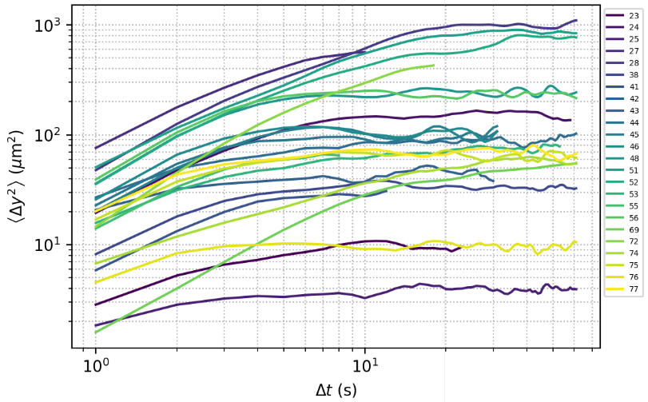

rescale y-axis

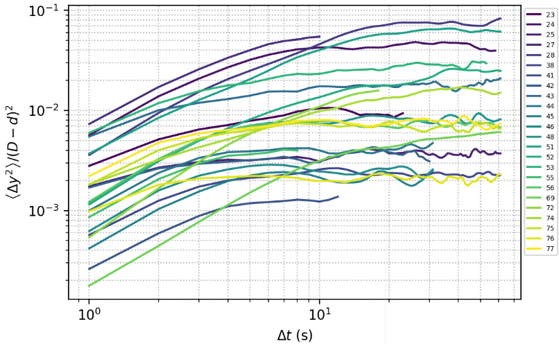

##### It's also interesting to rescale  $\left< \Delta y^2 \right>$ in such a way that all the plateau values collapse, to inspect the time scale difference.

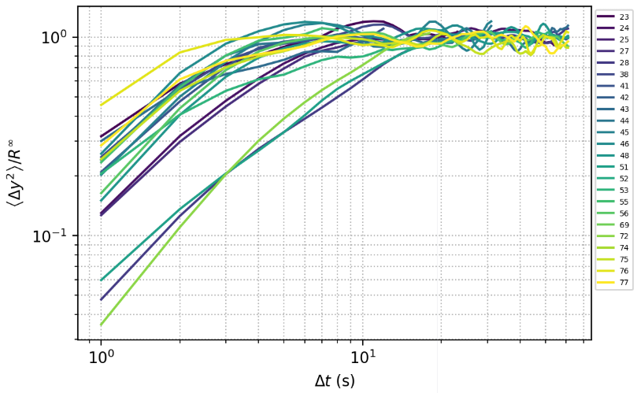

##### If we rescale $\Delta t$ with $\tau^*$ as well, all the curves can be collapsed.

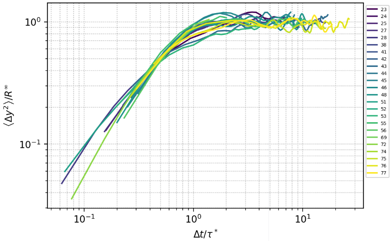

Such collapse demonstrates that the motions of inner droplets share a similar pattern, which can be described by two parameters $R^\infty$ and $\tau^*$. However, theoretical understanding of these two parameters, in particular how confinement influences them, is still lacking.

##### Next, we try to reveal the confinement effect by plotting $R^\infty$ and $\tau^*$ as functions of $D$ and $d$.

vs. D

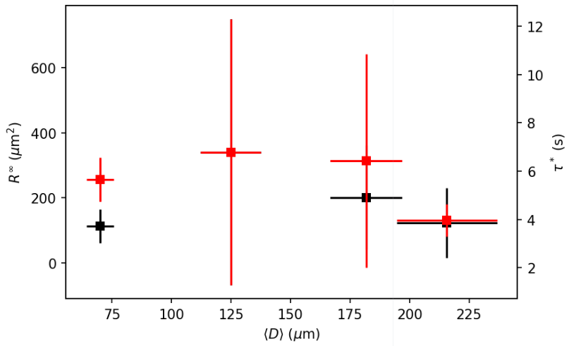

vs. d

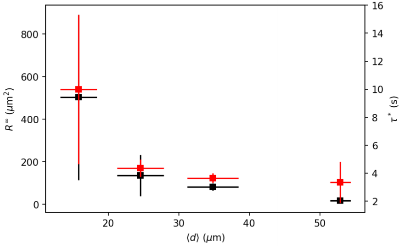

vs. D/d

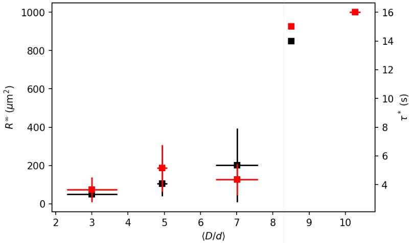
