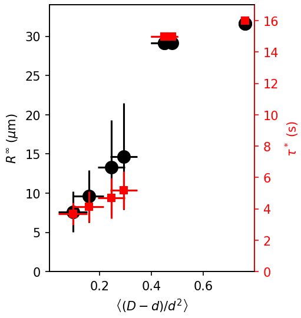

### Model the confinement effect

After talking with Cristian, we realized a better way to show the confinement effect, which can be rationalize by the "spring" model.

##### Intertwined bins for $(D-d)/d^2$ (OD=50~70)

##### Saturation length $R_\infty$ vs. $(D-d)/d^2$

##### How to understand the limit where the spring assumption breaks down?

##### We can also look at data from other concentrations.

As expected, at low concentrations, the displacements of inner droplets are so small, so that the Langevin equation of form

$$
\dot x = \eta (t) + \gamma x
$$
