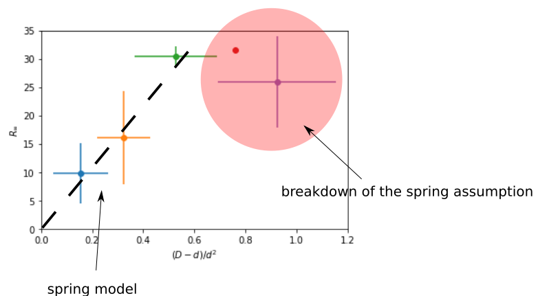

### Model the confinement effect

##### Intertwined bins for $(D-d)/d^2$ (OD=50~70)

##### Saturation length $R_\infty$ vs. $(D-d)/d^2$

##### We can also look at data from other concentrations.

As expected, at low concentrations, the displacements of inner droplets are so small, so that the Langevin equation takes the following form

$$
\dot x = \eta (t) + \gamma x,
$$

where $\eta(t)$ is assumed to be an exponentially correlated noise, satisfying $\left< \eta(t)\eta(t') \right>=Ae^{-\nu|t-t'|}$. It can be shown that this equation predicts the following MSD saturation value $R_\infty$ and transition time $\tau^*$:

$$
R_\infty = \frac{A}{\gamma(\nu+\gamma)},
$$
$$
\tau^* = \frac{1}{\gamma}=\frac{\Gamma}{k},
$$

where $\Gamma=6\pi\eta r_i$ is the drag coefficient and $k=m^*g/(r_o-r_i)$ is the effective spring constant.
Notice that $m^*$ is the buoyant mass of the oil droplet in water, and can be computed as $m^*=\rho^*\frac{4}{3}\pi r_i^3$. Taken together, $\tau^*$ can be expressed as

$$
\tau^* = \frac{9\eta}{2\rho^*g}\frac{r_o-r_i}{r_i^2}.
$$

To be consistent with my diameter representation,

$$
\tau^* = \frac{9\eta}{\rho^*g}\frac{D-d}{d^2}.
$$

Use water viscosity $\eta=0.001$ Pa s, we can compute the theoretical coefficient $K=9\eta/\rho^*g=3.9$ $\mu$m s. $\tau^*$ is plotted against $(D-d)/d^2$ as below:

The nice linear relation observed at low OD's in the $R_\infty$ vs. $(D-d)/d^2$ plots is not observed in the $\tau^*$ plots. If we force a linear fitting to the data points, we obtain a constant slope $\approx 7$ $\mu$m s for OD up to 90. Although the linear relation is not very pronounced, the value of the prefactor $\approx 7$ $\mu$m s is quite close to the theoretical prediction $3.9$ $\mu$m s.
##### Difference between $\tau^*$ and $1/\gamma$

Note that although we stated $\tau^*=1/\gamma$, it is actually not exact. The figure below plots a typical MSD predicted by the Langevin model, with the definitions of both $\tau^*$ and $1/\gamma$ illustrated.

If we use the $1/\gamma$ definition to measure the time scale $\tau^*$, the $\tau^*$ curves will shift up and deviate more from the theoretical prediction.

##### Discuss the theoretical saturation value $R_\infty$

In the previous section, I show that the time scale $\tau^*$ (or $1/\gamma$) scales linearly with $(D-d)/d^2$. The Langevin model predicts that

$$
R_\infty = \frac{A}{\gamma(\nu+\gamma)}
$$

where $\nu=1/\tau>1$ is roughly a constant according to current data. Since $\gamma\ll 1$ holds true in  most scenarios, we can assume $\nu \gg \gamma$. The saturation value $R_\infty$ can be approximated as $A\tau\tau^*$. It is also assumed that $A$, the activity of the active bath, is only a function of the bacterial concentration OD, and does not depend on the confinement. Therefore, at a fixed OD, we expect

$$
R_\infty \approx A\tau\tau^* \propto \tau^* \propto \frac{D-d}{d^2}
$$

Look at the $R_\infty$ vs. $(D-d)/d^2$ plots, this is indeed a good prediction for the low OD and large inner size regime. More interestingly, although we derive how $R_\infty$ depends on the confinement through $\tau^*$, $R_\infty$ actually shows better linear relations than $\tau^*$. This has brought new questions:

##### Why does $R_\infty$ show better linear relation with $(D-d)/d^2$ than $\tau^*$? Is it because our $\tau^*$ is not exactly the $1/\gamma$ in the model? Or $A\tau$ is not a constant, but also depends on the confinement? Or more simply, the model is wrong?
##### How to understand the limit where the spring assumption breaks down?
