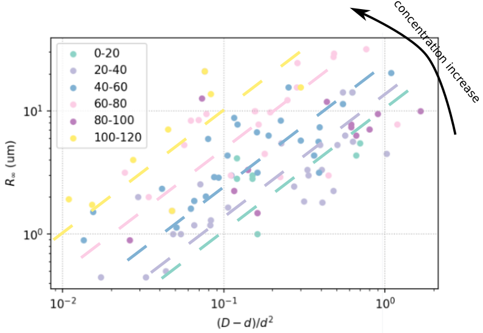

### Review Cristian's data

Today I have summarized the trajectory data from Cristian. The MSD's of all the trajectories are shown below.

In the following, let's do an overview of the parameter space and try to make the same $R_\infty$ and $\tau^*$ plots as we did before. Finally, we try to merge the two data sets.

##### Parameter distributions

##### $R_\infty$ and $\tau^*$ scaling

##### Compare Chile and Paris data

In general, Paris data show larger saturation displacement and shorter transition time, which imply better activity.

**Plot $R_\infty$ and $\tau^*$ scaling of Paris data below.**

##### Try to plot Chile and Paris data together

My first feeling of the data is that $R_\infty$ scales _linearly_ with $(D-d)/d^2$, and the scaling factor increases monotonically with bacterial concentration (almost, except purple data points 80-100 OD). The figure below shows the guide-of-the-eye of the linear scaling.

$\tau^*$ shows a _sublinear_ relation with $(D-d)/d^2$. Interestingly, such relation does not seem to be a function of bacterial concentration.

##### Discussion on the geometrical quantity $(D-d)/d^2$

From the Langevin equation model, we derive the relevant geometrical quantity, $(D-d)/d^2$ which may dictate the MSD saturation values and the saturation time scales. It turns out that this quantity helps to reveal some deeper physics trends of the system. **However, the trends does not agree exactly with the prediction.**

Specifically, we have predicted from the model that i) the saturation time scale $\tau^*$ depends linearly on $(D-d)/d^2$. If we further assume the activity $A$ and persistence time $\tau$ to be independent of confinement, we can predict ii) the saturation MSD $R_\infty=A\tau\tau^*$ depends linearly on $(D-d)/d^2$, too.

The data, however, show that $\tau^*\not\propto (D-d)/d^2$. Since this is the underlying assumption for the prediction $R_\infty\propto (D-d)/d^2$, we would expect that this prediction also fails. Surprisingly, our data show that $R_\infty\propto (D-d)/d^2$ is true, despite that $\tau^*\not\propto (D-d)/d^2$. If we assume $R_\infty=A\tau\tau^*$ is true, then $A\tau$ has to be dependent on confinement. More analysis on this dependence will be done later.

##### Collapse the $R_\infty$ curves

We noticed earlier that the scaling factors of $R_\infty$ and $(D-d)/d^2$ varies with bacterial concentration (_OD_). If we divide $R_\infty$ by _OD_, the curves collapse onto a master curve (not perfectly but good already, except the purple curve).

