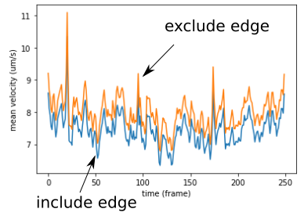

### Mean velocity and mask

How much do the edge data affect the mean velocity we measure? Let's take the same example as used in the VACF note and test.

##### Mean velocity over time

##### Mean velocity vs. $r_{stop}$

Two observations:

- Small droplets are more susceptible to the choice of mask than large droplets
- The negative effect of edge data is revealed in all the 3 tests

##### Only exclude edge data

The example above uses different $r_{stop}$ intervals for different droplet sizes. Here, we visualize the effect only from the edge data (using droplet#19).

Overall, edge data decrease the mean velocity by 0.5~1 $\mu$m/s. Note that this value is not so significant compared to the velocity variation when $r_{stop}\to r$, meaning that the large variation there is due more to the **non-uniform velocity profile**, than including the edge data. The mean velocity calculated including the edge data should still be considered as acceptable.
