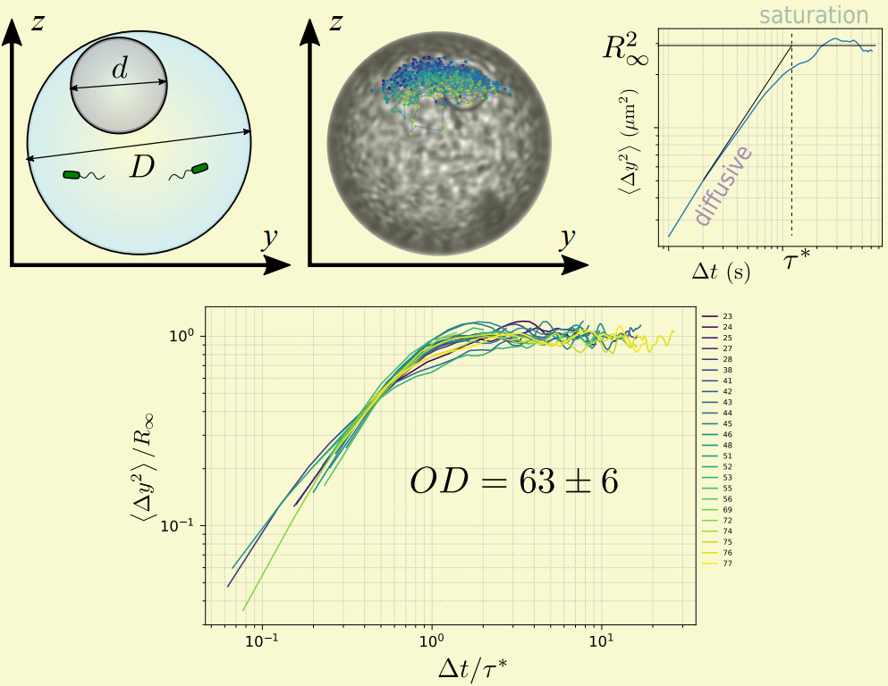
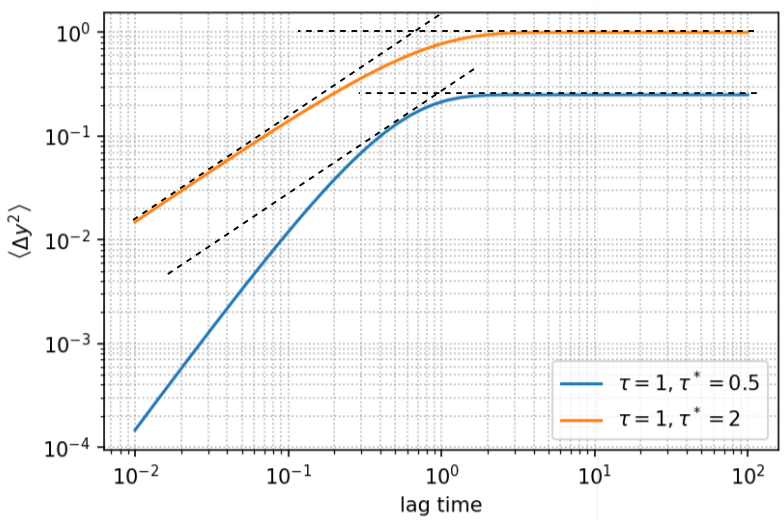
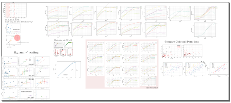
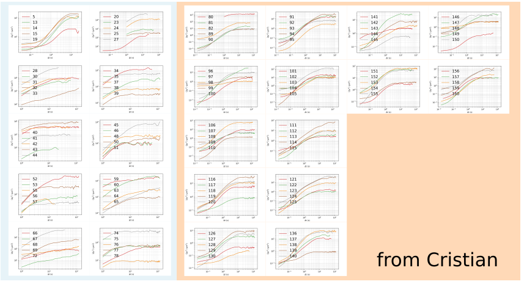
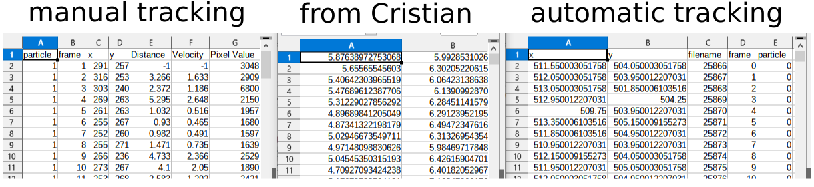
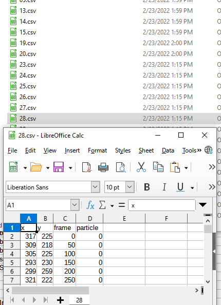

### MSD data reorganization

##### MSD repository (.svg)

Our first attempt to parameterize MSD data is to use the saturation value $R_\infty$ and the transition time to saturation $\tau^*$. These two parameters successfully capture the shape of many MSD curves, as evidenced in the collapse of curves shown below.

However, the determination of the two parameters is manual, and therefore is subject to errors especially for MSD curves that do not show very pronounced diffusive and saturation regimes. This scenario is expected when the noise time scale $\tau$ gets close to the saturation time scale $\tau^*$ ($\tau\approx\tau^*$). The predicted MSD from the stochastic Langevin model illustrates this scenario:

 

 In experimental data, there are even worse cases, and I cannot guarantee that each of my determination satisfies everyone's criteria. Furthermore, there might be information hidden behind these two parameters, which requires that we be able to go back to the raw MSD curves when we wish to.

Currently, I have a messy inkscape project file which I've been using to manually measure $R_\infty$ and $\tau^*$, which looks like

It's initially for manual extraction of $R_\infty$ and $\tau^*$, but has been growing when I add other plots. Also, the legends are too small when I zoom out, so it's impossible to quickly retrieve the MSD curve I want to look at. Therefore, I want to replot all the relevant MSD curves in an **MSD repository**, with larger legends and clearly labeled "zones" for different data sets.

New look of MSD repository "MSD_repo.svg": with all the data organized in order, and large enough legends to be visible when zooming out.

##### Unify trajectory data format

The trajectory data are from two sources currently: automatic tracking and manual tracking. For the automatic tracking, each frame of an image sequence is processed, whereas for manual tracking, only a small fraction (typically 1 every 50 frames) is processed. As a result, the data from the two sources are different and we need to treat them differently. Recently, I also asked Cristian for his data from Chile, which is again in a different format, making the data treatment even more complicated. The picture below shows how the three types of trajectory data look like.

Currently, they are put in separate folders and I write different code to compute MSD and other things from them, which is annoying. Here, I reorganize them into a unified format with only essential information [x, y, frame, particle]. Then the time difference in each data will be determined by the information in the main log (FPS) and the frame column. Then the data will allow a unified treatment, and can be placed in the same folder.
The file name format is `{:02d}.csv`, with the `DE#` values.

New look of unified trajectory data:

