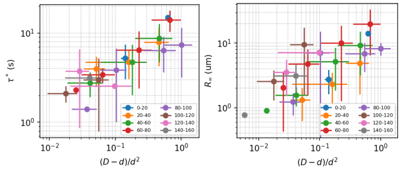
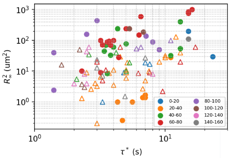

### Stochastic model discussion summary
(Feb 25, 2022)
##### Formulation and solution

We will continue the discussion with the equations and solutions given by Maggi 2014:

$$
\dot y = -\mu ky + \eta^T + \eta^A,
$$

where $\eta^A$ is the active noise, satisfying $\left< \eta^A(t)\eta^A(t') \right>=(D_A/\tau)e^{-|t-t'|/\tau}$. The active part of the solution is

$$
\left< \Delta y^2(t) \right> = \frac{2D_A}{\mu k} \frac{1-e^{-\mu kt} - \mu k\tau(1-e^{-t/\tau})}{1-(\mu k\tau)^2}.
$$

We let $\mu k = 1/\tau^*$, and it can be shown that the $\tau^*$ here is the saturation time scale of inner droplet motion.

##### Limit cases

$$
t\to 0:\, \left< \Delta y^2(t) \right> = \frac{D_A}{\tau(1+\tau/\tau^*)} t^2
$$

$$
\tau^*\gg t\gg \tau:\, \left< \Delta y^2(t) \right> = \frac{2D_A}{1-(\tau/\tau^*)^2}(t-\tau)
$$

$$
t\to\infty:\, \left< \Delta y^2(t) \right> = \frac{2D_A\tau^*}{1+\tau/\tau^*}
$$

##### Evaluate $R_\infty$ and $\tau^*$

A typical MSD curve can be described by the saturation value $R_\infty^2$ and the transition time $\tau^*$. The ballistic regime, where $\left< \Delta y^2(t) \right> \propto t^2$, is usually within 1 second and is difficult to measure accurately in experiment.

The transition time $\tau^*$ comes out directly from the model as

$$
\tau^* = \frac{1}{\mu k},
$$

where $\mu=(6\pi\eta r_i)^{-1}$ is the particle mobility and $k=m^*g/(r_o-r_i)$ is the effective spring constant.
Notice that $m^*$ is the buoyant mass of the oil droplet in water, and can be computed as $m^*=\Delta\rho\frac{4}{3}\pi r_i^3$. Taken together, $\tau^*$ can be expressed as

$$
\tau^* = \frac{9\eta}{2\Delta\rho g}\frac{r_o-r_i}{r_i^2} =  \frac{9\eta}{\Delta\rho g}\frac{D-d}{d^2}
$$

Use water viscosity $\eta=0.001$ Pa s, we can compute the theoretical coefficient $K=9\eta/\rho^*g=3.9$ $\mu$m s.

In the limit $\tau^*\gg\tau$, the saturation value $R_\infty^2\approx 2D_A\tau^*\propto\tau^*\propto (D-d)/d^2$,

$$
R_\infty \propto \frac{\sqrt{D-d}}{d}.
$$

When $\tau^*\sim\tau$, the experimental determination of $\tau^*$ becomes problematic.

##### Experimental data

The current data set presents 3 parameters: $D, d, n$ and two observables: $R_\infty$ and $\tau^*$. $D$ and $d$ are always combined as $(D-d)/d^2$ as $x$-axis. Bacterial concentration $n$ is encoded using `tab10` colormap, with the following mapping.

The data here combines Chile and Paris data. To discern them, I use solid circle to plot Paris data, and empty triangle to plot Chile data.

Parameter distribution:

$\tau^*$ vs. $(D-d)/d^2$

$R_\infty$ vs. $(D-d)/d^2$

Plot the scattered data in bins

##### Some attempts

Rescale $R_\infty$ with $n$ (OD)

Plot $R_\infty^2 / \tau^*$ vs. $(D-d)/d^2$ ($=\frac{2D_A}{1+\tau/\tau^*}$)

Plot $R_\infty^2$ vs. $\tau^*$ (similar to above, expect a linear regime)

Separate $(D-d)/d^2$ regimes (already evidenced in $R_\infty^2 / \tau^*$ vs. $(D-d)/d^2$ plot, and in $\tau^*$ vs. $(D-d)/d^2$ plot). A linear regime is seen for $\tau^*$ at intermediate $(D-d)/d^2$. Fit the linear regime, we obtain a slope $\sim 22$ $\mu$m s. The stochastic model predicts this slope to be $9\eta/\Delta\rho g\approx 3.9$ $\mu$m s. This discrepancy is interesting to look into.

