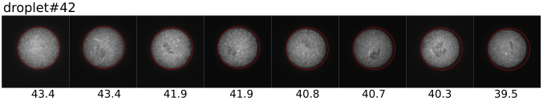
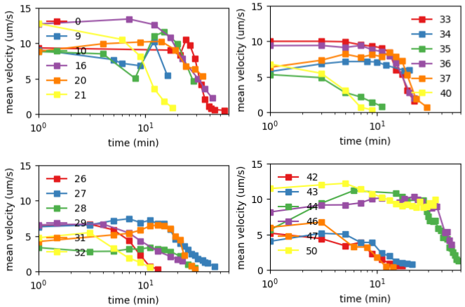
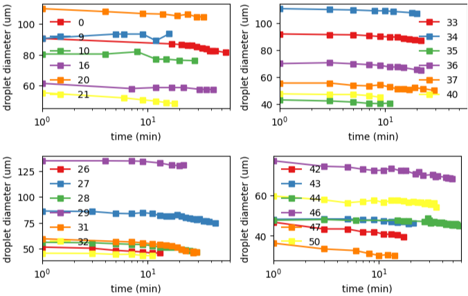
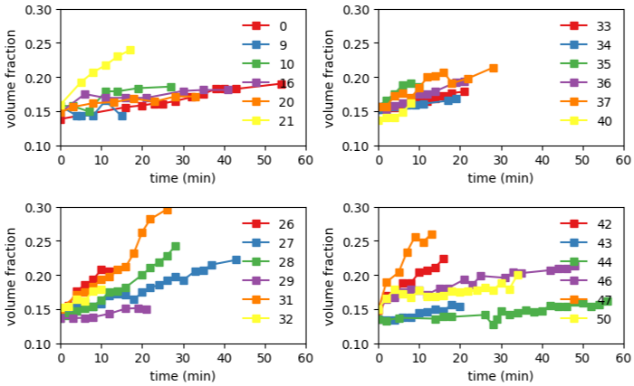
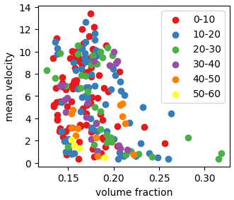

### Droplet shrinking

(Mar 04, 2022)

More analysis reveals that droplet size is not a constant during each experiment. Instead, it decreases with time. This decrease effectively increase the volume fraction of bacteria inside a droplet, leading to higher probability of jamming. Below is a time series of droplet#42.

##### Mean velocity evolution

##### Droplet size evolution

##### Effective volume fraction evolution

##### Correlation between mean velocity and volume fraction

We know that the activity of bacteria, or mean velocity decays with time. To see if the decay is due to the increase of volume fraction, let's plot mean velocity vs. volume fraction, and see if there is a strong correlation. The result is shown below. Data points from different time regime are colored differently.

Although there seems to be a decreasing trend of velocity with increasing volume fraction, the data is too scattered to draw a definitive conclusion. The shrinking of droplets must have an effect on the droplet lifetime. However, how it work together with the natural aging of bacteria is not clear.

Moreover, the current visualization does not account for different light exposure conditions (i.e. continuous or intermittent, blue laser or white light). This could be a reason the data is scattered. Separating different conditions may help us understand the correlations better. 
