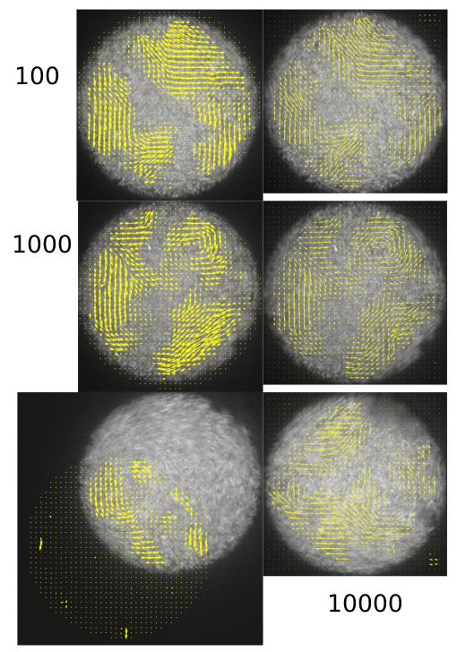
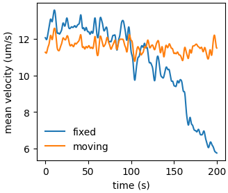
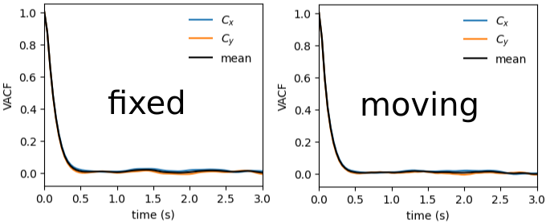
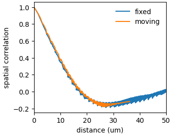

### Compare the PIV results from fixed mask and moving mask

After 3 days of computation, we've got some PIV results from the moving mask PIV method. _The code is very slow at the moment due to the cross-correlation-based droplet tracking method._ Here, let's compare the PIV  downstream analysis results to assess the difference caused by droplet movements. The images below compare the PIV's of droplet#16 at frame 100, 1000 and 10000. At early times, the droplet does not move significantly, and the flow structures measured by both algorithms are similar in general. At late times, the droplet is faraway from the initial mask, resulting in very different PIV results, even for the same region.

##### Mean velocity

The initial discrepancy is due to the fact that I did not crop out the velocities in the corners in moving mask PIV data, while the old PIV is done with a circular mask.

If we pass the moving mask PIV data through a circular mask, we get the following mean velocity.

##### velocity autocorrelation

The two PIV schemes show very similar velocity autocorrelation functions, with a characteristic time scale $\tau\approx0.2$ s. This value is close to the ratio between the length of bacteria $l\approx 3$ $\mu$m and swimming speed $V\approx 15$ $\mu$m/s. The significance of this value will be investigated.

##### 1D spatial correlation

The spatial correlation is also not affected.

