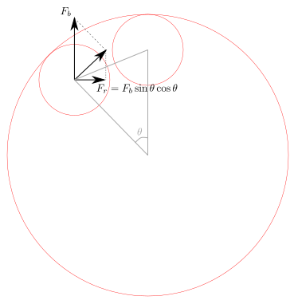
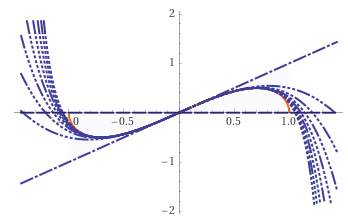
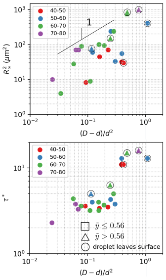
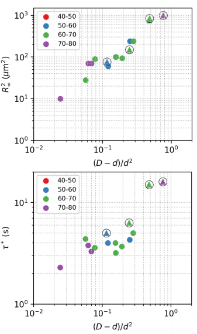

### Spring approximation assessment

We assumed the restoration force exerted by buoyancy on inner droplets to be a spring force, of which the magnitude is proportional to the displacement from the equilibrium position. Such assumption holds true for very small displacement in horizontal direction, which is necessarily true for our experiment.

In this note, we give a clearer definition of "small displacement", where we can apply the assumption. We will also go over the experimental data, to identify the experiments that clearly go beyond this assumption. Lastly, we expand the buoyant force under confinement to higher order terms, to see how "larger" displacements are included in this framework.

##### Linear approximation

The restoration force is the horizontal component of the net force on the inner droplet. It can be expressed in terms of buoyant force $F_b$ and horizontal displacement $y$ by
$$
F_r = - F_b \sin\theta \cos\theta,
$$
where
$$\sin\theta=\frac{y}{r}, \cos\theta=\frac{\sqrt{r^2-y^2}}{r}.$$
$r=r_o-r_i$ is the free space radius in the double emulsion.

Let $\tilde y=y/r$, we can rewrite $F_r(\tilde y)$ as
$$
F_r(\tilde y) = -F_b \tilde y \sqrt{1 - \tilde y^2}
$$

We can expand $F_r$ around $\tilde y = 0$ as

$$
F_r(\tilde y) \approx -F_b (\tilde y - 0.5 \tilde y^3 - 0.125 \tilde y^5 - 0.0625 \tilde y^7 - ...).
$$
The first order term $-F_b \tilde y = -F_b y/r$ is consistent with the spring approximation adopted by Maggi et al., and is also what we used for the first analysis. The plot below shows how good the approximations are for various orders of expansions.

**Say error within 20% is the criterion for acceptable approximation**, the linear approximation remains acceptable up to $\tilde y = 0.56$. The third order approximation works up to $\tilde y = 0.84$. Higher order approximations can be even better.

##### Screen experimental data, identify experiments where the linear approximation does not work

As discussed in the last committee meeting, we will look at the OD range 40-80, where the $R_\infty$ and $\tau^*$ data are less scattered. In the following, we plot this subset of data in finer bacterial concentration bins:

In the plots, displacements beyond the "good approximation criterion" are highlighted using triangle markers. The experiments where inner droplets leave the out droplet surface are circled out. The overall increasing trend is still clear, but the two criteria based on the spring force approximation **do not** separate "good" points from "bad" points.

When I review the videos, I found that in some experiments, the bacteria were not as active as expected. This accounts for several unexpected low points of the $R_\infty$ plot. By removing these low points, an envelop with slope 1 is revealed. Plots with low points removed are shown below:

##### Are nonlinear terms necessary?

$R_\infty$ data show that both the "large displacement" points and "leaving surface" points fit in very well with other data points. For $\tau^*$ data, even if we get rid of those problematic points, the predicted linear relation $\tau^*\propto(D-d)/d^2$ cannot be recovered.

Clearly, including higher order terms in the spring force will not reconcile these conflicting data. We need more careful experiment to make quantitative claims, and need to think about ways to improve the model.
