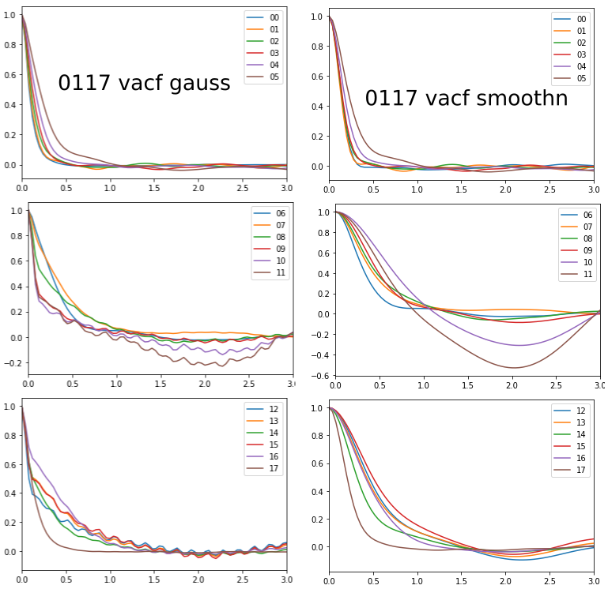
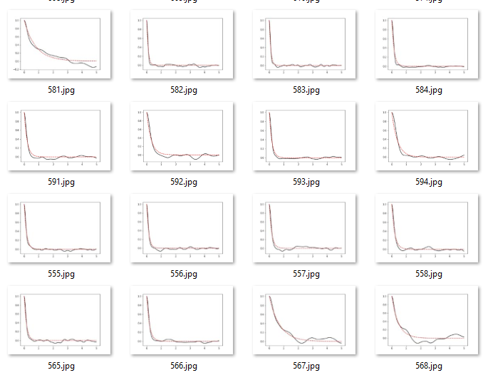
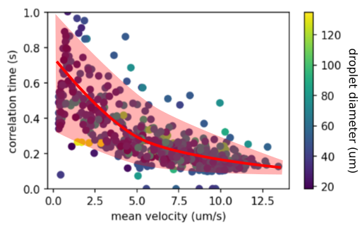

### Correlation time analysis using `smoothn`

Using `smoothn`, most noisy VACF curves can be smoothed adaptively. The 01172022 data are shown below as an example.

The curves are fitted with exponential decay to obtain the correlation time $\tau$.

The fitting curves are saved for future quality check in a .zip archived stored on Google Drive.

We hypothesized that the correlation time is correlated with the bacterial activity. Below I plot correlation time against mean velocity to visualize this correlation.

