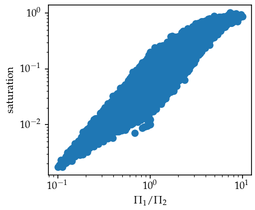
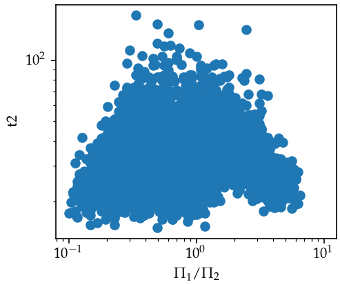

### Simulation data summary
(Mar 30, 2022)

Today I receive the first batch of simulation data from Cristian. Here, I convert the simulation parameters to experimental ones, and use plots to provide an overview of the results. Simulation details, namely $v_{bath}$, $\tau$ and boundary conditions, I have to confirm with Cristian.

##### Dimensionless parameters $\Pi_1$ and $\Pi_2$
$$
\Pi_1 = \frac{v_{bath}}{\tilde v}
$$
$$
\Pi_2 = \frac{v_{bath}\tau}{r}
$$
where $\tilde v = \frac{2\Delta \rho g r_i^2}{9\eta}$ is the sedimentation velocity, $r=r_o-r_i$ is the free space radius of the double emulsion.

$$
\frac{\Pi_1}{\Pi_2} = \frac{r}{\tilde v\tau} = \frac{9\eta}{\Delta\rho g\tau}\frac{D-d}{d^2}
$$
For constant $\tau$, $\Pi_1/\Pi_2\propto (D-d)/d^2$. Therefore, we can plot $R_\infty$ and $\tau^*$ simulation data (as "saturation" and "t2" from Cristian) against $\Pi_1/\Pi_2$ to get similar plots as the experimental ones.

##### Plots

**saturation vs.  $\Pi_1/\Pi_2$**

**$t_2$ vs.  $\Pi_1/\Pi_2$**

##### Questions

1. Is $\tau$ a constant throughout all the cases? I understand that $\Pi_1$ and $\Pi_2$ are the only variable that affects the simulation result, but using the information to deduce geometrical parameter requires the knowledge of $\tau$.

2.
