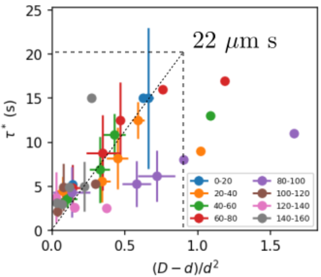

### Thoughts on the large slope of $\tau^*$ vs. $(D-d)/d^2$

In the experimental data summary, we plot $\tau^*$ vs. $(D-d)/d^2$ as the following:

where the slope is 22 $\mu$m s, much larger than the value predicted by the spring model to be $\frac{9\eta}{\Delta\rho g} \approx 3.9 $ $\mu$m s. We notice that this coefficient is essentially the ratio between viscous force $\eta$ and buoyant force $\Delta\rho g$. From a theoretical point of view, the large slope can be attributed to the larger effective viscosity $\eta_{eff}$.

1. Bacteria may come in the way of inner droplets, which increases the effective viscosity experienced by the droplets.
2. The viscous drag on the inner droplets was assumed to be the Stokes drag on a hard sphere. However, the inner droplet is a liquid sphere close to a liquid-liquid interface. The hydrodynamic effect can be more complex than the scenario of a hard sphere in bulk. For example, the thin fluid layer may have **localized lubrication flow** which causes drag force that is not negligible.
3. The fluid inside the inner droplet can flow, too. This may cause additional energy dissipation, increasing $\eta_{eff}$.
4. In many experiments, we observe bacteria stuck on the surface of inner droplets. Since bacteria are slightly heavier than water, they can decrease the buoyant force at the denominator, which can also contribute to a large slope.

##### Propose new experiments

1. Replace hexadecane with other oil as inner droplet. By doing this, we change the viscosity and density of the inner droplet, and in turn control the relative contribution of "internal flow", "lubrication flow" and "buoyant force".
2. Put tracer particles inside the inner droplet to see the internal flow. 
