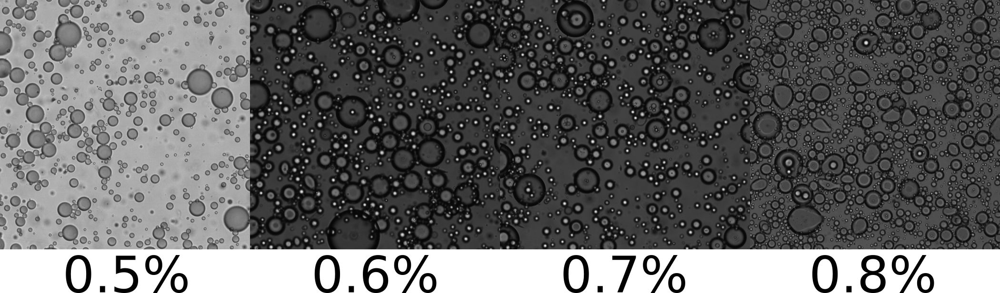

### Best surfactant concentration for double emulsion

Polymeric surfactant is shown to be essential for stabilizing double emulsions. We have been using both PVA and Pluronic F-127 to successfully stabilize bacterial double emulsions. Despite the success, we realize that these surfactants cause bacteria to for immotile clusters, indicating that excessively high concentration of polymeric surfactant may create adversity for bacteria. Therefore, it is critical to determine a concentration of polymeric surfactant as low as possible, which still stabilize double emulsions.

In an experiment, I varied the mass fraction of Pluronic F-127 in water from 0.1% to 0.8%, and use the shaking technique to create concentrated emulsions and double emulsions. When the surfactant concentration is low (0.1%), no double emulsion is observed. As I increased surfactant concentration, the number of double emulsions observed also increased. Notably, I found that 0.7~0.8% is likely the concentration I am looking for, which is the lowest concentration that does the stabilization work.

Data shown below.

