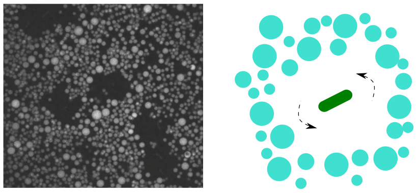
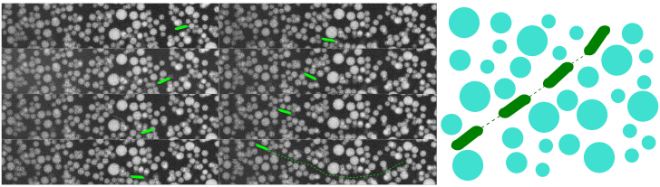

### Droplet wall experiment summary

There are a few interesting observations in the droplet wall experiment. I summarize them below with links to videos for discussion and future references. I also list some existing works that are relevant to our experiment as an attempt to find an interesting topic.

##### [1. rotators create holes](https://drive.google.com/open?id=1Irejmws359Y69ZWMgP15ToOFDia1CHFt&authuser=liux3141%40umn.edu&usp=drive_fs)

Instead of swimming in straight lines, some bacteria rotate near the capillary surface and locally create holes in the "cream" of dense droplets. Two topics related to this phenomenon can be found in literature:

- rotating motion of bacteria near hard surface: several mechanisms have been proposed for this phenomenon.
  - Motor adheres to surface: Silverman 1974
  - Unbalanced hydrodynamic torque on body and tail: Lauga 2006, Di Leonardo 2011
  - Trapped in the flow generated by flagella: Dominick 2017
- flow field generated by bacterial swimming.
  - Dipolar flow: Drescher 2011

By the rotation direction we are able to eliminate some mechanisms, but determining the rotation direction requires a careful test on if the microscope image is reversed artificially or not. Then, the strength of the flow generated by the rotation may tell us more about the mechanism.

##### [2. runners leave trails](https://drive.google.com/open?id=1Iu_5TVoTGeGtofrWtq6vlr11M8eWv55U&authuser=liux3141%40umn.edu&usp=drive_fs)

When swimming in the "cream" of dense droplets, bacteria leave temporary trails by direct collisions with droplets and hydrodynamic flows. These structural changes in the cream may affect the motility of other bacteria, an effect similar to memory.

This is a direct imaging of bacterial swimming in complex fluids. With both bacteria and droplets being visible, the interaction between them can be studied in more details compared to existing works, for example those study motility enhancement in polymer solutions and colloids. Relevant existing studies on motility enhancement in complex fluids include:

- Porous network structure: Berg 1979, Magariyama 2002
- Low viscosity vicinity: Martinez 2014, Man 2015, Zhang 2018, Zottl 2019
- Less tumbling: Patteson 2015  
- Reduced flagellar bundling time: Qu 2018, 2020
- Swirling flow: Binagia 2020
- Less wobbling: Kamdar 2022

A review paper (Bechinger 2016) also provides a good overview on this matter.

##### [3. coexistence of clumps and dispersed droplets]()

Might be a motility induce phase separation (MIPS), but requires more well controlled experiment. MIPS was a theoretically predicted phenomenon, which has been also observed in simulations. However, it has not been observed in experiments. Cates 2015 provides a comprehensive review on this subject.

##### [4. Super brownian motion of agitated droplets]()

The diffusion of droplets is enhanced by swimming bacteria. The effects of bacterial concentration, particle size, particle anisotropy and swimmer type have been studied. I have a summary in Section 1.2.2 of my [PhD thesis](https://zloverty.github.io/research/papers/Thesis_Liu.pdf).

### References

Silverman M, Simon M. 1974. Flagellar rotation and the mechanism of bacterial motility. Nature. 249(5452):73–74

Lauga E, DiLuzio WR, Whitesides GM, Stone HA. 2006. Swimming in Circles: Motion of Bacteria near Solid Boundaries. Biophysical Journal. 90(2):400–412

Di Leonardo R, Dell’Arciprete D, Angelani L, Iebba V. 2011. Swimming with an Image. Phys. Rev. Lett. 106(3):038101

Dominick CN, Wu X-L. 2018. Rotating Bacteria on Solid Surfaces without Tethering. Biophys J. 115(3):588–94

Drescher K, Dunkel J, Cisneros LH, Ganguly S, Goldstein RE. 2011. Fluid dynamics and noise in bacterial cell-cell and cell-surface scattering. Proceedings of the National Academy of Sciences. 108(27):10940–45

Berg HC, Turner L. 1979. Movement of microorganisms in viscous environments. Nature. 278(5702):349–51

Magariyama Y, Kudo S. 2002. A mathematical explanation of an increase in bacterial swimming speed with viscosity in linear-polymer solutions. Biophys J. 83(2):733–39

Martinez VA, Schwarz-Linek J, Reufer M, Wilson LG, Morozov AN, Poon WCK. 2014. Flagellated bacterial motility in polymer solutions. Proceedings of the National Academy of Sciences. 111(50):17771–76

Man Y, Lauga E. 2015. Phase-separation models for swimming enhancement in complex fluids. Phys. Rev. E. 92(2):023004

Zhang Y, Li G, Ardekani AM. 2018. Reduced viscosity for flagella moving in a solution of long polymer chains. Phys. Rev. Fluids. 3(2):023101

Zöttl A, Yeomans JM. 2019. Enhanced bacterial swimming speeds in macromolecular polymer solutions. Nat. Phys. 15(6):554–58

Patteson AE, Gopinath A, Goulian M, Arratia PE. 2015. Running and tumbling with E. coli in polymeric solutions. Sci Rep. 5(1):15761

Qu Z, Breuer KS. 2020. Effects of shear-thinning viscosity and viscoelastic stresses on flagellated bacteria motility. Phys. Rev. Fluids. 5(7):073103

Qu Z, Temel FZ, Henderikx R, Breuer KS. 2018. Changes in the flagellar bundling time account for variations in swimming behavior of flagellated bacteria in viscous media. Proc Natl Acad Sci U S A. 115(8):1707–12

Binagia JP, Phoa A, Housiadas KD, Shaqfeh ESG. 2020. Swimming with swirl in a viscoelastic fluid. Journal of Fluid Mechanics. 900:

Kamdar S, Shin S, Leishangthem P, Francis LF, Xu X, Cheng X. 2022. The colloidal nature of complex fluids enhances bacterial motility. Nature. 603(7903):819–23

Bechinger C, Di Leonardo R, Löwen H, Reichhardt C, Volpe G, Volpe G. 2016. Active Particles in Complex and Crowded Environments. Rev. Mod. Phys. 88(4):045006

Cates ME, Tailleur J. 2015. Motility-Induced Phase Separation. Annual Review of Condensed Matter Physics. 6(1):219–44
