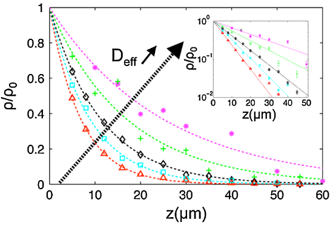

### Literature review -- Effective temperature of an active bath

##### Wu and Libchaber 2000: fluctuation-dissipation

They studied the diffusion of PS particles of 4.5 and 10 $\mu$m in _E. coli_ bath, and found the effective diffusivity to be $1.0\times 10^{-6}$ cm$^2$/s and $4.3\times 10^{-7}$ cm$^2$/s, respectively. Compared to the thermal diffusivity $D_T\sim 10^{-9}$ cm$^2$/s, the active bath enhances the diffusivity about 100 times greater. With the Stokes-Einstein relation,
$$
D = \frac{k_BT}{6\pi\eta R},
$$
this enhanced diffusivity implies an effective temperature of the active bath 100 times greater than room temperature, i.e. $T_{eff} \approx 30000$ K.

##### Palacci et al. 2010: average potential, fluctuation-dissipation

They studied the stationary distributions of active Janus particles (latex) in the gravity potential (the Jean-Perrin experiment for active colloids). The balance between gravitational sedimentation and diffusion leads to a steady Boltzmann distribution profile
$$
\rho(z) = \rho_0\exp(-z/\delta_{eff}),
$$
where $\rho_0$ is the normalizing factor, $z$ is the position in gravity direction, and $\delta_{eff}$ is the effective sedimentation length, corresponding to the length over which particle density drops by $1/e$.

Using a piezo-mounted microscope, they scanned the sample chamber over $z$ to measure the stationary distribution of particle number. The density profiles are shown to be dependent on the $D_{eff}$ of individual active particles.

Effective temperature can be recovered by
$$
\delta_{eff} = \frac{k_B T_{eff}}{mg},
$$
where $m$ is the buoyant mass of particles. For a sedimentation length 6 $\mu$m, the effective temperature is
$$
T_{eff} = \frac{\delta_{eff}mg}{k_B}=\frac{6\times 10^{-6} \times 55 \times 5.2 \times 10^{-19}\times 10}{1.38\times 10^{-23}} = 124 \:\text{K}.
$$
This is approximately a factor of two difference from the data shown in the paper. I'm not sure what is missing in my calculation but for now I'm more concerned about the order of magnitude.

In the same system, the diffusivity of individual particles also has an associated effective temperature, which can be calculated by
$$
D_{eff} = \frac{k_BT_{eff}}{6\pi\eta R},
$$
where $\eta=0.001$ Pa s is water viscosity and $R=0.5$ $\mu$m is particle radius. For $D_{eff}\approx 0.3$ $\mu$m$^2$/s, which corresponds to 6 $\mu$m sedimentation length, the effective temperature is
$$
T_{eff} = \frac{6\pi\eta R D_{eff}}{k_B}=\frac{6\pi\times 0.001\times 0.5\times 10^{-6}\times 0.3\times 10^{-12}}{1.38\times 10^{-23}} = 205 \:\text{K}.
$$
My calculation gives two different effective temperatures. What is wrong?

##### Maggi et al. 2014: average potential

They studied the motion of glass beads confined at the bottom of a cylindrical capillary. They found that the probability distribution of the glass bead can be well approximated by a Gaussian distribution
$$
P(y)\sim \exp(-ky^2/2k_BT_{eff}).
$$
Consider a particle randomly fluctuating in a harmonic potential, the higher the temperature, the farther it will explore the potential well. An active bath also induce fluctuations. In this way, the **average potential** energy acquired by the fluctuating particle is a measure of effective temperature.

The average potential is calculated as
$$
U = \frac{1}{2}k\langle y^2\rangle = \frac{1}{2}k\lim_{t\to\infty}\langle \Delta y^2(t)\rangle/2,
$$
where the second equation can be understood like this: the mean square displacement $\langle \Delta y^2(t)\rangle$ considers the displacement from one side of the potential well to the other side, therefore it is twice the displacement from the equilibrium position statistically.

Then, using $U=k_BT_{eff}/2$, we can calculate $T_{eff}$ as
$$
T_{eff} = \frac{2U}{k_B} =  \frac{k\langle \Delta y^2(t)\rangle_{max}}{2k_B},
$$
where $k=m^*g/(r_o-r_i)=1.4\times 10^{-7}$ kg/s$^2$. In the paper, they present 3 $\langle \Delta y^2(t)\rangle_{max}$ values: 2, 1 and 0.1 $\mu$m$^2$, corresponding to being close to air bubble, being far from air bubble and in the absence of bacteria. The effective temperatures corresponding to these scenarios can be calculated:
$$
T_{close} = \frac{2\times 1.4\times10^{-7}\times 2\times 10^{-12}}{1.38\times 10^{-23}} \approx 40000 \:\text{K}\\
T_{far} = \frac{2\times 1.4\times10^{-7}\times 1\times 10^{-12}}{1.38\times 10^{-23}} \approx 20000 \:\text{K}\\
T_{nobac}=\frac{2\times 1.4\times10^{-7}\times 0.1\times 10^{-12}}{1.38\times 10^{-23}} \approx 2000 \:\text{K}
$$
Although their results show similar effective temperature as Wu and Libchaber, the no-bacteria scenario does not recover room temperature, posing a question of using average potential to measure temperature.

##### Ye et al. 2020

They consider three definitions of effective temperature: fluctuation-dissipation $D_{eff}/\mu$, mean kinetic energy $E$ and mean potential energy $U$. In some scenarios, these definitions can be shown to be equivalent.
