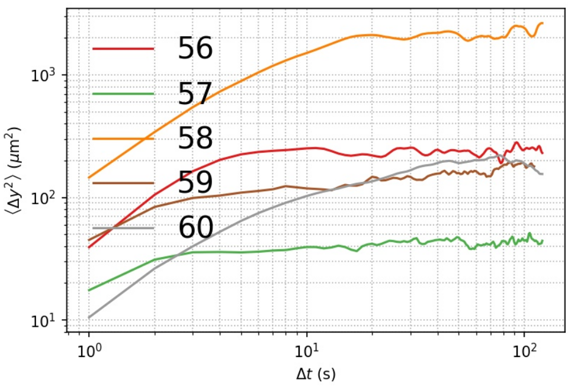
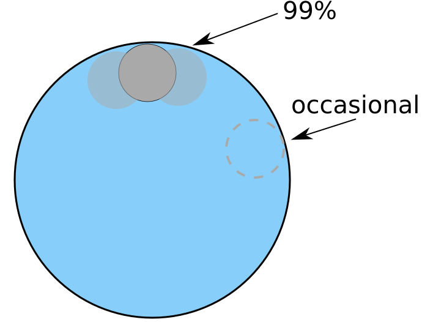
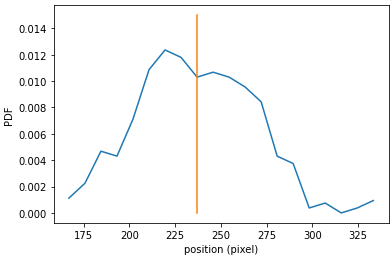

### Questions: May 4th, 2022

##### Weird MSD curve

Some MSD's show weird features. For example, DE#60 (shown below) show a very gradual transition from diffusive to saturation.

The corresponding video (11102021/02) shows that the inner droplet occasionally explores extraordinarily large extent, while most of the time stay within a small vicinity near the equilibrium position. I sketch the inner droplet positions below, along with a probability distribution.

