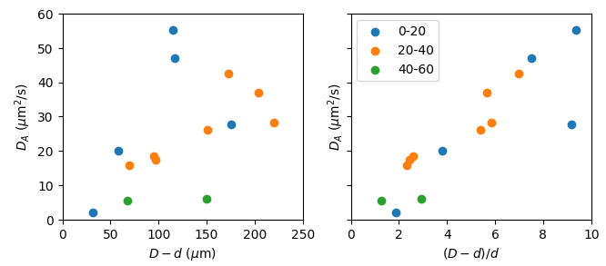
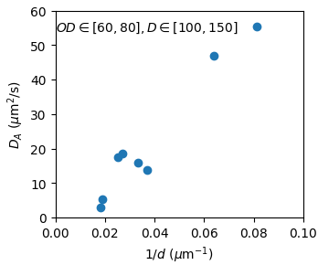
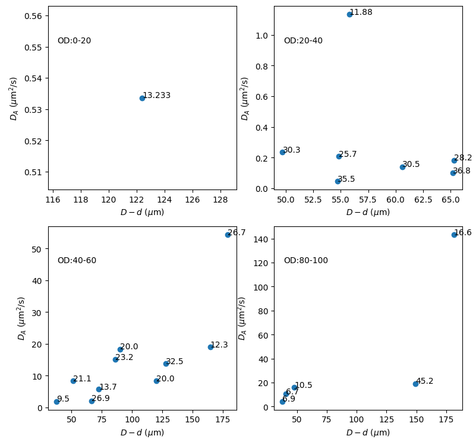

### How to understand confinement dependent $D_A$

In the stochastic model
$$
\dot y = - \mu ky + \eta^T + \eta^A
$$
$D_A$ is the prefactor of the exponentially correlated active noise velocity $\eta^A$: $\langle \eta^A(t)\eta^A(t')\rangle =(D_A/\tau)e^{-|t-t'|/\tau}$.

When applying this model to **active particles** (e.g. the self-propelled Janus particles in Palacci et al. 2010), $D_A$ and $\tau$ are intrinsic properties of an active particle and can be measured by tracking individual particles.

People have been borrowing this model to understand the motion of **passive particles in an active bath** (Wu 2000, Maggi 2014, Ye 2020). Qualitatively, the superdiffusive-diffusive type of MSDs are well captured by the model. In the experiment of Wu 2000, they study the diffusivity of particles of two different sizes: 4.5 $\mu$m and 10 $\mu$m in diameter. Their results suggest that the effective diffusivity $D_{\text{eff}}\propto 1/R$, where $R$ is the particle radius. In their paper, they commented that
> ...which has the same $R$ dependence as the Stokes-Einstein relation, $D_T=k_BT/6\pi\eta R$. Such a result is expected for a system at thermal equilibrium, but not for a nonequilibrium system such as ours.

This $1/R$ dependence coincide with our data. If we look at the $D_A$ vs. $D-d$ plot in the left below,

the $D_A$ data are very scattered until we rescale the $D-d$ with $d$, the inner droplet diameter. If we fix $D-d$ in the left panel, and plot $D_A$ as a function of $d$, what we get is essentially $D_A\propto 1/R$. Below is a direct verification of such dependence, where we fix $OD$ and $D$ in a narrow range.

It is encouraging to see that a previously identified relation $D\propto 1/R$ is found again in our experiment. Being very similar to the form of Stokes-Einstein relation, this observation may suggest that the active bath results in a fixed amount of energy flux to the particle, which then dissipates through viscous drag.

##### Energy equipartition

In equilibrium system, energy is equally distributed to all degrees of freedom. Maggi et al. 2014 investigated the energy distribution of a silica particle in a glass capillary parallel and perpendicular to the capillary axis. When moving parallel to capillary axis, the motion is unconstrained, and the energy associated with this degree of freedom is $E_\parallel=(D_T+D_A)/\mu$. When moving perpendicular to capillary axis, the motion is effectively constrained by a harmonic potential, and the energy is $E_\perp = D_A/[\mu(1+\mu k\tau)] + D_T/\mu$. This energy partition comes directly from the solution of the stochastic equation, and provide a picture of how external potential can modify the energy equipartition in an active system.

In their system, they have access to 2 different curvatures - zero and nonzero, along $x$ and $y$. They did state in the paper that both $x$ and $y$ MSD's fit well to the theoretical prediction. The two fittings should independently give two sets of fitting parameters ($D_A$, $\tau$, $\tau^*$). However, they only present one $D_A$ and do not comment on the other, implying that the results from both fittings are identical.

This is on the contrary to our result, where $D_A$ increases linearly with $(D-d)/d$. The bacterial concentration in their experiment is $\sim 10^{10}$ cells/ml, roughly corresponding to $OD\sim 15$. This is the dilute regime before the onset of collective motion. Below I plot our $D_A$ vs. $D-d$ data in other concentration bracket:

As can be seen, the dependence on $D-d$ only start to be observed when $OD>40$. When $OD\in [20, 40]$, $D_A$ shows no pronounced dependence on confinement.

 Maybe collective motion is where confinement really change the bacterial behavior. 
