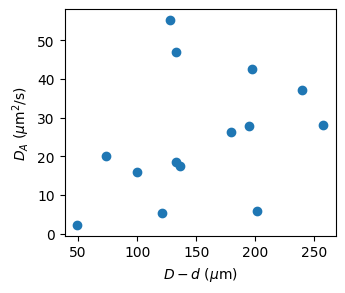

### DE data summary
(July 1, 2022)

It's been about half a year since I wrote the last data summary on the double emulsion project. Over this period, we have some new data/analysis/interpretation. I will summarize them here.

##### Automatic fitting

I also managed to do  automatic fitting rather than hand fitting. The fitting results do not deviate from each other much, as we expected before. See below:

##### Some clues of geometry dependence

When I plot $D_A$ vs. $D-d$, I see a roughly increasing curve.

Looking into a specific concentration bracket 60-80 on a linear scale, I found that the data is still very scattered.

This scattering can be reduced significantly, by realizing the role of inner droplet size $d$. Typically, larger inner droplets show lower diffusivity.

This is reminiscent to the Stokes-Einstein relation:
$$
D = \frac{k_BT}{6\pi\eta a}.
$$
Therefore, we plot $D_A$ against $(D-d)/d$, instead of $D-d$, to eliminate the "Stokes drag" effect. The new plot looks much better in this concentration bracket:

##### New low concentration data set

After the October November data, I add another low concentration (OD=20-40) data set in June. Using the new geometry parameter we had in the previous section, we can plot all the data:

The 60-70 data (pink symbols) show good linear relation. The new low concentration data (20-40, green and red symbols) are much lower in magnitude so they look like flat lines in this plot. If we plot the data in log-log scale, we can observe the same increasing trend as the high concentration data.

##### What is the cause of this confinement effect?

Bacteria swim slower in small droplets. This leads to reduced active diffusivity of passive object immersed in bacterial suspensions. Confinement reducing activity is evidenced in the figure below (OD=20-40):

I also have mean velocity data for higher concentrations, where strong collective motions can be observed. See data below. Note that colors denote different imaging technique: bf for bright field and fl for fluorescence.

##### What makes velocity low in confinement?

I'm not sure yet!
