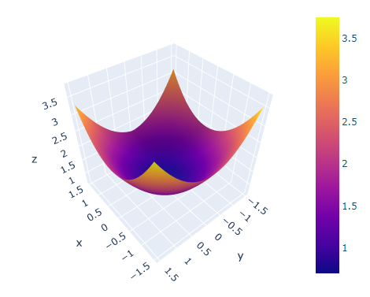
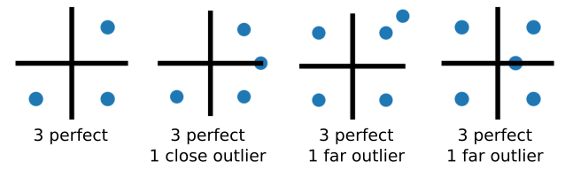
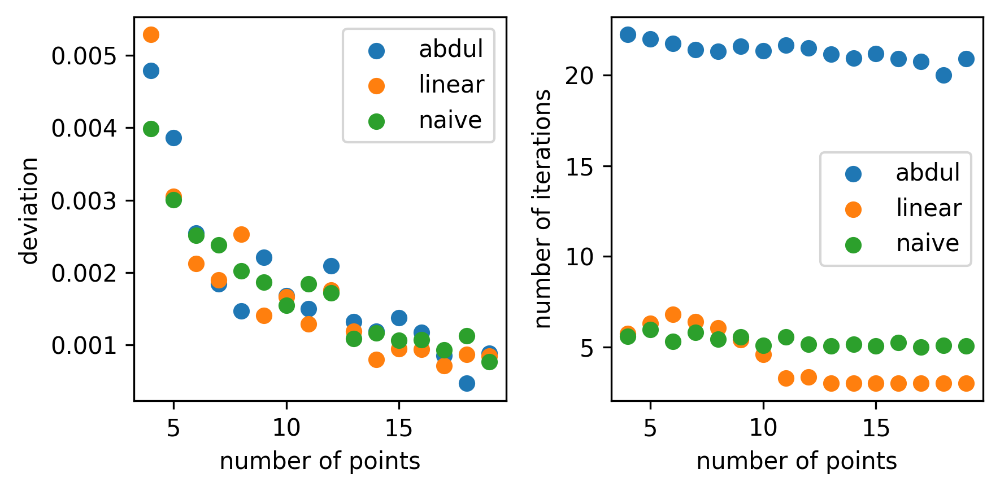
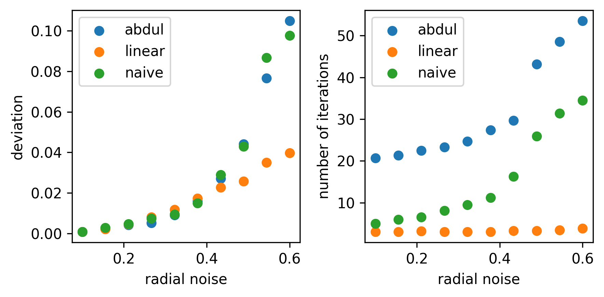
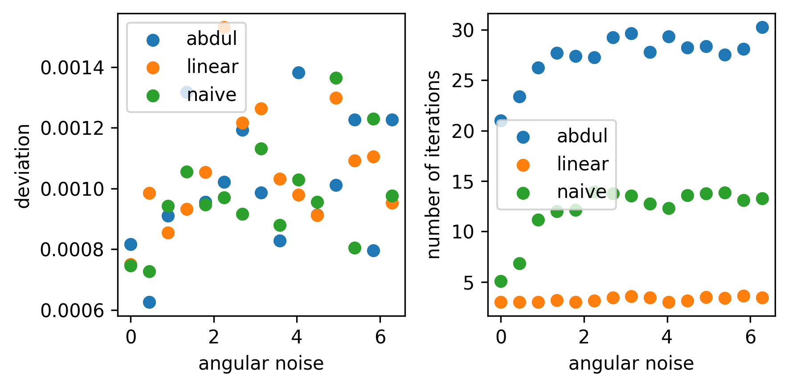

### Improve droplet tracking

At the beginning, I tried HoughCircles algorithm (HC) to detect inner droplets. If the droplet is large and has sharp dark boundary, HC works well. However, if the droplet is small, many false detections come up and make the results very "dirty".

Then, I got an idea that I can perform HC on cropped regions. The idea is to use the droplet position in frame 1 to crop frame 2, then use HC on the cropped region to find droplets. I call this method _crop HoughCircles_ (cHC). This method can significantly reduce the number of false detections. However, if it makes mistakes in the process, it will likely lead the cropped region to a wrong place, making subsequent detections difficult. This method is therefore not robust.

Since the failure of cHC, I started to use the most primitive method - hand tracking - to get droplet trajectories. In a typical video, I have 30,000 frames. It is very challenging to do hand tracking on so many frames, so I only do it every 50 frames (corresponding to 1 s). In this way, I got the first trajectory data set, of which the temporal resolution was 1 s. This resolution allows me to measure the relaxation time scale and the saturation value of MSD, but measuring the ballistic regime remains impossible.


Recently, I obtained a new data set of lower bacterial concentration. Since the motion is in general weaker, I start to think that I can get better results with HC. This time, after carefully reading the document of HC, I find two important parameters that can improve the tracking: `param1` and `param2`.

>**param1**	First method-specific parameter. In case of HOUGH_GRADIENT and HOUGH_GRADIENT_ALT, it is the higher threshold of the two passed to the Canny edge detector (the lower one is twice smaller). Note that HOUGH_GRADIENT_ALT uses Scharr algorithm to compute image derivatives, so the threshold value shough normally be higher, such as 300 or normally exposed and contrasty images.
>
>**param2**	Second method-specific parameter. In case of HOUGH_GRADIENT, it is the accumulator threshold for the circle centers at the detection stage. The smaller it is, the more false circles may be detected. Circles, corresponding to the larger accumulator values, will be returned first. In the case of HOUGH_GRADIENT_ALT algorithm, this is the circle "perfectness" measure. The closer it to 1, the better shaped circles algorithm selects. In most cases 0.9 should be fine. If you want get better detection of small circles, you may decrease it to 0.85, 0.8 or even less. But then also try to limit the search range [minRadius, maxRadius] to avoid many false circles.

Adjusting these two parameters can always lead to a satisfactory degree of false positive cases, while keeping the correct detection. With these two parameters adjusted, I don't have to use cHC to avoid false positive. So even if the algorithm makes mistakes in the process, the mistake will not lead to more mistakes in the next frames, making the method robust. With this method, I'm able to obtain some full trajectories.


##### Problems of HC algorithm

The python implementation of HC ([cv.HoughCircles()](https://docs.opencv.org/4.x/dd/d1a/group__imgproc__feature.html#ga47849c3be0d0406ad3ca45db65a25d2d)) has two main issues:

- No subpixel accuracy: all the detections are separated from each other by integer pixels.


- Inconsistent detection: whether it detects the inner edge or the outer edge of a droplet is not consistent, because it only considers the pixel intensity gradient.


In the Matlab `imfindcircle()` function, the subpixel accuracy issue is handled. I'm not sure if the inconsistent detection issue is also handled or not.

Here, I'm going to add a correction step to make the trajectory more accurate.

##### Correction of HC results

All the droplets in images have dark edges, which may be a result of strong refraction at the edges. If we draw a line from droplet center, in the radial direction, to outside the droplet, the image intensity profile along that line would likely show a valley (a dark peak). This valley is a more unambiguous indicator of the droplet position. By drawing multiple (>3) lines and fit each to get a valley position, we get the coordinates of multiple points on the droplet, from which we can fit a circle.


As the first implementation, I sample four points from top, bottom, left and right to fit circle. Then, for better statistics and accuracy, I take more samples from various directions. However, that leads to a problem, where the outer droplet boundaries are included in the profile and make the valley detection wrong. To fix this, I set a angular range, and only use intensity profiles in that range to fit for valleys. As an example, I show in the right panel of the figure above, where I only find valleys on the left of the inner droplet. The valley detection turns out to be much better than in the middle panel.

##### Tracking quality

This correction can clearly improve the tracking in most images. But in some images, the results are still not ideal and can be improved. It is desired to have a number to quantify the tracking quality, so that we can easily identify which tracking can be improved.


On the left, I plot the original and the corrected droplet position. On the right, I plot the pixel intensity profiles along the two contours. As can be seen, the original intensity profile shows stronger fluctuations than the corrected one. Hence, we can use the standard deviation of the contour intensity profile to quantify the tracking quality. The larger the standard deviation, the worse the tracking quality.

For the two profiles in the image for example,
$$
\sigma_o = 40.8,\, \sigma_c = 23.6
$$
To make the number more intuitive, we rescale the value with image pixel standard deviation, and the substract from 1, so that the maximum becomes 1, and the value typically ranges from -1 to 1. We define this as _tracking quantity Q_:
$$
Q = 1 - \frac{\sigma_{\text{ctr}}}{\sigma_{\text{img}}}
$$
with $\sigma_{\text{img}}=35.6$, we can compute the tracking quality before and after the correction:
$$
Q_o = -0.15,\, Q_c = 0.34
$$
Clearly, the corrected circle has a better quality since $Q_c>Q_o$.

##### Processing large image sequence

As I noted before, a typical video consists of 30,000 frames. So far, it is challenging to make all the correction great using the same parameter. For example, I show below the tracking quality time series of both original and corrected tracking:


There are strong fluctuations in both original and corrected trajectories. In particular, there are multiple instances where the corrected tracking has $Q<0$. Let's see what happens there, for example in frame 40, we have


We can see that it's just because the upper right cross boundary line touches the outer droplet edge, leading to one point that is not really on the inner droplet edge. And that leads to a big deviation from the correct fitting. To avoid this, I add another input argument `sample_range`, so that I can specify the angle range within which I extract intensity profiles. This is noted before, and with this modification, I'm able to improve the tracking quality on this image.


To quantify the tracking quality of the whole image, we can count the number of frames where the tracking quality decreases after correction. Let's use the same image sequence for example, we get 13.8% of frames getting worse after correction for the method without `sample_range`. And by searching only in the left side, I can improve the getting worse rate to 2.9%. The tracking quality time series of the original, initial correction and the refined correction are shown below:


##### Circle fitting methods

The above procedure gives a bunch of coordinates that are likely to be on a circle. However, these coordinates are not yet the ultimate circle properties we want. A circle fitting step is necessary to convert these coordinates into circle center coordinates, as well as circle radius.

**1. Naive method**

Circle fitting turns out to be an important technique in this correction. I used to apply a gradient descent algorithm to find an optimization with the least square error from data points to fitted circle edge. Formally, the optimization tries to find $a$, $b$ and $r$ that minimize the residual
$$
f(a, b, r) = \sum_{i=1}^{n} [(x_i-a)^2+(y_i-b)^2 - \bar r^2]
$$
where $\bar r = \frac{1}{n}\sum_{i=1}^{n}\sqrt{(x_i-a)^2+(y_i-b)^2}$. Using some linear transformation, the problem can be reduced to
$$
\min_{a,b} F(a, b) = a^2 + b^2 - \bar r^2
$$
This is the traditional circle fitting formulation. Below is a visualization of the minimization problem, when given points are `(1, 1), (1, -1), (-1, -1)`, centered at `(0, 0)`. We can see from the surface plot that the minima is roughly around `(0, 0)`.



```python
import plotly.graph_object as go
import numpy as np

points = ((1, 1), (1, -1), (-1, -1))
X, Y = np.meshgrid(np.linspace(-1.5, 1.5), np.linspace(-1.5, 1.5))
F = X ** 2 + Y ** 2
s = []
for point in points:
    s.append(((X - point[0]) ** 2 + (Y - point[1]) ** 2) ** 0.5)
stack = np.stack(s, axis=0)
mean = stack.mean(axis=0)
Z = F + mean
fig = go.Figure(data=[go.Surface(x=X, y=Y, z=(F+mean)/2)])
fig.update_layout(title='Circle fitting problem visulization', autosize=True,
                  width=500, height=500,
                  margin=dict(l=65, r=50, b=65, t=90))
fig.show()
```

As a first attempt to do this optimization, I implement a simple gradient descent as the following:
$$
a_{i+1} = a_{i} - \lambda \frac{\partial F}{\partial a},
$$
$$
b_{i+1} = b_{i} - \lambda \frac{\partial F}{\partial b},
$$
where $\lambda$ is the updating rate that can be chosen empirically. The gradient of $F(a,b)$ takes the following form:
$$
\nabla F = \left[ \begin{aligned}
                  & \partial F/\partial a \\
                  & \partial F/\partial b \end{aligned} \right] =
           \left[ \begin{aligned}
                  & a + \bar u \bar r \\
                  & b + \bar v \bar r \end{aligned} \right]    ,    
$$
where
$$
u_i = \frac{x_i - a}{r_i}, \, v_i = \frac{x_i - b}{r_i}.
$$

Here, let $\bm{p_i} = (a_i, b_i)$, we can express each updating step $\bm{h}$ as:
$$
\bm{h_i} = \bm{p_{i+1}} - \bm{p_i} = \lambda\nabla F(\bm{p_i}),
$$


**2. Fast method (Abdul-Rahman 2014)**

In this method, $\bm{h}$ is slightly modified, for better speed and stability:
$$
\bm{h_i} = -\mathcal{H}_\lambda^{-1}\cdot \nabla F
$$
where
$$
\mathcal{H}_\lambda = \mathcal{H} + \lambda\bm{I}.
$$
$\mathcal{H}$ is the Hessian matrix of function $F(a, b)$, taking the following form:
$$
\frac{1}{2}\mathcal{H} =
\left[
\begin{aligned}
& 1-\bar u^2 - \bar r \overline{vv/r} & - \bar u\bar v + \bar r \overline{uv/r} \\
& -\bar u\bar v + \bar r \overline{uv/r} & 1 - \bar v^2 - \bar r \overline{uu/r}
\end{aligned}
\right]
$$

Note that $\lambda$ in this method is very similar to the naive method. In fact, if we are at a local minimum, where $\mathcal{H}=0$, the two methods are equivalent.

**3. Convert to linear least square problem (Coope 1993)**

The starting point of the problem is still to minimize the residue function
$$
\min_{\bm{x},r} \sum_{j=1}^m {f_j(\bm{x}, r)} ^ 2,
$$
where
$$
f_j(\bm{x}, r) = |\bm{x}-\bm{a_j}|^2 - r^2.
$$
We can expand $f_j(\bm{x}, r)$ as
$$
f_j(x, r) = x^Tx - 2x^Ta_j+a_j^Ta_j-r^2.
$$
We notice that $a_j^Ta_j$ is a constant, so we can neglect it in the minimization problem. The left over terms can be rewritten as
$$
x^Tx - 2x^Ta_j-r^2 = \left[-2x^T, x^Tx-r^2 \right]
\left[ \begin{aligned} & a_j \\ &1 \end{aligned}\right].
$$
Let
$$
y_i = 2x_i, \, i =1, ..., n, \,\,\, y_{n+1} = r^2 - x^Tx
$$
$$
b_j = \left[ \begin{aligned} & a_j \\ &1 \end{aligned}\right],
$$
the problem reduces to
$$
\min_y \sum_{j=1}^m (a_j^Ta_j -b_j^Ty)^2 = \min_y |By - d|^2,
$$
where $B^T = [b_1, b_2, ..., b_m]$, and $d$ is the vector with components $d_j=|a_j|^2$.

Now, the nonlinear least square problem is converted to a linear least square problem and can be easily solved for $y$. Then, the solution $x$ and $r$ can be recovered by:
$$
x_i = y_i / 2, \, r = \sqrt{y_{n+1} + x^Tx}
$$
```python
import numpy as np
from scipy.optimize import minimize

# Function to minimize
def fun(y, *args):
    B = args[0]
    d = args[1]     
    return ((np.matmul(B, y) - d) ** 2).sum()

# Fitting
points = np.array(((1, 1), (1, -1), (-1, -1))) # given points coords
B = np.concatenate((points, np.ones((points.shape[0], 1))), axis=1) # construct B
d = (points ** 2).sum(axis=1) # construct d
x0 = np.append(points.mean(axis=0), 0) # initial guess of y
res = minimize(fun, x0, args=(B, d)) # minimize
y = res["x"]
a, b = y[0]/2, y[1]/2 # recover results
r = (y[2] + a**2 + b**2) ** 0.5
print("a: {0:.2f}, b: {1:.2f}, r: {2:.2f}".format(a, b, r))
```

##### Circle fitting test simple

There are two properties we want to test in particular: i) speed, ii) susceptibility to outliers. The following data set will be used to test the three methods.



Table for method comparison:

T1

| Method | Speed | iteration | susceptibility |
| :----- | :---- |:---       |:---            |
| Naive(1)  |       |    44       |                |
| abdul(.01)  |       |     71      |                |
| linear |       |      9     |                |

T2

| Method | Speed | iteration | susceptibility |
| :----- | :---- |:---       |:---            |
| Naive(1)  |       |   52        |                |
| abdul(.01)  |       |    79       |                |
| linear |       |      6     |                |

T3

| Method | Speed | iteration | susceptibility |
| :----- | :---- |:---       |:---            |
| Naive(1)  |       |   14        |       0.04         |
| abdul(.01)  |       |     36      |     0.04           |
| linear |       |      4     |      0.078          |

T4

| Method | Speed | iteration | susceptibility |
| :----- | :---- |:---       |:---            |
| Naive(1)  |       |   12        |        0.06        |
| abdul(.01)  |       |    38       |         0.06       |
| linear |       |      4     |        0.007        |

I also need to test the scenario where most points are on one side of the circle, since this is relevant to our goal.

This test is not very systematic, since the point numbers are too small and the outlier deviation is not quantified very well. However, we can have a rough idea how the three methods work in the presence of outliers:

- when outliers are close to the center, linear method works better
- when outliers are far from center, quadratic method works better

None of these methods is superior in all cases.

##### Circle fitting test systematic

The point sets can be described by number of points, radial noise and angular noise. We can systematically vary these 3 parameters and compare 3 methods, in terms of efficiency and accuracy. The outlier susceptiblity is similar to the accuracy at strong radial noise.

**1. Number of points**

Fix radial noise at 0.1, and angular noise at 0. Vary number of points from 4 to 20.

3 methods achieve very similar accuracy, while the linear method uses the least number of iterations.



**2. Radial noise**
Fix number of points at 19, angular noise at 0. Vary radial noise from 0.1 to 0.6 (for larger noise, abdul method diverges).

Linear method is again most accurate and requires least number of iterations.



**3. Angular noise**

Fix number of points at 19, radial noise at 0.1. Vary angular noise from 0 to $2\pi$ .

3 methods show similar accuracy. Linear method requires least number of iterations.



With this systematic test, we conclude that the _linear_ method is the best among the three. While it always gives similar accuracy as the other two methods, it requires less, sometimes far less number of iterations to find the minimum.
