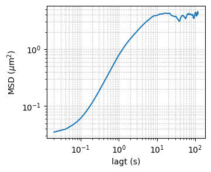
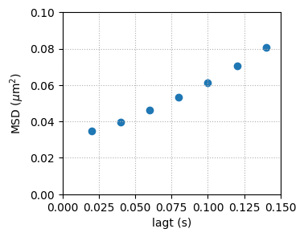
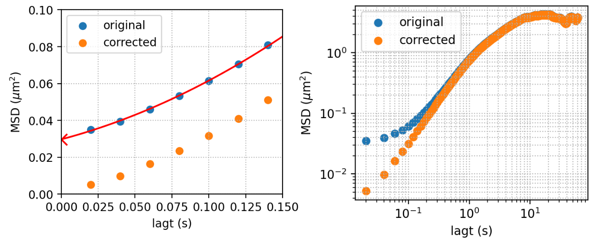
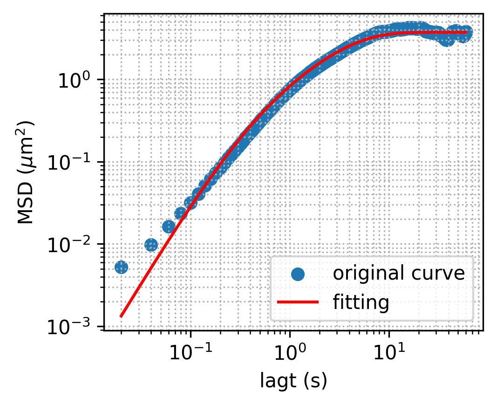

### Deal with detection noise

As noted in the previous note, the detection noise may never disappeared even if we correct our tracking very carefully.

In the past, we have tried to smooth the trajectory data and then compute MSD. While this approach can successfully eliminate the subdiffusive regime in the MSD, it always creates an artificial ballistic regime. Even worse, if the smooth window size is not chosen properly, the artificial time scale can overwrite the time scale from the measurement, making the measurement meaningless.

Hence, we seek a threoretical approach based on reasonable assumptions to minimize the impact of detection noise, while keeping other key features unchanged.

##### Model the detection noise

The detection noise is modeled as an additive white Gaussian noise (AWGN). It has zero mean and the temporal correlation is a delta function of a constant prefactor $A$.

Let $y_i$ be the detected position at $i^{\text{th}}$ frame, $x_i$ be the real position, and $\sigma_i$ be the additive detection noise, we have
$$
y_i = x_i + \sigma_i,
$$
where
$$
\left< \sigma_i \right>  = 0,
$$
$$
\left< \sigma_i\sigma_j \right>  = A\delta_{ij}.
$$

The mean square displacement (MSD) we measure initially is

$$
\left< (y_{i+k} - y_{i})^2 \right> = \frac{1}{n-k} \sum_{i=1}^{n-k} (y_{i+k} - y_i)^2.
$$
Note that both left- and right- hand side expressions are functions of $k$, which is the lag time of the MSD in frame unit. If we substitute the noise model to the equation above, we get

$$
\begin{align}
\begin{split}
\left< (y_{i+k} - y_{i})^2 \right> & = \left< (x_{i+k} - x_{i} + \sigma_{i+k} - \sigma_{i})^2 \right> \\ \nonumber
& = \left< (x_{i+k} - x_{i})^2\right> + \left< (\sigma_{i+k} - \sigma_{i})^2 \right> \\
& = \left< (x_{i+k} - x_{i})^2\right> + \left< \sigma_{i+k}^2 \right> - \left< 2\sigma_{i+k}\sigma_i \right> + \left<  \sigma_{i}^2 \right> \\
& = \left< (x_{i+k} - x_{i})^2\right> + A - 0 + A \\
& = \left< (x_{i+k} - x_{i})^2\right> + 2A  .
\end{split}
\end{align}
$$
The first term on the RHS is the real MSD, and the second term is a constant. This noise model is therefore suggesting that the detected MSD is only different by a constant offset $2A$, which measures the strength of the noise.

##### Obtain the offset

A typical measured MSD of a confined particle immersed in an active bath has the following features:

- subdiffusive regime at short times
- diffusive regime at intermediate times
- saturation regime at long times

If we look closely at the short time regime, in a linear-linear scale, we find that the 0 lag time extrapolation of the curve is not 0, which clearly violates the definition of MSD.

This is the consequence of the unavoidable detection noise $\sigma_i$. In our model, this noise superposes a constant addition on the real MSD, leading to the non-zero MSD at $\Delta t=0$. By definition, we know that $MSD(\Delta t = 0) = 0$. This provides us a way of obtaining the constant offset $2A$:

$$
2A = MSD(\Delta t = 0)
$$

In practice, we extrapolate the measured MSD curve to 0, and the corresponding $y$ value is used as the offset to correct the experimental MSD. The corrected MSD in both log and lin space is shown below:

This approach eliminates the short time subdiffusive regime by a constant offset. Since it does not involve the arbitrary smooth window size, no artificial ballistic regime is introduced.

##### Fit the corrected MSD

The corrected MSD is better fit with our model. Inconsistency only appears at very short time ( $< 0.1$ s), due to the fact that no real ballistic regime is revealed. But other than that, the curve can be fitted very well with the model.

The accurate fitting gives a good estimate of $\tau$, the correlation time of the active noise. In this specific case, $\tau\approx 0.16$ s is very close to our PIV measurement at high bacterial concentration.
