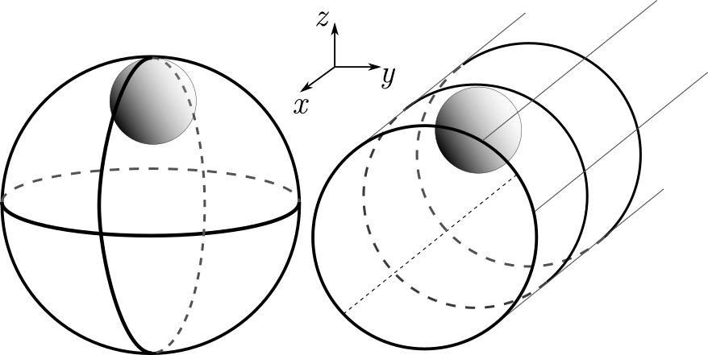

### 1D projection of trajectory and MSD in a sphere

We use the solution of the Langevin equation in Maggi et al. 2014 (MSD) to fit our data. Although the fitting look okay, we need to stress a difference between our experimental geometries, being that their confinement is a cylinder and our confinement is a sphere, which can lead to different solutions. The following sketch shows the different geometries.

For their cylindrical system, the Langevin equation is written as
$$
\mathbf{\dot r} = \mu \mathbf{f(r)} + \mathbf{\eta^A} + \mathbf{\eta^T},
$$
where $\mathbf{f(r)}=(0, -ky)$, basically no restoring force along the flat direction and an approximated spring force along the curved direction. Therefore, they can solve only the $y$-component equation to get $\langle \Delta y^2(t) \rangle$. The solution is the one we have always been using:
$$
\langle \Delta y^2(t) \rangle = \frac{2D_A}{\mu k}\frac{1-e^{-\mu k t} - \mu k\tau (1-e^{-t/\tau})}{1-(\mu k\tau)^2}
$$

We can also decompose the vectors in spherical coordinates:
$$
\dot r = \mu f(r) + \eta^A_r + \eta^T_r \\
r\dot\theta = \eta^A_\theta + \eta^T_\theta
$$

The r-component equation can be solved for $\langle \Delta r^2(t) \rangle$. But I'm not sure if I write the $\theta$-component equation right.

For our spherical system, the original equation has to be modified. Specifically, the restoring force $\mathbf{f(r)}$ depends on both $x$ and $y$ position. Essentially, $\mathbf{f(r)}$ is now isotropic in $xy$-plane, formally $f(r) = kr$, so we can write the Langevin equation as:
$$
\dot r = -\mu k r + \eta^A + \eta^T
$$
where $r = \sqrt{x^2+y^2}$.

We notice that this is almost identical to the $y$-component equation in the cylindrical system, except that the noise magnitude should be twice since we consider two spacial dimensions. The solution is therefore identical in the form, except the prefactor:
$$
\langle \Delta r^2(t) \rangle = \frac{4D_A}{\mu k}\frac{1-e^{-\mu k t} - \mu k\tau (1-e^{-t/\tau})}{1-(\mu k\tau)^2}.
$$

What we observe with confocal is not $\langle \Delta r^2(t) \rangle$, but $\langle \Delta y^2(t) \rangle$. Due to the isotropic nature of the motion, we can connect $\langle \Delta r^2(t) \rangle$ and $\langle \Delta y^2(t) \rangle$ by:
$$
\Delta y(t) = \Delta r(t)\cos\theta,
$$
where $\theta$ is the angle between $\Delta r$ and $y$-axis. It follows:
$$
\langle \Delta y^2(t) \rangle = \langle \Delta r^2(t) \rangle \langle \cos^2\theta\rangle.
$$

Hence, $\langle \Delta y^2(t) \rangle$ and $\langle \Delta r^2(t) \rangle$ take exactly the same form, only has a difference in the prefactor $\langle \cos^2 \theta \rangle=\int_0^{2\pi}P(\theta)\cos^2\theta \,d\theta=\frac{1}{2}$. Interestingly, with this prefactor evaluated, we go back to exactly the same $\langle \Delta y^2(t) \rangle$ as in the cylindrical system.
