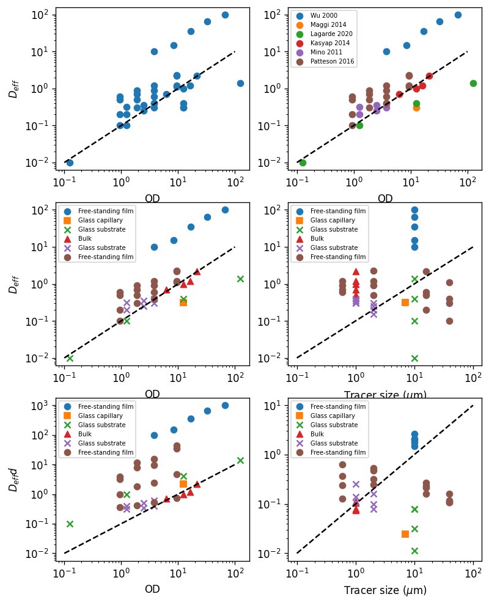

### Diffusivity data from literature

There are a few earlier works trying to measure the active diffusivity (or effective diffusivity). In Wu 2000, they fit the 2-D MSD with
$$
\langle\Delta\vec{r}^2(t)\rangle = 4Dt[1-\exp(-t/t_C)]
$$

In Maggi 2014, they fit 1-D MSD in the unconstrained direction $x$ with
$$
\langle\Delta x^2(t)\rangle = 2D_Tt + 2D_A[t-\tau(1-e^{-t/\tau})].
$$
In the $t\ll\tau$ limit, $1-e^{-t/\tau}\approx t/\tau - t^2/2\tau^2$, so that
$$
\langle\Delta x^2(t)\rangle = 2D_Tt + 2D_A[t-\tau(t/\tau - t^2/2\tau^2)] = 2D_Tt + \frac{D_A}{\tau}t^2
$$

In the diffusive regime, where $t\gg\tau$, the first expression simplifies to
$$
\langle\Delta\vec{r}^2(t)\rangle = 4Dt,
$$
while the second expression simplifies to
$$
\langle\Delta x^2(t)\rangle = 2(D_T+D_A)t.
$$

Note that the prefactor difference comes from the 2-D and 1-D difference. Then we realize that $D_{\text{eff}}$ is equivalent to $D_A+D_T$. If $D_T\ll D_A$, which is usually the case for particles larger than 10 $\mu$m, $D_{\text{eff}}$ is equivalent to $D_A$.

**Aside: diffusivity of 10 $\mu$m particle**

According to Stokes-Einstein relation, the diffusivity of a 10 $\mu$m particle in water is
$$
D = \frac{k_BT}{6\pi\eta R} = \frac{1.38\times 10^{-23} \times 300}{6\pi \times 0.001 \times 5 \times 10^{-6}} = 0.04\,\mu\text{m}^2/\text{s}
$$

while the active diffusivity $D_A$ is typically greater than 0.1 $\mu$m$^2$/s. Therefor,e $D_A\gg D_T$ is true for most scenarios we are concerned.

##### Literature list

1. Wu, Xiao-Lun, and Albert Libchaber. “Particle Diffusion in a Quasi-Two-Dimensional Bacterial Bath.” Physical Review Letters 84, no. 13 (March 27, 2000): 3017–20. https://doi.org/10.1103/PhysRevLett.84.3017.
2. Miño, Gastón, Thomas E. Mallouk, Thierry Darnige, Mauricio Hoyos, Jeremi Dauchet, Jocelyn Dunstan, Rodrigo Soto, Yang Wang, Annie Rousselet, and Eric Clement. “Enhanced Diffusion Due to Active Swimmers at a Solid Surface.” Physical Review Letters 106, no. 4 (January 25, 2011): 048102. https://doi.org/10.1103/PhysRevLett.106.048102.
3. Kasyap, T. V., Donald L. Koch, and Mingming Wu. “Hydrodynamic Tracer Diffusion in Suspensions of Swimming Bacteria.” Physics of Fluids 26, no. 8 (August 2014): 081901. https://doi.org/10.1063/1.4891570.
4. Patteson, Alison E., Arvind Gopinath, Prashant K. Purohit, and Paulo E. Arratia. “Particle Diffusion in Active Fluids Is Non-Monotonic in Size.” Soft Matter 12, no. 8 (2016): 2365–72. https://doi.org/10.1039/C5SM02800K.
5. Lagarde, Antoine, Noémie Dagès, Takahiro Nemoto, Vincent Démery, Denis Bartolo, and Thomas Gibaud. “Colloidal Transport in Bacteria Suspensions: From Bacteria Collision to Anomalous and Enhanced Diffusion.” Soft Matter 16, no. 32 (August 19, 2020): 7503–12. https://doi.org/10.1039/D0SM00309C.
6. Maggi, Claudio, Matteo Paoluzzi, Nicola Pellicciotta, Alessia Lepore, Luca Angelani, and Roberto Di Leonardo. “Generalized Energy Equipartition in Harmonic Oscillators Driven by Active Baths.” Physical Review Letters 113, no. 23 (December 3, 2014): 238303. https://doi.org/10.1103/PhysRevLett.113.238303.

##### Results



##### Code for plotting
```python
# load data
D_data = pd.read_excel(io=r"..\Data\diffusivity_literature.ods")
D_data.head()

# plot data
fig = plt.figure(figsize=(7.5, 10), dpi=120)
ax = fig.add_subplot(321)
ax.scatter(D_data.OD, D_data["Effective diffusivity"])
ax.loglog()
ax.set_xlabel("OD")
ax.set_ylabel(r"$D_{eff}$")
ax.plot([.1, 100], [.01, 10], ls="--", color="black")

# discern data from different works
ax1 = fig.add_subplot(322)
for num, ref in enumerate(D_data["Reference"].drop_duplicates()):
    color = bestcolor(num)
    subdata = D_data.loc[D_data["Reference"]==ref]
    ax1.scatter(subdata.OD, subdata["Effective diffusivity"], label=ref, color=color)
ax1.loglog()
ax1.set_xlabel("OD")
ax1.plot([.1, 100], [.01, 10], ls="--", color="black")
ax1.legend(fontsize=6)

# discern data of different boundary condition
ax2 = fig.add_subplot(323)
es_to_marker = {}
marker_list = ["o", "s", "x", "^"]
for num, es in enumerate(D_data["Experimental system"].drop_duplicates()):
    es_to_marker[es] = marker_list[num]
for num1, ref in enumerate(D_data["Reference"].drop_duplicates()):
    color = bestcolor(num1)
    subdata = D_data.loc[D_data["Reference"]==ref]
    for es in subdata["Experimental system"].drop_duplicates():
        marker = es_to_marker[es]
        subdata1 = subdata.loc[subdata["Experimental system"]==es]
        ax2.scatter(subdata.OD, subdata1["Effective diffusivity"], label=es, color=color, marker=marker)
ax2.loglog()
ax2.set_xlabel("OD")
ax2.set_ylabel(r"$D_{eff}$")
ax2.plot([.1, 100], [.01, 10], ls="--", color="black")
ax2.legend(fontsize=6)

# plot as a function of particle size
ax3 = fig.add_subplot(324)
es_to_marker = {}
marker_list = ["o", "s", "x", "^"]
for num, es in enumerate(D_data["Experimental system"].drop_duplicates()):
    es_to_marker[es] = marker_list[num]
for num1, ref in enumerate(D_data["Reference"].drop_duplicates()):
    color = bestcolor(num1)
    subdata = D_data.loc[D_data["Reference"]==ref]
    for es in subdata["Experimental system"].drop_duplicates():
        marker = es_to_marker[es]
        subdata1 = subdata.loc[subdata["Experimental system"]==es]
        ax3.scatter(subdata["Tracer size"], subdata1["Effective diffusivity"], label=es, color=color, marker=marker)
ax3.loglog()
ax3.set_xlabel("Tracer size ($\mu$m)")
ax3.plot([.1, 100], [.01, 10], ls="--", color="black")
ax3.legend(fontsize=6)

# Rescale D_eff by timing tracer size, plot vs. OD
ax4 = fig.add_subplot(325)
es_to_marker = {}
marker_list = ["o", "s", "x", "^"]
for num, es in enumerate(D_data["Experimental system"].drop_duplicates()):
    es_to_marker[es] = marker_list[num]
for num1, ref in enumerate(D_data["Reference"].drop_duplicates()):
    color = bestcolor(num1)
    subdata = D_data.loc[D_data["Reference"]==ref]
    for es in subdata["Experimental system"].drop_duplicates():
        marker = es_to_marker[es]
        subdata1 = subdata.loc[subdata["Experimental system"]==es]
        ax4.scatter(subdata.OD, subdata1["Effective diffusivity"]*subdata1["Tracer size"], label=es, color=color, marker=marker)
ax4.loglog()
ax4.set_xlabel("OD")
ax4.set_ylabel(r"$D_{eff}d$")
ax4.plot([.1, 100], [.01, 10], ls="--", color="black")
ax4.legend(fontsize=6)

# Rescale D_eff by timing tracer size, plot vs. tracer size
ax5 = fig.add_subplot(326)
es_to_marker = {}
marker_list = ["o", "s", "x", "^"]
for num, es in enumerate(D_data["Experimental system"].drop_duplicates()):
    es_to_marker[es] = marker_list[num]
for num1, ref in enumerate(D_data["Reference"].drop_duplicates()):
    color = bestcolor(num1)
    subdata = D_data.loc[D_data["Reference"]==ref]
    for es in subdata["Experimental system"].drop_duplicates():
        marker = es_to_marker[es]
        subdata1 = subdata.loc[subdata["Experimental system"]==es]
        ax5.scatter(subdata["Tracer size"], subdata1["Effective diffusivity"]/subdata1["OD"], label=es, color=color, marker=marker)
ax5.loglog()
ax5.set_xlabel("Tracer size ($\mu$m)")
ax5.plot([.1, 100], [.01, 10], ls="--", color="black")
ax5.legend(fontsize=6)
```
