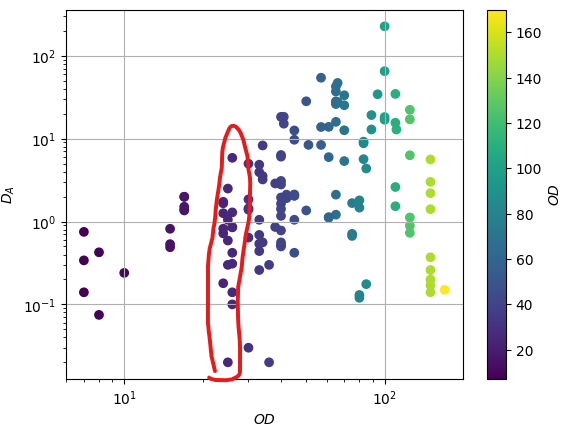
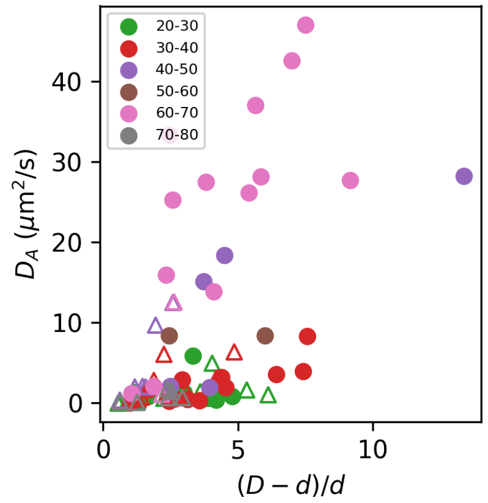
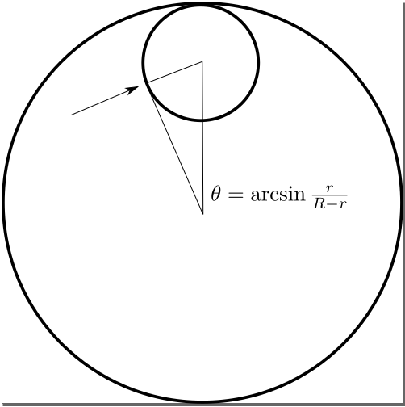
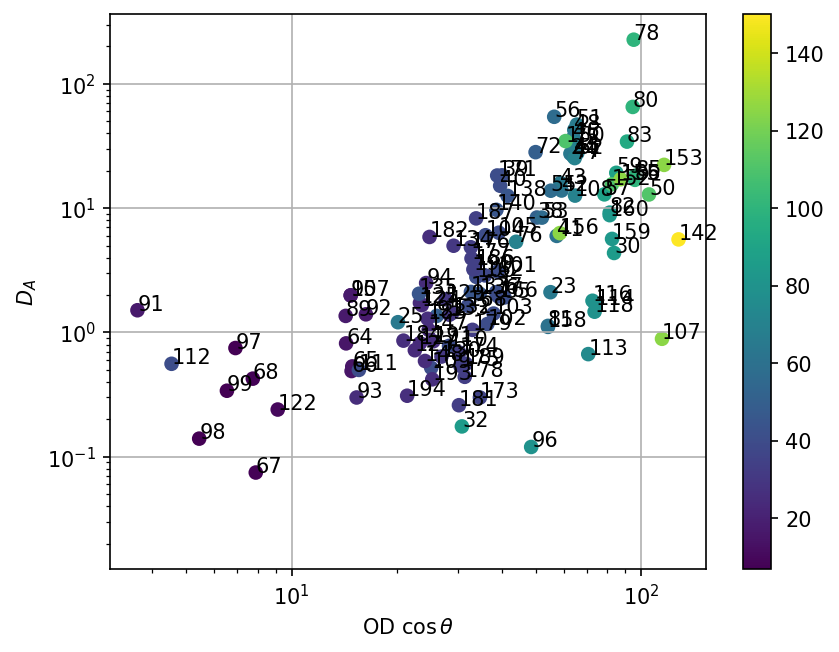

### Collision angle argument to account for the confinement effect

Wu & Libchaber 2000 and Mino et al. 2011 suggest that the active diffusivity depends linearly on the concentration of bacteria. We start with the "active flux" model from Mino et al.:
$$
D_A = D_0 + \beta n v
$$
Assuming we all the bacteria have same velocity and the coefficient $\beta$ is a constant, we can plot $D_A$ vs. $n$ and expect a linear relation. Below is the $D_A$-$n$ plot.

If we look at a vertical slice for constant bacterial concentration, the active diffusivity data significantly scatter. If we believe the constant velocity assumption, as well as the minimal "active flux" model, the only thing that leads to the scattering is the confinement from the double emulsion.

A while ago, we were searching for how confinement modifies $D_A$ at fixed concentrations. We plotted $D_A$ against $(D-d)/d$, and saw a linear dependence (approximately) between the two quantities, see the plot below.

A qualitative message we can get from the data is that: at same bacterial concentration, larger outer droplet size ($D$) tends to give larger active diffusivity. This leads to the following geometrical argument based on collision angle. In this argument, we assume two things:

- all the bacteria interacting with the inner droplet swim in parallel with the outer droplet surface
- only the horizontal component of "flux" contributes to the inner droplet motion

The idea is sketched below:

Consider only the horizontal component of "active flux", the model is modified to:
$$
D_A = D_0 + \beta n v \cos\theta = D_0 + \beta n v\frac{\sqrt{(R-r)^2-r^2}}{R-r}
$$
Note that when $r>R/2$, the square root above goes imaginary. This corresponds to relatively large inner droplets in our data set. In those cases, the diffusivity $D_A$ is mostly very small (\textcolor{red}{need data support}). Therefore, we use a 2-step function $f(R, r)$ as the correction factor to the model:
$$
D_A = D_0 + \beta n v f(R, r)
$$
where
$$
f(R, r) =
\begin{cases}
\frac{\sqrt{(R-r)^2-r^2}}{R-r}, & \text{if}\; r\le R/2 \\
0, & \text{if}\; r > R/2
\end{cases}
$$

Below we plot $D_A$ as a function of $nf(R, r)$:

This correction brings the data points at similar OD closer. For example, at $OD\in[20, 30]$, the original data span more than 2 orders, while now it's only around 1 order. There are still apparent outliers at higher bacterial concentrations, which requires closer inspection.
