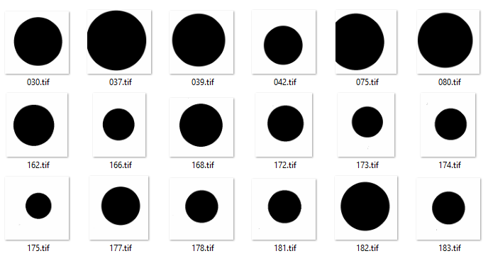

### PIV workflow recap

Recently, I performed PIV analysis on all the double emulsion images and try to have a unified measure of activity to compare across different experiments. The analysis involves the new "compact PIV" data structure, and therefore requires more steps. This note serves as a checklist for this first-time analysis. In the future, it can also help me remember the steps. 

Currently, the data are stored in the following (data&number) folder structure:

```
DE
|-- 01012022
|-- 11122022
    |-- 00.nd2
    |-- 01.nd2
    |-- ...
```
#### 0. Preconfigs

`run.py` script usually requires `os`, `sys` and `pandas`. Since PIV usually takes long time (hours), we should not submit all the jobs at once (if we have more jobs than the number of threads of the CPU, the CPU will need to shift frequently from one job to another, creating a lot of overhead computations and decrease the efficiency). Therefore, we also import `psutil` to check the CPU usage, and only submit jobs when there are available CPU's.

```python
import os
import sys
import pandas
import psutil
```

When performing batch analysis, we use the data in a log file (spreadsheet) to navigate which raw data needs to be analyzed. In the `run.py` script, we need to specify the directory of the log file, as well as the main folder of raw images.

```python
log = pd.read_excel(os.path.abspath("/home/zhengyang/Documents/GitHub/DE/Data/structured_log_DE.ods"), sheet_name="main")
master_folder = "/home/zhengyang/drives/DE"
```
#### 1. Generate preview images
To double check the quality of an experiment, we generate preview images of each nd2 file. Typically, we check if the droplet moves during the course of the video. Other aspects can also be checked.

```python
for num, i in log.iterrows():
    nd2Dir = os.path.join(master_folder, "{}".format(i.Date.strftime("%m%d%Y")), "{:02d}.nd2".format(i["Video#"]))
    if os.path.exists(nd2Dir):
        os.system("python gen_preview.py {0} ".format(nd2Dir))
```

#### 2. Run PIV on nd2 images

```python
for num, i in log.iterrows():
    while psutil.cpu_percent() > 90:
        print("CPU usage too high: {:.1f}, wait".format(psutil.cpu_percent()))
        time.sleep(300) # sleep for 5 min if cpu usage is higher than 90%
    nd2Dir = os.path.join(master_folder, "{}".format(i.Date.strftime("%m%d%Y")), "{:02d}.nd2".format(i["Video#"]))
    folder, filename = os.path.split(nd2Dir)
    if os.path.exists(nd2Dir):
        winsize = int(5.12/i.MPP) # set 32 pix for 40X lens, which corresponds to 5.12 um
        dt = 1 / i.FPS
        save_folder = os.path.join(folder, "PIV", filename.split(".")[0])
        os.system("python PIV.py {0} ".format(nd2Dir, winsize, dt, save_folder))
```

#### 3. Create masks

From the preview images, we can create masks to filter out velocities outside the droplets. This can be down easily in ImageJ. Masks should be gray images with the same shape as the raw images.

The mask folder looks like this:

  


#### 4. Apply masks

```python
mask_folder = os.path.join(master_folder, "mask")
for num, i in log.iterrows():
    while psutil.cpu_percent() > 90:
        print("CPU usage too high: {:.1f}, wait".format(psutil.cpu_percent()))
        time.sleep(300) # sleep for 5 min if cpu usage is higher than 90%
    piv_folder = os.path.join(master_folder, i.Date.strftime("%m%d%Y"), "PIV", "{:02d}".format(i["Video#"]))
    mask_dir = os.path.join(mask_folder, "{:03d}.tif".format(i["DE#"]))
    if os.path.exists(piv_folder) and os.path.exists(mask_dir):
        os.system("python apply_mask.py {0} {1}".format(piv_folder, mask_dir))
```

#### 5. Wrap PIV data into .mat files

```python
for num, i in log.iterrows():
    while psutil.cpu_percent() > 90:
        print("CPU usage too high: {:.1f}, wait".format(psutil.cpu_percent()))
        time.sleep(300) # sleep for 5 min if cpu usage is higher than 90%
    piv_folder = os.path.join(master_folder, i.Date.strftime("%m%d%Y"), "PIV", "{:02d}".format(i["Video#"]))
    mask_dir = os.path.join(mask_folder, "{:03d}.tif".format(i["DE#"]))
    if os.path.exists(piv_folder) and os.path.exists(mask_dir):
        os.system("python wrap_piv.py {0} &".format(piv_folder))
```

#### 6. Downstream analysis: mean velocity, autocorrelation functions, etc.

Following the adoption of `compact_PIV`, all the downstream codes need to be modified. 