### Batch PIV in Chile

Transferring terabytes of data turns out to be very difficult. In order to ensure unified PIV treatment on all the images, I will write an easy to use script and let Cristian run on his local data. The job should be a faithful replicate of what I have done in Paris. Below is a step-by-step guide.

##### 1. Install libraries and scripts

First, install `myimagelib` package, which contains many utility functions I've written over the years:
```
pip install myimagelib --upgrade
```

Then, unzip all the scripts to a local folder. Here's a checklist of the scripts:

- [ ] gen_preview.py
- [ ] PIV.py
- [ ] apply_mask.py
- [ ] wrap_piv.py
- [ ] batch_gen_preview.py
- [ ] run.py

##### 2. Prepare data

All the nd2 videos should be put in the same folder, say `nd2`. The expected folder structure is

```
|-- nd2
    |-- 000.nd2
    |-- 001.nd2
    |-- ...
    --- (The following directories will be generated by the scripts) ---
    |-- preview
        |-- 000.tif
        |-- 001.tif
    |-- mask
        |-- 000.tif
        |-- 001.tif
    |-- PIV
        |-- 000.mat
        |-- 001.mat
```

Initially, we have only nd2 files in the folder nd2. `batch_gen_preview.py` will produce folder `preview`. Then duplicate the preview folder and rename as `mask`. Then use ImageJ to draw binary masks based on the preview images.

Then `run.py` will perform PIV analysis on all the nd2 videos, and create `PIV` folder. 

##### 3. Generate preview

In your commandline tool (`cmd`), `cd` to the directory where the scripts are saved. For example, on my computer it is `C:\Users\liuzy\Documents\Github\script`.

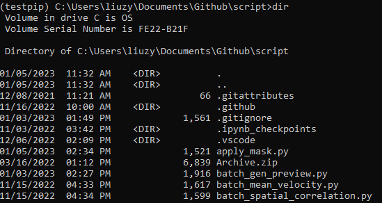  

Then run the following command:
```
python batch_gen_preview.py /your/folder/nd2
```
Here you need to specify the directory of the nd2 folder. In case you have white spaces in the directory, use full quotation marks (`""`) to enclose the directory. 

If the script executes correctly, you should see some info strings like:

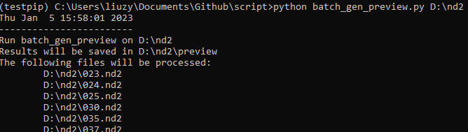  

##### 4. Make masks

1. Duplicate the preview folder
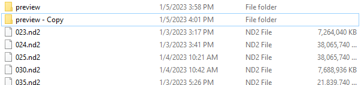  
2. Rename it as `mask`
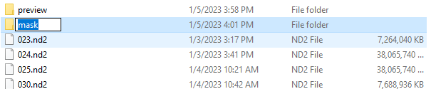  
3. Enter `mask` folder, open the first tif with ImageJ
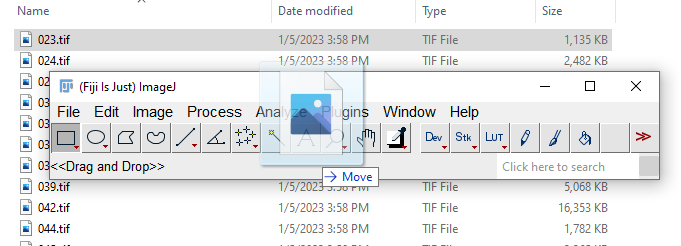  
4. Check if the positions of outer droplet are consistent in the two frames (they are the first and the last frames of the original video).
5. If OK, duplicate the first frame with `Ctrl+Shift+D`, uncheck "Duplicate stack" and set range to 1.
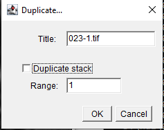  
6. In the duplicated frame, use circle tool to select a circle that overlaps with the outer droplet edge.
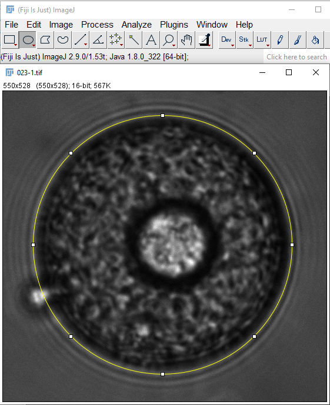  
7. Fill the circle with white color (`Ctrl+F`)
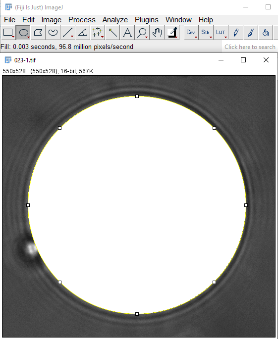  
8. Open Image->Adjust->Threshold menu.
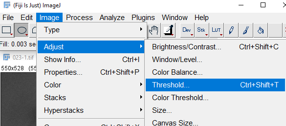  
9. Set algorithm to "Triangle", check "Dark background", then click "Auto" and "Apply".
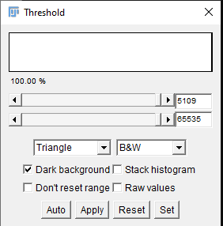  
10. Double check if the droplet part has large values and the outside part has small values. Then save the image to overwrite the original preview image. 
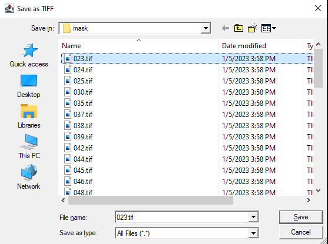  
11. Repeat this procedure to all the previews. Eventually the mask folder will look like this:
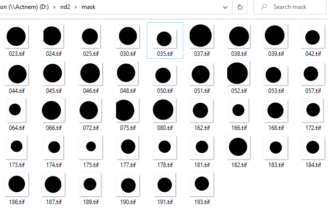  

##### 5. Execute `run.py`

`run.py` consists of PIV, applying mask and wrapping PIV into compact form. It should be executed only after mask preparation (step 4), since masks are need for this script.

```
python run.py /your/folder/nd2
```

Once finished, you will have a `PIV` folder under your `nd2` folder, filled with xxx.mat files. Send them to me and I will do the downstream analysis. Also you are welcome to play around with the data!