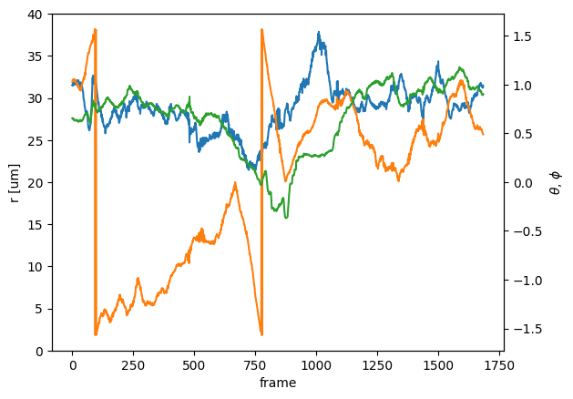
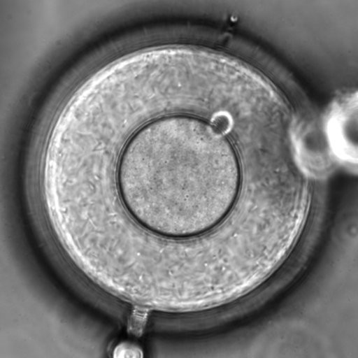

# Aug 13, 2021 Research Log

## 1. Effective temperature
See [the note on Diffusivity and Effective temperature](../../Notes/Diffusivity)

## 2. Learn confocal from Mengshi
We are able to rotate the microscope to observe the sample from an angle perpendicular to gravity. A gas valve controls the angular motion.

## 3. Motion in spherical coordinates
See the graphical abstract above.

## 4. DE device issues

### Low encapsulation rate
Several new devices are not as good as the previous one I used in mid-July.
At the same set of flow rates, I cannot produce DE's of same dimensions.
The most obvious thing that has changed is the **encapsulation rate**.
Previously, with in a range of flow rates, I can achieve ~100% encapsulation.
With the new devices, no matter what flow rate I operate the device at, the encapsulation rate is low.

I presume the issue comes from the imperfect geometry of the devices.
Pay attention to device geometry and try to find the characteristics of a good device in future experiments.

On Aug 13, I tried 1 ml syringe for the inner flow (which typically operates at 50 ul/h, a very low flow rate for 10 ml syringe). This improves the encapsulation rate, indicating that the issue is in part due to the unstable flows.

### Satellite droplets
The double emulsions are usually not perfect, but have one or more much smaller droplets inside the outer droplets. These small droplets are likely due to the *satellite* droplet phenomenon, generic to jets under Rayleigh-Plateau instability. Despite their small size, they may affect the motion of the "main" inner droplet considerably. Seek for a solution to avoid these small droplets.

