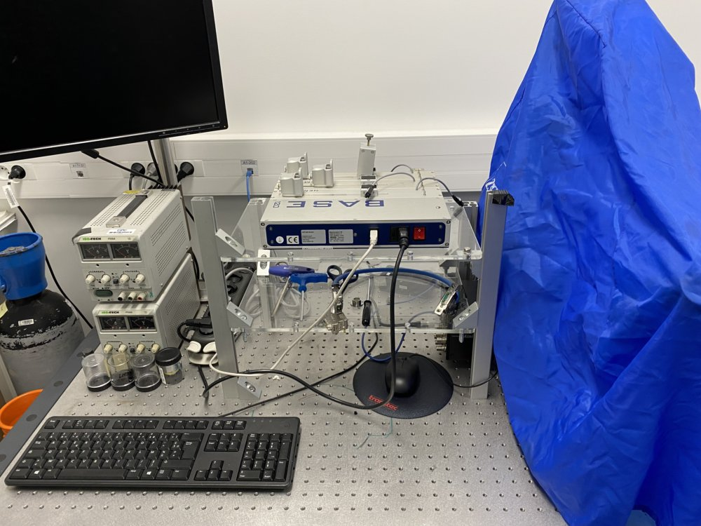
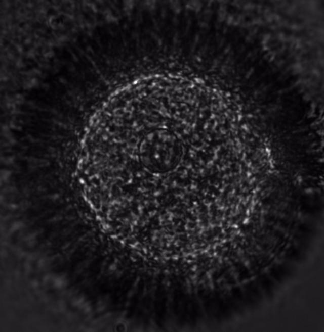
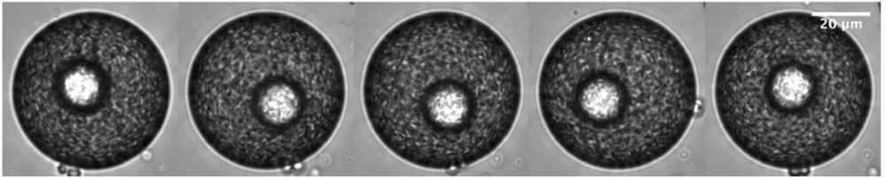

# Weekly Research Log
July 09, 2021
## General
This week I continued the test on the capillary devices and was able to generate double emulsions with only one inner droplet.
It's in part due to the revision of the density fluctuation paper, as well as traveling around Paris, that I stopped updating the research log. 
The research on double emulsion was not ceased.
I was just too lazy to keep the log every week.
Nevertheless, having some records is beneficial in long term.
So I'm doing one more here, at the beginning of July.

## Research
These 3 weeks, I have been setting up the double emulsion microfluidic device in the PMMH lab.
The motivation for doing it is the microscope availability issue at Gulliver.
At Gulliver, only the confocal is capable of doing fluorescence imaging.
However, the schedule was tight and I am still not yet trained to use it.
The only microscope I was trained to use by Martina and Martyna was not capable of taking videos.
Although it's ok to take quick looks at samples, it's not sufficient for serious analysis of data.
Thus, I decided to move the system to PMMH, where better microscopes are available.
Below is a picture of the system I set up.

It's basically a duplicate of the 3-pump system at Gulliver, using different models of pumps.
We don't own a highspeed camera in the Clement Group, but Eric managed to borrow one from another lab.
With this camera I can take high quality pictures and videos of double emulsion, see example below.

Using the other Zeiss microscope in the same room equipped with a Hamamatsu camera, I can observe the double emulsions using higher magnification lenses.
High quality images are again obtained, where the motion of inner drop can be tracked.

I also have requested some documents from Cristian, where he described his experiment and simulation in detail.
Although I have not read every detail in them, I realize that I have exactly the same challenge as he has - the collection of DE's.

## Problems
### Collecting DE's
Inside the microfluidic device, the double emulsions are well seperated and the sizes are well controlled.
However, when I collect them in a glass slide chamber, most coalesce and I can hardly find an intact drop as in the device.

There are two approaches to improve the collection method:
- improve the stability from the inside of the double emulsion
- make the outside environment more "friendly"

I have tried the second approach by making my collection glass slides hydrophobic, by applying Aquapel.
The result was not satisfactory.
There are more things I can try.
For example, adding a polymeric surfactant Pluronic-F127 may improve the stability, following the first approach.
A literature research is needed and more possible solutions should be explored.

### Tracking of the inner drop
The visibility of inner drop in my image is far behind that of the images taken by Cristian (below).

In his images, the inner drops are very bright.
It might be due to the addition of fluorescent dyes, which is not present in his documents.
I will try to add some [Nile Red](https://en.wikipedia.org/wiki/Nile_red) to the inner phase (hexadecane).

## Additional thought
### The role of the research logs
I've been thinking why I write things at different places: research logs, blogs, study notes and protocols.
The purpose of research logs is to remind myself what I was doing in a certain period of time.
This can potentially help me to focus.
They don't need to be very detailed, but need to be broad.
Blogs are not necessarily research related, and can help me think about long term problems, like how to focus.
Study notes have specific topics and should be detailed.
Protocols should be maintained regularly to reflect the most up-to-date methods of experiment.
