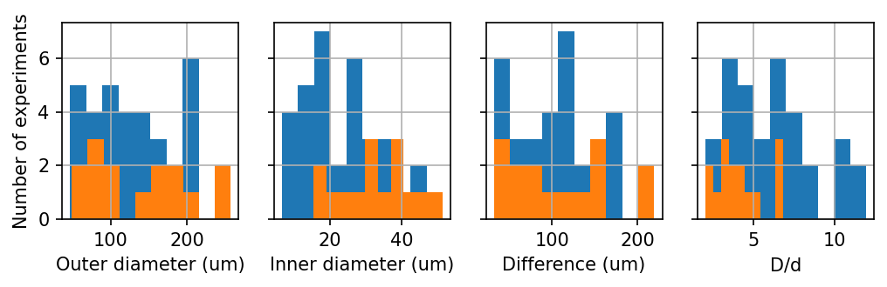
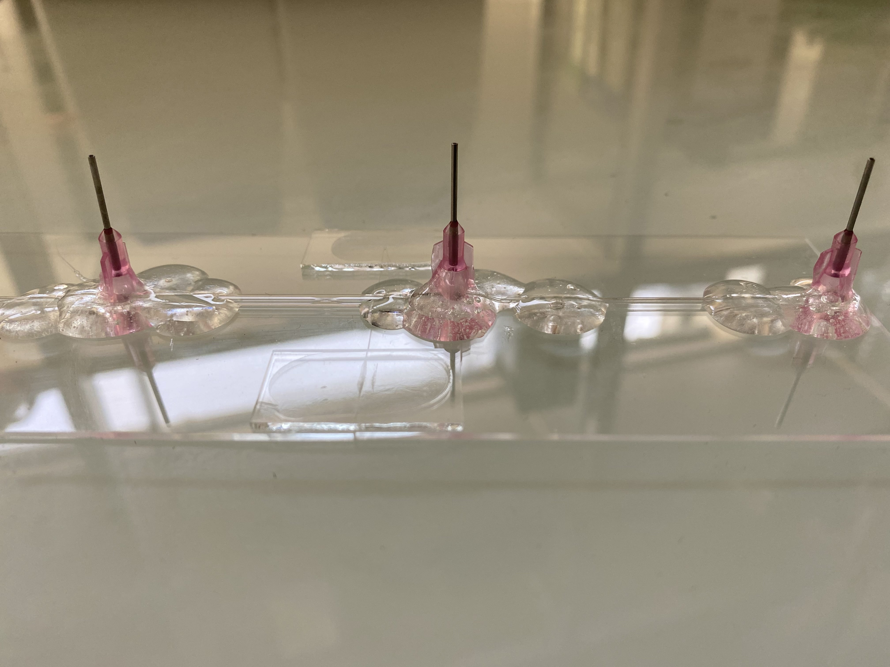

# Research Log November 5, 2021

## Results

### 1. Videos of double emulsions in X-Z plane

How many, distribution of inner and outer sizes

##### Some interesting observations

- Droplets sometimes suspend in the middle, instead of falling to the bottom [[video]](https://drive.google.com/file/d/1Ez53i1fpOHm_dpOOg7TctQUnP-h840ic/view?usp=sharing)
- Inner droplets disappear after several minutes of imaging [[video]](https://drive.google.com/file/d/1x2-R9Q-4yt_RF7itIDZVpICp19f4wjie/view?usp=sharing)
- A trick to produce double emulsions in microscope specimen: tapping [[video]](https://drive.google.com/file/d/17MzMtGCHkqfK-UjqAf7ESyY3mBHYoSir/view?usp=sharing)

##### Preliminary analysis of the X-Z videos (will discuss in the meeting with slides)

##### Parameter space

### 2. Device is under development

Cut the base of syringe needles to reduce the volume inside the device. Easier to clog the device when applying glue.

## Questions

### 1. Improve the image quality for tracking
- Fluorescent dye for oil droplets?
  - We tried **Oil Red O**. It's red without fluorescence. The contrast between inner droplets and surrounding bacteria is not improved much.
  - We tried **fluorescent bacteria** and image using only laser, the contrast is not satisfactory. [[video]](https://drive.google.com/file/d/1T3BTf3KnROhvhnknCPQJSrdPpFEBYtKv/view?usp=sharing)

### 2. Confocal disk speed limits our imaging FPS.
