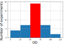
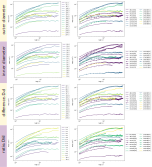
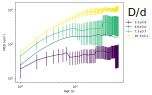

# Research Log November 19, 2021
We summarize the inner droplet motion data and get more data from tracking 2 um PS particles in bacterial droplets.

## Results

### 1. Inner droplets of double emulsions (hand tracking at 1 frame per second)

Experiments are performed at various outer diameters (D), inner diameters (d) and bacterial concentrations (OD). Among the three parameters, we have the best control over OD since we can do dilution during the bacterial sample preparation. Therefore, the preliminary experiments, **we keep OD roughly constant and study the effects of geometry (outer and inner droplet sizes).**

The OD distribution of our experiments is shown below:

We have 19 runs within the OD range (50, 75). The size distribution of these 19 runs is shown below:

We have multiple runs for almost all the brackets of different size parameters. Let's compare the diffusivity, see which parameter groups the diffusion curves best. **Intuitively, large outer droplet + small inner droplet together give rise to high diffusivity. That is, a larger difference (D-d) or ratio (D/d) would correspond to higher MSD curve.**

The MSD curves are summarized in the following figure, by grouping the curves by outer diameter, inner diameter, difference and ratio.

Indeed, for the regrouping based on size ratios (D/d), we see a monotonic increasing of the magnitude of MSD curve with D/d. If we average the runs within each group, the plot gets cleaner:

The trend of the MSD magnitude (wrt size ratio D/d) is consistent with our intuition. More information can be extracted from the motion of the inner droplets: **the time scale where transitions from ballistic to diffusive to confined motion happens (2->1->0).** However, these information requires a more time resolved trajectory, which is beyond the capability of manual tracking. A model which captures these transitions in MSD is also needed, so we have a systematic way to fit the data, and understand the origin of the phenomena.

### 2. 2 um particle motion in bacterial droplets

### 3. Prototype of the W/O/W double emulsion experiment

## A list of videos

Videos are for entertainment. Here is a list.

Particles on the surface of "active droplet"

3D reconstruction of a Z-scan pancake
