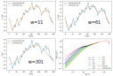

# Research log October 25, 2021

## Results
### 1. Device with smaller oriface
During the past two weeks (10/11-10/24), I start to work on the capillary microfluidic devices with **smaller oriface** at the inlet tapered tips. Some technical issues are encountered, for example [wetting problem](https://drive.google.com/file/d/14PdT1iwlVyy2smhgbYBcu0nY8JnMUhlZ/view?usp=sharing) and clogging. But we manage to generate smaller inner droplets.

With this device we produce many double emulsions of uniform size.

### 2. Measure the noise in active bath
The motion of a droplet in active baths is modeled as an exponentially correlated noise.
Our experiment with neutrally buoyant particles in bacterial suspensions verifies this model.

### 3. Necking [[video]](https://drive.google.com/file/d/1gL8pQmgUWLkIWdlLymVFsNHLYxo7o6DH/view?usp=sharing)

We took a video of necking bacterial suspensions in the microfluidic device at OD ~40.

## Questions
### 1. Weird motion observed in double emulsions without bacteria [[video]](https://drive.google.com/file/d/1UOQRxZ9zzvxmubj8-G0pvQAjW6pS5U-d/view?usp=sharing)
We prepare double emulsions with only water, oil and surfactants. Some unexpected particulates are fluctuating in the inner droplet.

### 2. Cluster in droplets [[video]](https://drive.google.com/file/d/1osAjwdYmdSvJW0GEY1hOp8bxK6GFaplL/view?usp=sharing)
The cluster does not grow over half an hour, so it's likely that the formation of the cluster is prior to the droplet encapsulation. We also found last Thursday that the cluster issue can be reduced significantly by harvesting bacteria when the OD is around 0.5. How effective this is in droplet remains to be tested.

### 3. Smoothing in trajectory analysis
When comparing the results of trajectory analysis, we realize that the smoothing scheme has a significant influence. For example in MSD, the larger smoothing window we use, the smaller the short time displacement. **How to determine a good and unarbitrary smoothing scheme?**

### 4. Bacterial suspension goes through water via a thin stream
The same problem we discussed last time. I thought it was an oil problem, but realized that even if I fill the device with water and start inject bacterial suspensions first, I still have this problem. This may result in concentration difference in the prepared suspensions and the suspensions in droplets.

### 5. Droplet size control
In the dripping regime, inner droplet size remains constant (roughly). So it's possible to investigate the effect of outer curvature while keeping constant inner curvature. However, keeping outer constant while varying inner remains challenging.

## Plans
### 1. Investigate outer curvature effect in double emulsions
We can fix the inner droplet size with the microfluidic device.

### 2. Manually focus inner droplets in future confocal imaging
Even without the tracking system, it is better to manually keep the inner droplets in focus because the subsequent image analysis will be easier.

### 3. A lot of 2D trajectory data in x-y and x-z [[video]](https://drive.google.com/file/d/11GrSBeDcYSCBOc6Ivlsi0lKb_ykynC2F/view?usp=sharing)
Suggestions on how to make a clean surface to image the side view of the droplets?
