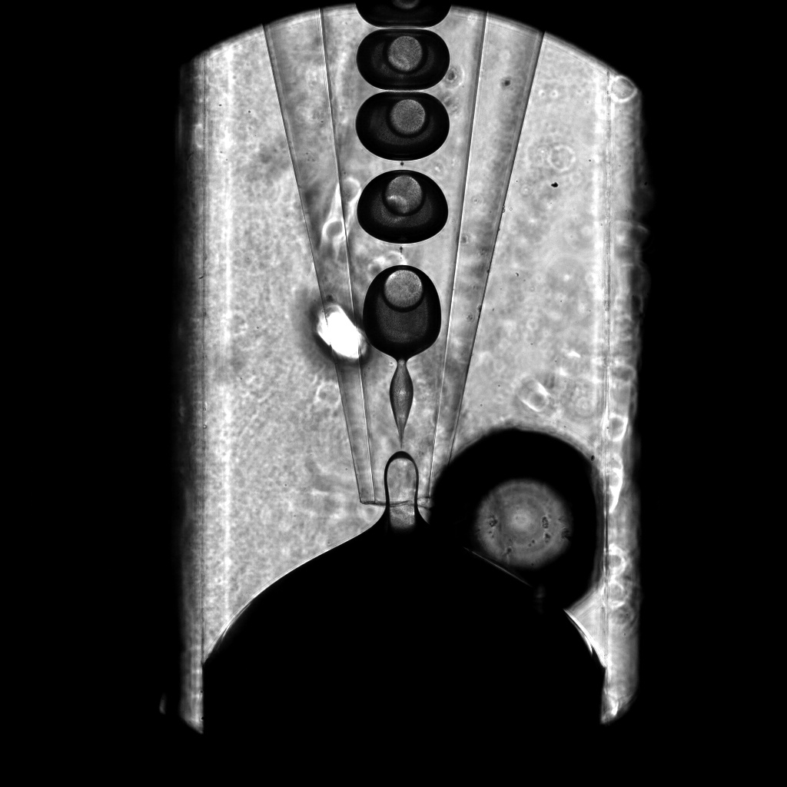
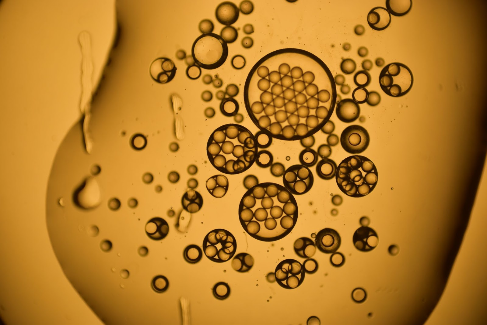

# Log
My research logs for DE project.
Summarize the progress regularly to remind myself the next steps.

## Updates
- June 06, 2021: it's good to have a graphical abstract for each log to highlight the progress.

## Folder structure
```
|- Log
  README.md (the main log, contains guidelines and snapshots of date logs)
  |- mmdd-yyyy
  |- mmdd-yyyy
  |- mmdd-yyyy
  |- ... (date logs)  
```
## Snapshots

### July 09, 2021
<a href="July09-2021"></a>
### June 06, 2021
<a href="June06-2021"></a>
