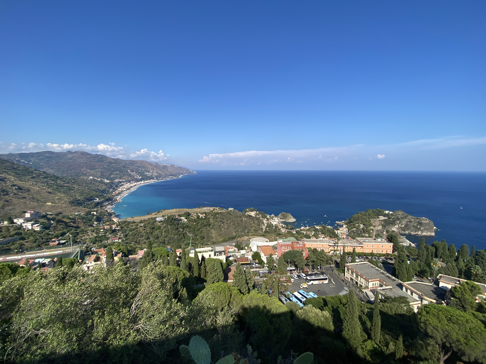
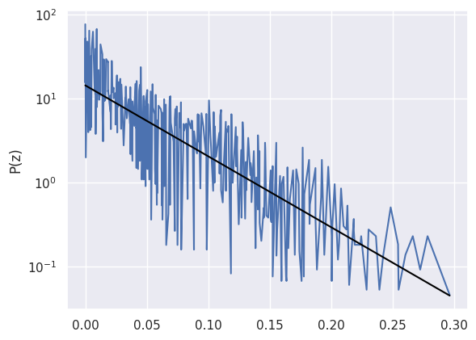
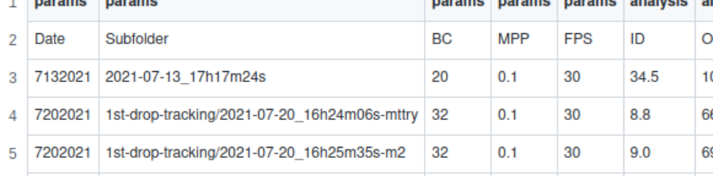
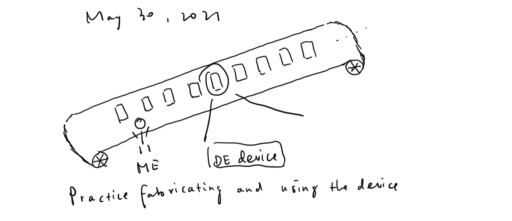
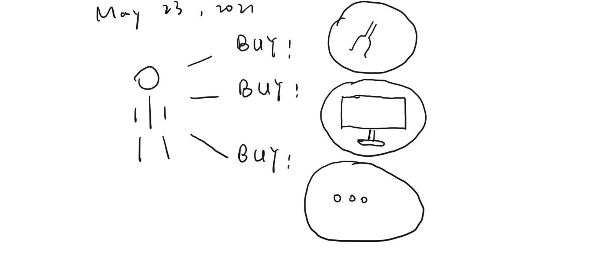
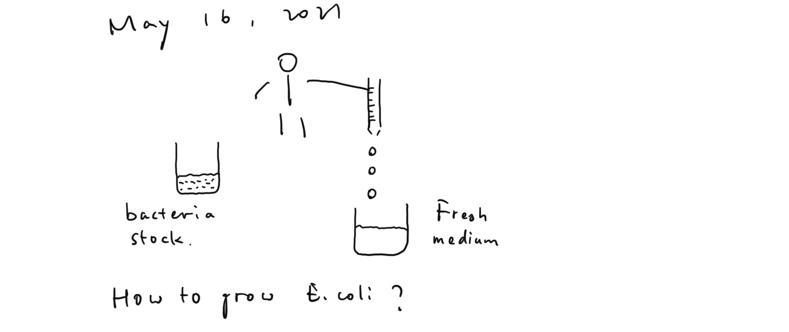
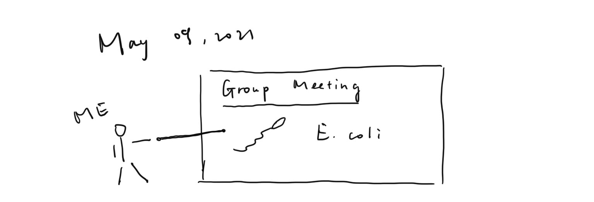
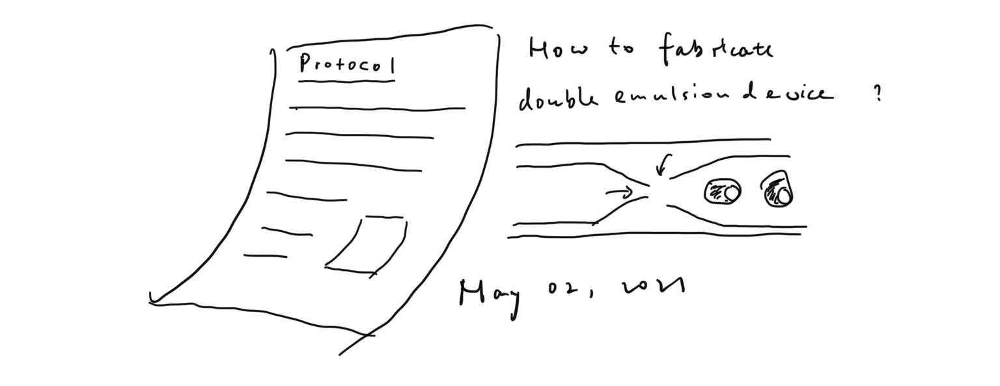
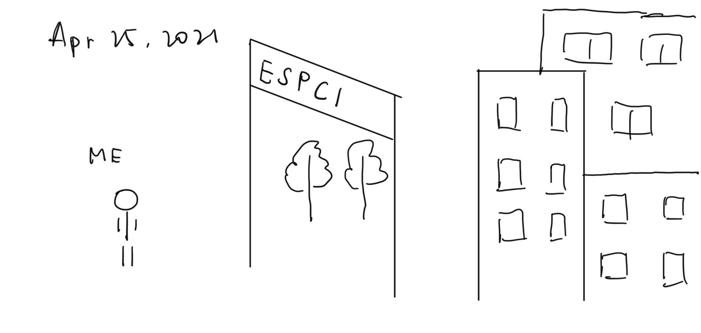

# Log
My research logs for DE project.
Summarize the progress regularly to remind myself the next steps.

## Updates
- June 06, 2021: it's good to have a graphical abstract for each log to highlight the progress.
- Jan 12, 2022: folder structure change, I no longer use a folder for each log. Instead, each log will just be a .md file under the main "Log" folder. With the help of Markdown writer, images are handled with much more ease and no longer need to be in the same folder as the log. There is no need to update the content in this doc, because the logs are already very handy if I'm in this directory.

## Folder structure
```
|- Log
  README.md (the main log, contains guidelines and snapshots of date logs)
  |- mmdd-yyyy (deprecated Jan 12, 2022)
  yyyymmdd.md
  yyyymmdd.md
```

## Contents
- Date + short description + picture

### Sept 24, 2021: Trip to Bordeaux (Gulliver)
<a href="Sept24-2021"></a>
### Sept 17, 2021: Trip to Italy
<a href="Sept17-2021"></a>
### Sept 03, 2021: Meeting with supervisors
### Aug 27, 2021: Write MSCA proposal
<a href="Aug27-2021"></a>

### Aug 20, 2021: Fit *z* position to Boltzmann distribution
<a href="Aug20-2021"></a>

### Aug 13, 2021: Effective temperature, puzzling
<a href="Aug13-2021"></a>

### Aug 06, 2021: Meeting with Anke, data table
<a href="Aug06-2021"></a>

### July 30, 2021: Visualize inner and outer droplets
<a href="July30-2021"></a>

### July 23, 2021: 3D trajectory
<a href="July23-2021"></a>

### July 16, 2021: size control
<a href="July16-2021"></a>

### July 09, 2021: generate double emulsion in PMMH
<a href="July09-2021"></a>

### June 06, 2021: generate double emulsion
<a href="June06-2021"></a>

### May 30, 2021: practice with the device
<a href="May30-2021"></a>

### May 23, 2021: buy!
<a href="May23-2021"></a>

### May 16, 2021: learn bacteria
<a href="May16-2021"></a>

### May 09, 2021: group meeting
<a href="May09-2021"></a>

### May 02, 2021: learn DE device
<a href="May02-2021"></a>

### April 25, 2021: arrive at ESPCI
<a href="April25-2021"></a>
