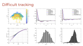
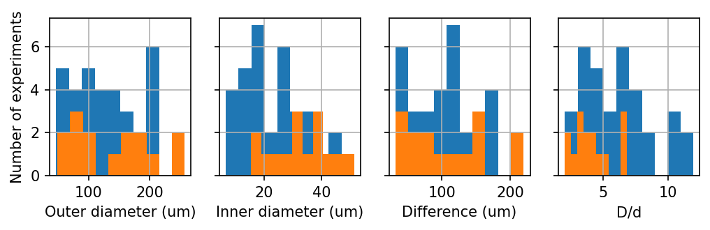
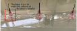
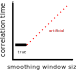
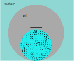

# Research Log November 5, 2021

## Results

### 1. Videos of double emulsions in X-Z plane

##### Some interesting observations

- **Droplets suspend** in the middle sometimes, instead of falling to the bottom [[video]](https://drive.google.com/file/d/1Ez53i1fpOHm_dpOOg7TctQUnP-h840ic/view?usp=sharing)
- **Inner droplets disappear** after several minutes of imaging [[video]](https://drive.google.com/file/d/1x2-R9Q-4yt_RF7itIDZVpICp19f4wjie/view?usp=sharing)
- A trick to produce double emulsions in microscope specimen: **tapping** [[video]](https://drive.google.com/file/d/1I5yhVX9U4lV9AFpVKsskS2nauE08BxFf/view?usp=sharing)

##### Preliminary analysis of the X-Z videos (47/10[42])

##### Parameter space (orange denotes "easy to analyze")

### 2. Device is under development

Cut the base of syringe needles to reduce the volume inside the device. Easier to clog the device when applying glue.

## Questions

### 1. Improve the image quality for tracking
- Fluorescent dye for oil droplets?
  - We tried **Oil Red O**. It's red without fluorescence. The contrast between inner droplets and surrounding bacteria is not improved much.
  - We tried **fluorescent bacteria** and image using only laser, the contrast is not satisfactory. [[video]](https://drive.google.com/file/d/1T3BTf3KnROhvhnknCPQJSrdPpFEBYtKv/view?usp=sharing)

### 2. Confocal disk speed limits our imaging FPS.

## Feedbacks

### 1. particle dynamics in confined bacterial suspensions

After the discussion on the **1 micron particle dynamics in confined bacterial suspensions**, some questions can be asked:
- **In the short time regime, all the MSD curves collapse, regardless of bacterial concentration (OD) and droplet size. Is this also true for unconfined bacterial suspensions? What are the bacteria really doing in droplets and how exactly they interact with passive particles?** To tackle these questions, we will (i) study the dynamics of particles in bulk bacterial suspensions of different concentrations and (ii) study the flow fields of bacterial suspensions in droplets of different sizes at different concentrations. *#In the collective motion regime, the short time dynamics might be universal.*
- **Smoothing trajectory data is necessary, since it removes unphysically large fluctuations at short times. However, over-smoothing can lead to artificial coherence in the motion, which hinders the real fluctuations in the system. The question is: what is the best way to smooth the trajectory data?** After discussion, we realized that this parameter can be chosen by experimenting some smoothing window sizes. The criterion for a good window size is: **the smoothing window size does not affect the velocity correlation time**. As visualized in the sketch below, when smoothing window size is very small, the measured correlation time should be independent of the choice of the window size. When the window size is so large that it exceeds the real time scale of the particle dynamics, the measured correlation time will become dependent on the choice of window size.

### 2. Suspended droplets

The [**suspended droplet**](https://drive.google.com/file/d/1Ez53i1fpOHm_dpOOg7TctQUnP-h840ic/view?usp=sharing)  also raised some questions and hypotheses. It is not clear to us how the gravity is balanced, but the next we see this phenomenon, the following should be carefully checked:
- **wetting:** is the droplet wetting any surface of the glass chamber?
- **flow:** the flow generated by bacterial collective motion in the droplets can lead to drag force, which helps the big aqueous droplets suspend in lighter oil. Though, it would be a surprise to me if this drag can completely counter the gravity.

### 3. Active droplets

Ideas about **active droplets** were exchanged. A fun experiment conceived by Cristian is to study the fluctuations of a bacterial droplet confined in an oil droplet, as sketched below. This W/O/W double emulsion system provides a well defined potential well for the **active droplet** and thus makes quantifying the activity possible. The W/O/W double emulsions are more stable compared to the inverse (O/W/O) double emulsions. [Fluctuations (several microns) of bacterial droplets](https://drive.google.com/file/d/1I4tMaZw23_NutxnIyEoQMw4HjDgfd-a1/view?usp=sharing) have already been observed in O/W/O double emulsion systems.

# Plans

- Experiment
  - More inner droplet videos to **fill the parameter space**
  - **3D tracking of fluorescent particles** in confined and unconfined bacterial suspensions, to answer the questions we raised in [particle dynamics in confined bacterial suspensions](#1.-particle-dynamics-in-confined-bacterial-suspensions). The following experiment can help us understand the data better:
    - the dynamics of particles in bulk bacterial suspensions of different concentrations
    - the flow fields of bacterial suspensions in droplets of different sizes at different concentrations
    - dynamics of particles before the onset of collective motions
  - Test new devices
- Analysis
  - Determine a good smoothing window size by examining the relation between **correlation time** and **smoothing window size**
  - Analyze inner droplet motions in the videos we already have
