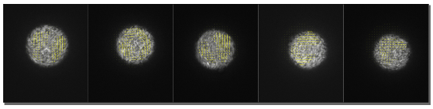
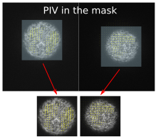
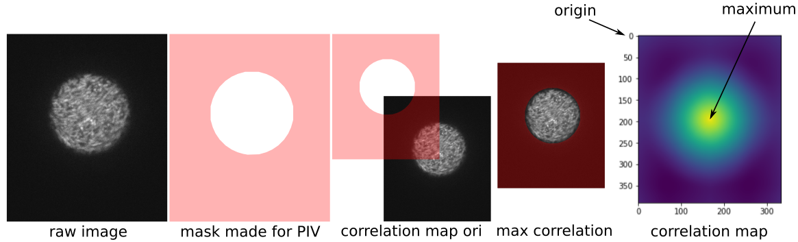
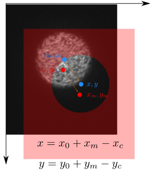
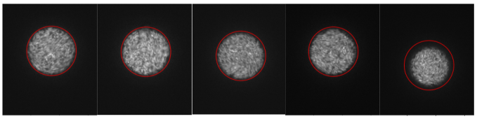
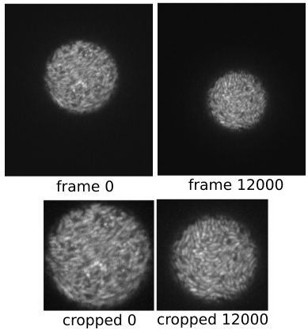
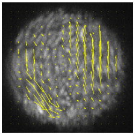

### Moving mask, droplet frame PIV

I've been doing fixed mask PIV on droplet videos. Although it helps me extract mean velocity and other useful information, it has problems when droplets are moving out of the predefined fixed mask, as illustrated below (see full video [here](https://drive.google.com/file/d/1dVpFt5QnkcqWwfzX6QjP6YFnP3_k2dvq/view?usp=sharing)).

One way to eliminate the droplet motion from PIV is to use a moving mask, and do PIV using image pairs only inside the mask. The following picture illustrate this idea:

To achieve this, we need to first determine the mask position on each frame, i.e. the trajectory of the mask. Then, we use this position to crop each frame. Finally, we perform PIV on the sequence of cropped images.

##### Determine mask trajectory

(Use 01192022/16 data to test)

The most natural tracking method that comes to my mind is the cross correlation tracking. In the confocal images, the droplets are bright and have well defined circular shape. Outside the droplets, everything is dark, so the chance to detect a false peak in the correlation map is minimal. A small test shows that this is indeed the case.

The origin of the correlation map corresponds to the case where the center of the mask coincide with the upper left corner of the image. For the first image, from which we make the mask, the maximum of correlation, $(x_m, y_m)$, appears at the exact center of the correlation map, $(x_c, y_c)$. We want to determine the position of the droplet, $(x, y)$. In the first image, this can be done manually done as a calibration, to have the initial position of the droplet $(x_0, y_0)$. In the following images, the displacement of the droplet is equivalent to the displacement of correlation maximum position, as illustrated in the sketch below.

We measure from the first image $(x_0, y_0)$ and $(x_c, y_c)$. Notice that by definition, $(x_c, y_c)$ should be close to the center of the image $(w/2, h/2)$, where $w$ and $h$ are the width and height of the image. Then, $(x_m, y_m)$ can be measured by performing cross correlation and peak finding on each frame. The trajectory of droplet, $(x, y)$, can finally be recovered by

$$
x = x_0 + x_m - x_c \\
y = y_0 + y_m - y_c
$$

The result on the test images is shown below.

At early times, the detection is quite accurate. When we get to the end of the video, _the droplet shrinks in size_ and the detection might not be perfect.

##### Generate cropped images

We can read the raw image and use the trajectory data to generate a cropped sequence. The class `droplet_image` provides a method `get_cropped_image()` to retrieve cropped images. The figure below illustrates the effect of the cropping.

We can then perform PIV analysis on the cropped images.

##### PIV

Directly apply `pivLib.PIV` on the cropped image sequence, we get satisfactory velocity field already.

##### Batch script
