# 0117-0119 Data Analysis

Analysis on the collective motions in droplets data. Since the collective motion is much strong in this data set, I start a new note analyzing the new data.

## I. Overview of the data set

During the 3-day experiment, I have taken 78 videos of 22 different droplets. Most of the droplets contained highly active and dense bacteria (68 videos of 12 droplets), except those for testing percoll and serine effects (10 videos of 10 droplets). Among the 12 droplets, 3 are dedicated to the XY-XZ difference investigation, and all can be used to study the steady-state. [For a complete structured log, click here](Data\structured_log\structured_log.ods).

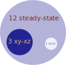

The sizes of droplets are carefully chosen, so that they span the range from 28 to 112 um nicely, providing a good ground for investigating the size dependence. Moreover, the concentrations of bacteria in these droplets center around 185. Strong collective motions are observed in all the droplets in the beginning of each experiment, so the concentration effect can be neglect in the first analysis. The graph below shows the droplet size and OD distribution of this data set.

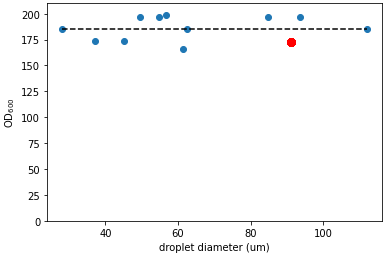

## II. Experimental subtleties

### A.Serine effect

Bacteria swim significantly faster and last longer with the addition of L-serine. Compare the two videos: [Video: with serine](https://drive.google.com/open?id=13AmyeAelieYmGZzB1sTbPr1HU4LrCKRJ&authuser=liux3141%40umn.edu&usp=drive_fs) and [Video: without serine](https://drive.google.com/open?id=1S35GxkcylCAK8tRshJNpPtZJlCH9gpmc&authuser=liux3141%40umn.edu&usp=drive_fs), difference can be told without further quantification.

### B. Percoll effect

1. Centrifuge with percoll fails. Tried a higher centrifuge speed (5000 g) but still no pellet. Got a very dilute suspension.
2. Adding percoll at the final step makes bacteria less active.

### C. Laser effect

The only bright field video in this data set is a droplet of which $D=91$ um diameter and $OD=173$ (0117/0-11). We know that activity is a strong function of droplet size, so we compare this droplet with another droplet that has similar size ($D=93$ um and $OD=197$, 0118/9-14).

I will compare two quantities: mean velocity and the time scale that activity decreases.

#### 1. Bright field (0117/0-11)

The mean velocity evolution measured by PIV is shown in the following graph. The highest mean velocity captured is around 10 um/s. There are time gaps between the videos, which are not illustrated as lengths in horizontal direction. Instead, they are indicated by text labels.

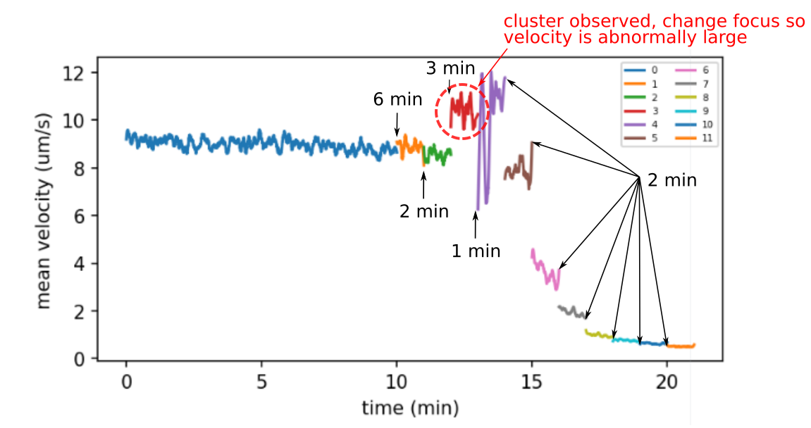

In the first 20 minutes, the mean velocity is roughly constant. Starting from video 3 (red curve), I start to notice the formation of clusters in the middle of the droplet. The activity starts to decrease at roughly this time. So the first 20 minutes can be regarded as "steady state".

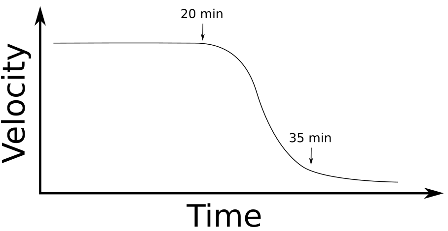

#### 2. Confocal, blue laser 11.5% (0118/09-14)

The mean velocity evolution curve is shown below. As the previous one, the time gaps between videos are indicated by text labels.

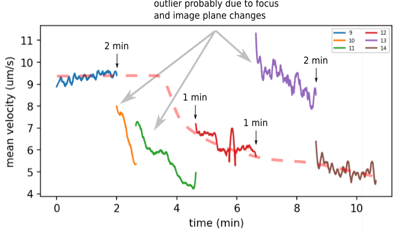

This data set is complicated by some outliers, because I tried to investigate the $xy$-$xz$ difference in this experiment, too. Due to the frequent rotations and focus adjustment, the measurements in $xy$ plane (10, 11, 13) may be inconsistent with the $xz$ plane (9, 12, 14). Furthermore, the measurement accuracy is affected by the displacement of the droplet during the experiment. In my masked PIV method, a constant mask is provided to each video. If a droplet moves too much, it can escape the mask and thus hinder the velocity detection. Droplets leaving masks in this data set is illustrated in the figure below.

This problem is most pronounced in video 10 and 11, therefore I don't want to include them in the analysis. Since the magnitude of 13 is also abnormally high, I also exclude it in the current analysis. As a result, we are only going to look at videos 9, 12 and 14, which are all imaged in the $xz$ plane. The velocity evolution in these three videos follows a "constant the decrease" trend nicely, as indicated by the red dashed line in the velocity curve plot.

#### 3. Simplified comparison

Below is a simplified velocity evolution of these two samples. Under bright light, the activity of bacteria shows a longer steady state (~20 min), whereas under blue laser, the steady state is much shorter (~5 min).

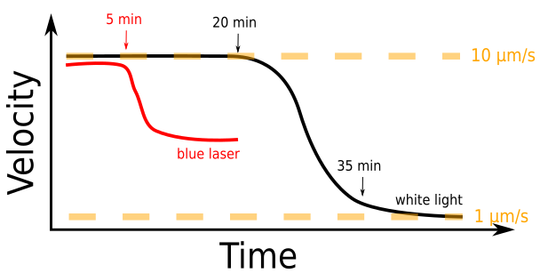

#### 4. Other data

##### Droplet #6 (0117/17-19) | 61 um | 166
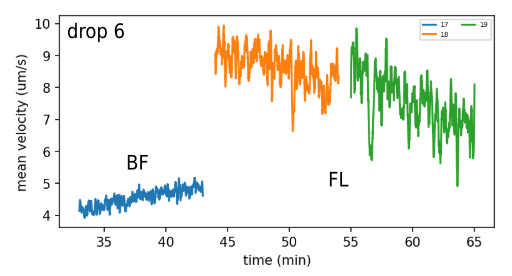

##### Droplet #7 (0118/00-03) | 55 um | 197
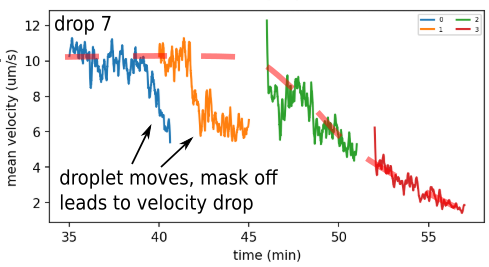

##### Droplet #8 (0118/05-08) | 50 um | 197
Note: video 08 is a very short video showing the droplet is already frozen, data point is not shown.

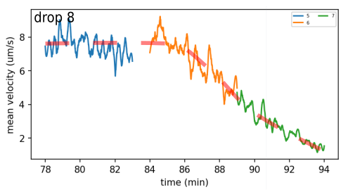

##### Droplet #10 (0118/15-22) | 85 um | 197 | xyxz
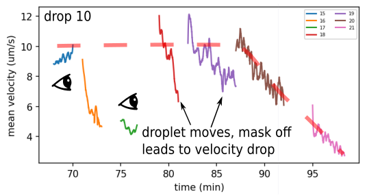

##### Droplet #16 (0119/00-07) | 62 um | 185 | xyxz
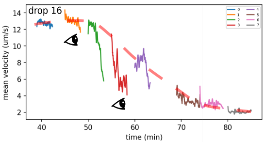

##### Droplet #17 (0119/08-11) | 37 um | 174
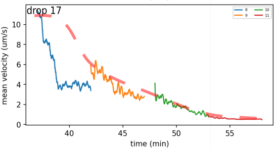

##### Droplet #18 (0119/12-15) | 45 um | 174
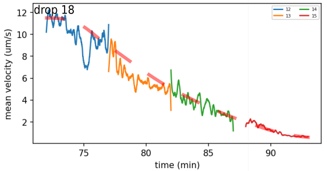

##### Dropolet #19 (0119/16) | 28 um | 185
Note: this is a single video, velocity start to decrease within the first minute.

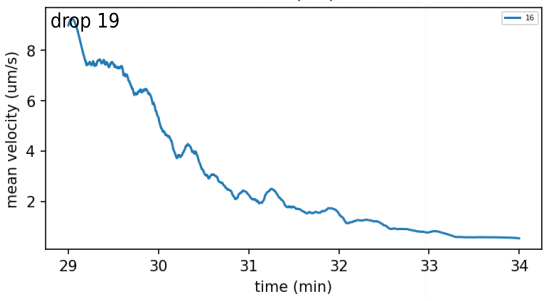

##### Droplet #20 (0119/17-24) | 112 um | 185
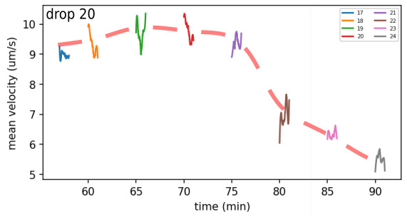

##### Droplet #21 (0119/25-30) | 57 um | 199
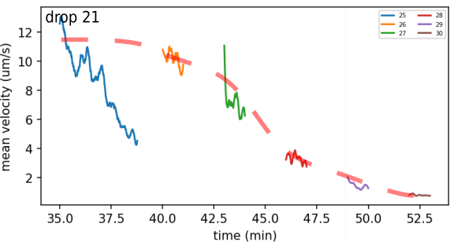
### E. Life time of a droplet

### F. Others

## II. Confirmed steady state?

## III. How much does serine enhance the motility?

## IV. Does blue laser make a difference?

## V. Percoll??

## VI. Frozen droplets
