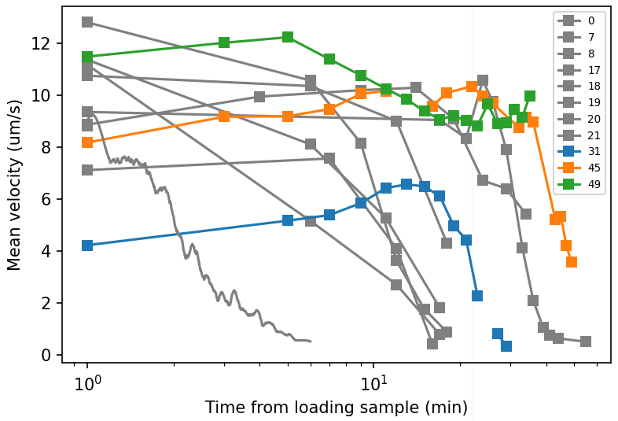
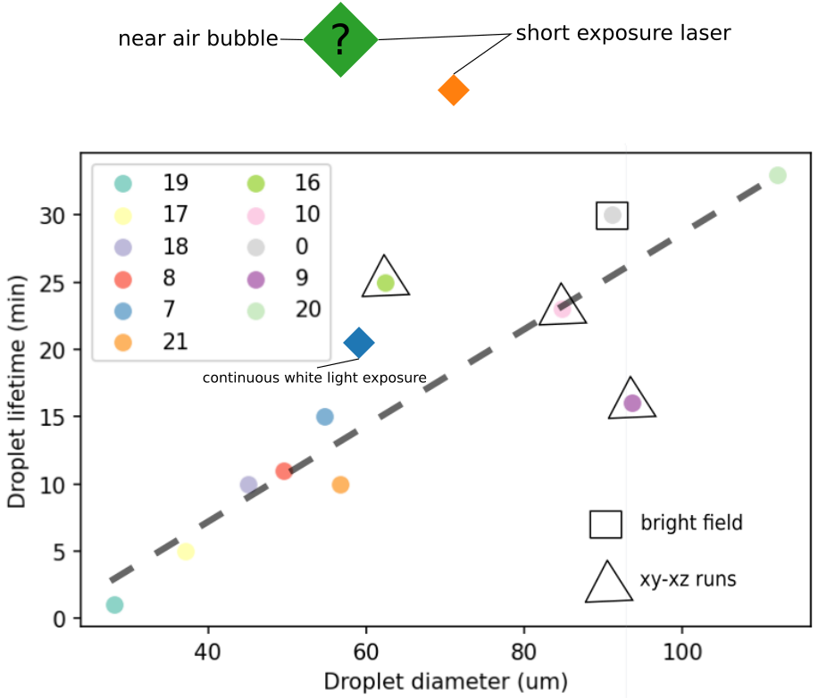
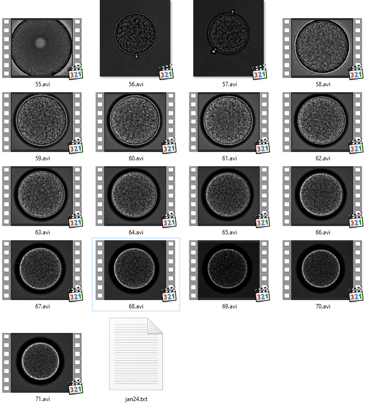
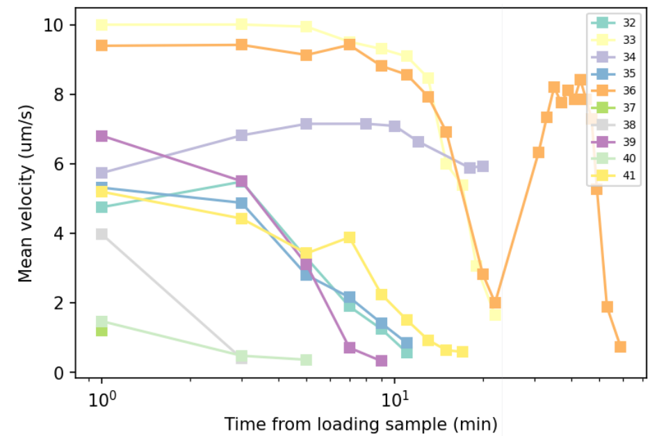
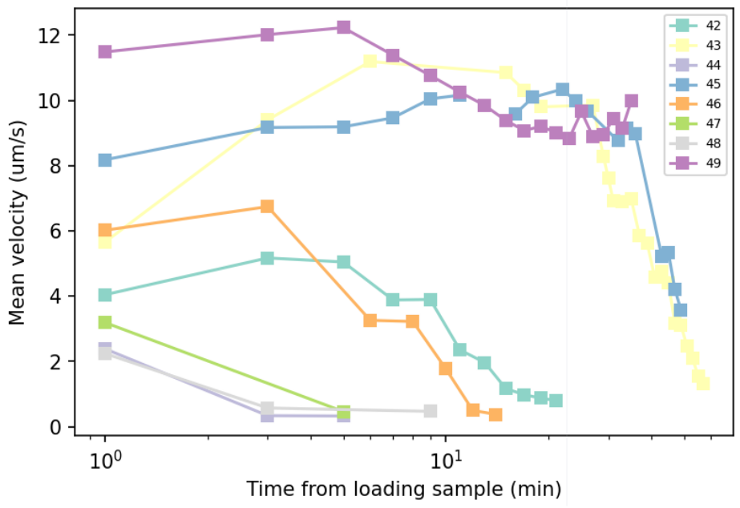

# 0124-0126 data analysis
Last time, I showed that the droplet lifetime depends strongly on the droplet size. A linear-like relation has been identified. However, this week's data show that the freezing process also strongly depends on the light exposure. For example, continuous white light exposure gives rise to slightly longer lifetime, ~20 min for 60 um droplet (blue). Intermittent short blue exposure gives rise to even longer lifetime, ~40 min for 50 um droplets (orange). More interestingly, a droplet that happens to be near an air bubble, shows no sign of velocity decreasing over 45 minutes (green).

If we plot droplet lifetime against droplet size for the new data, the plot looks like the following, where diamond symbols are new data.

## Some observations

### A. Widening dark ring

### B. Velocity increase at early times
Naively, we expect the activity of bacteria in a droplet to decrease monotonically over time. However, some of my experiments show increasing activity in the early times (typically around 10 minutes), followed by a monotonic decrease. This happens predominately in the blue laser short exposure tests (droplet#41-49), as shown below.

