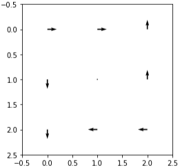
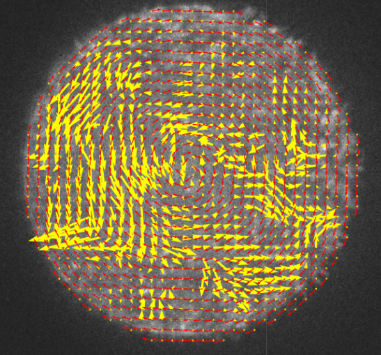
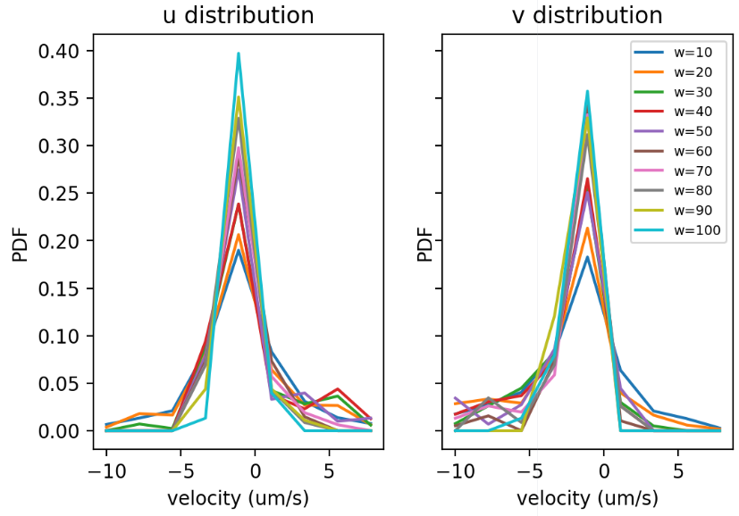

# Analysis of Collective Motions in Droplets

In this note, I summarize the analysis on the collective motions of bacteria in droplets. Most analysis will be performed on the PIV data. More ambitiously, I can try to compare PIV analysis with the optical flow methods in Hamby2018.

## I. Masked PIV

**The need for masked PIV arises from the study of bacterial flow field in droplets.** Unlike previous bulk experiments, where the whole field of view is filled with bacteria, the images I have now usually have all bacteria confined in parts of the images. The followings are typical images I obtained recently, with one or more droplets in each image.


The first image is a bright field image of a double emulsion in the XZ plane (gravity pointing to the left). The boundary is not very clean so that the left boundary of the droplet does not show completely. The second image is a confocal image of several small droplets. The third image is a bright field with a cleaner boundary, so that even the left edge can be seen clearly. The fourth droplet is the confocal image of the same droplet in the third image.

### A. Masking method

#### 1. Rectangle + circle
Initially, I came up with a two-step masking scheme to deal with images like the first image. Specifically, step one is to apply a rectangular region of interest bonding the droplet (red rectangle); step two is to specify the center position and radius of the droplet (yellow circle). This scheme is illustrated in the following sketch.


Following this masking procedure, PIV analysis is performed in the rectangular ROI, and only the velocities inside the yellow circle are kept as valid velocities.

#### 2. Flexible mask

**In images with more complicated morphological features, more flexible masks are required.** For example, when there are multiple droplets in one image, the Rectangle + circle method is not sufficient. **In this scenario, I can manually draw a mask image in ImageJ based on the raw image, and pass this image to PIV algorithm as a mask.** An example is shown below.


This mask can then be used with the function `PIV_masked()` in `pivLib`, by passing the mask image as an argument. As an example, we test `PIV_masked()` on above left image (image 2), with the right image as the mask image, by running
```python
x, y, u, v = PIV_masked(I20, I21, 20, 10, 0.02, mask2)
```
As can be seen in the result below, yellow PIV arrows are found in both big droplets. The small droplet is smaller than the PIV box size, so no velocity is detected there.


**Moreover, this method makes it possible to apply masks with arbitrary morphologies (not just circles).** For example, I made a freehand drawing as shown in the left panel below and use it to mask the velocity field in the middle panel. The resulting masked velocity field is plotted on top of the mask in the right panel.


It may be noticed that for the masked PIV in the images above, there is a gap between the mask contour and the PIV arrow contour. This gap is caused by the way I convert the pixel mask into PIV window mask. There is a threshold setting in this process, determining what kind of windows are considered "transparent" and what windows are considered "opaque". In code, this thresholding is implemented as the following:
```python
mask_w = divide_windows(mask, windowsize=[winsize, winsize], step=winsize-overlap)[2] >= 1
```
Setting threshold to 1 leads to the most conservative mask (smallest transparent region), which causes the gap between the contours. To close the gap to include more velocities in the mask, simply set the threshold to 0.5. The figure below illustrates the effect of the threshold.


### B. Masking procedure

There are several ways to use the mask. To mask the raw images before applying PIV or to mask the final velocity result, or to do both. How much do these options affect the final result of the PIV analysis? We test the following procedures:

1. Mask raw images by setting background 0, then apply PIV.
2. Apply PIV directly on raw images, then apply mask on velocity.
3. Mask raw images by setting background nan, then apply PIV. (PIV algorithm does not support nan pixels for the moment, so this cannot be tested yet).

The test code can be found in `Masked_PIV.py`. Use Hydrogen to view the results by `Run all`.

**In conclusion, the two procedures produce very similar results, except that procedure 1 runs a little bit faster.**

Below are some plots comparing the overall velocity field, velocity PDF and running speed:

- overall velocity


- velocity PDF


- running speed


## II. Does bacterial activity decays over time?

We know that after a couple of hours, most bacteria in droplets stop moving and droplets look like "frozen". But, is there a more **precise time scale** for this "freezing" process? What is the **major cause** of this phenomenon? Here we examine **bacterial activity over time** in several different droplets and try to estimate this time scale.

### A. Experiment

My experiment comprises **4 10-minute videos of the same droplet** whose diameter is 55 um (snapshots can be found in the following figure 21-24). 21 and 23 are bright field images, 22 and 24 are confocal images. Images were taken in order from 21 to 24, and the time delay between two videos was less than one minute and should be _negligible_.
19-20 are also bright field and confocal images of the same droplet with smaller size. The size of the droplet is comparable to PIV box size and may detoriote the PIV quality. Therefore, we only use 21-24 for the analysis.


### B. Results and discussion

Below is the mean velocity of PIV velocities in videos 21-24.


We note a few things from this measurement:
1. **velocity decay is most pronounced in the first 10 min**, later on the velocity remains constant for 30 min
2. Confocal measures a **higher** mean velocity
3. Confocal laser **does not** seem to harm bacterial activity
4. the **sudden drop of velocity** in the middle of yellow curve is not expected, watch video to find out why.

## III. Order parameter

### A. Technical: generate azimuthal unit vector field
#### 1. Compute tangent unit vecotr field
To compute the order parameter above, we first need to compute the tangent unit vector $t_i$. Let $x$, $y$ be the point of interest, $x_1$, $y_1$ be the tangent unit vector, we know that $x_1$ and $y_1$ should satisfy
$$
xx_1 + yy_1 = 0 \\
x_1^2 + y_1^2 = 1
$$
We can set $x_1$ arbitrarily and $y_1$ can be calculated. Then $x_1$ and $y_1$ can be rescaled to meet the unit vector requirement. For example, we have $(x, y)=(1, 1)$. Set $x_1=1$, we get $y_1=-1$. Then rescale $x_1$ and $y_1$ by the length of $(x_1, y_1)$, $l=\sqrt{x_1^2+y_1^2}$ to get the unit vector. This is illustrated in the following figure.


Here I notice that it's important to set the sign of $x_1$. For example, if we set $x_1=-1$ in the first place, the arrow in the above figure would be in the opposite direction (the red arrow). If we set all $x_1$'s to $-1$ for example, we end up with a vector field like the following, which is not coherent and is clearly wrong.


To make the arrow direction coherent through out the whole droplet, roughly speaking, we need to set half of the $x_1$'s positive and the rest negative. In my code, this is taken care of by the following lines:
```python
ind = np.logical_or(r[1] > 0, np.logical_and(r[1] == 0, r[0] < 0))
x1 = -1 * np.ones(len(point[0]))
x1[ind] = 1
```
**numpy logical functions** help determines the signs of each $x_1$ in batch. With this modification, we get the correct vector field.


On a mesh grid (like PIV data), the tangent unit vector field is the following


**As illustrated above, CW direction is defined as the positive direction.**

#### 2. Pay attention to coordinate system inconsistency

When I plot the tangent unit vectors on top of an image, they no longer look like circulation, but rather and extension flow.


Red is the tangent unit vector we just computed. Yellow arrows are the PIV data. **This is clearly an error caused by coordinates inconsistency**.
To understand this inconsistency, see the sketch of coordinate systems below


The conversion between these two systems is not a simple rotation, but consists a mirror reflection. This makes the $x_1$ initiation rule opposite.
```python
ind = np.logical_or(r[1] > 0, np.logical_and(r[1] == 0, r[0] > 0))
x1 = np.ones(point.shape[1:])
x1[ind] = -1
```
---
Here is an investigation of the coordinate system inconsistency using simpler synthetic data.

First, we synthesize a 3x3 velocity field with clockwise circulation.


The corresponding PIV data is


When we use `quiver(x, y, u, v)` to show the velocity field, we get



While the positive directions are correct, the velocity field I get is opposite from my design in y direction. There are two possible mistakes: i) x, y are reversed, i.e. x is vertical and y is horizontal, ii) y velocity is plotted in the opposite way, i.e. (0, 1) is plotted as an upward vector in `quiver`.

To test, we make a small change in the `v` matrix: replace the upper right 1 by -1:


then `quiver(x, y, u, v)`, we get


The upper right arrow points to the opposite direction. Now it's clear that hypothesis (ii) is right. y velocity is plotted in the opposite way, i.e. (0, 1) is plotted as an upward vector in `quiver`.

From the manual velocity measurement, we know that OpenPIV returns velocity field that is consistent with this convention. I need to make my azimuthal unit vector generator function consistent with this convention, too. To do it, I simply reverse the output y-component. As a result, the azimuthal unit vector field displays correctly on images, as shown below.


<font color="blue">The divided by 0 handling in function `tangent_unit()` deserves a note, because the problem solved is of broader interest.</font>

### B. Compute order parameter from my PIV data

#### 1. Wioland 2013 (Ref. 3)
##### i. Definition
> 

But note that this order parameter does not reflect any information about the oscillatory motion. By taking the absolute value of $v_i \cdot t_i$, no matter $v_i$ is parallel or antiparallel to $t_i$, the outcome is the same.

##### ii. Computation

Below I plot together the azimuthal unit vector field (red) and the velocity field measured by PIV.


Using the formula given in definition, we get an order parameter for the PIV data in the example $\phi=0.23$. _Although I feel the alignment is very good already._ According to Wioland 2013, $\phi>0$ indicates the **existence of a coherent circulation**. <font color="red">Replace the illustration and analysis with a more updated PIV, where more area near the edge is included, and verify that the vector outside the droplet are not included as 0 when averaging.</font>

The whole video No.22 shows noisy order parameter oscillation between -0.4 and 0.4. The positivity is not pronounced compared to the noise.


<font color="red">When looking at the oscillation of OP, a shorter time scale is desired. According to Hamby 2018, the period of the circulation is several seconds.</font>
#### 2. Hamby 2018 (Ref. 9)
##### i. Definition
> 

According to the description, the formal definition of the order parameter ($\psi$) should be

$$
\psi = \frac{\sum_i \bm{v}_i\cdot \bm{t}_i}{\sum_i|\bm{v}_i|}
$$

where $\bm{v}_i$ is the local velocity of bacterial suspensions in droplets (PIV data), $\bm{t}_i$ is the azimuthal unit vector at the same point of $\bm{n}_i$. In this definition, if all the velocities align perfectly with the positive azimuthal direction, forming a clockwise (CW) circulation, $\psi=1$. If all the velocities are antiparallel to the positive azimuthal direction, forming a counter clockwise (CCW) circulation, $\psi=-1$. In cases where uniform circulations are not pronounced, i.e. chaotic flows, $\psi \approx 0$.

##### ii. Computation

The example we use here is the velocity field shown below, still from 12092021/22 data. The wider yellow arrows are the velocity field from PIV, $\bm{v}$, and the thinner red arrows are the corresponding azimuthal unit vector, $\bm{t}$. In this snapshot, the order parameter is -0.54. Indeed, the circulation in this snapshot is CCW. _Remember that we define CW circulation as positive order parameters._



We can calculate the order parameter for many frames now and look at its temporal evolution. For this specific sample, we can see some oscillatory circulation, not as strong as in Hamby 2018 though. The time scale for the period is indeed on the order of 1 second.


In a longer time scale (minutes), such oscillation could have repeated for too many times, hence is not easily resolved from the curve.


<font color="red">This OP better reveals the circulation directions of the flow. Although in this example, perfect oscillatory circulation is not observed, we can use this OP as a single number metric to percept other data.</font>

## IV. Validity of PIV analysis

### A. Visual inspection

**So far the best way to validify PIV analysis is visual inspection.** Such inspection is two-fold. First, we can compare hand measured velocity with PIV results quantitatively. This can be done for a few frames, and doing it for all the data is unfeasible. _Actually, that's why we use PIV, because it's more efficient with large data set._ Second, we can plot PIV arrows on top of corresponding images and see roughly if the directions and magnitude make sense.

#### 1. Make overlay movies
**A python function `matplotlib.pyplot.quiver(...)` is used to plot the velocity field of PIV.** By default, `quiver` automatically determines a proper scale for each velocity field. This is kind of similar to the contrast autoscaling for images, which makes sure that an image is not too dark or too bright, and patterns can be seen. While autoscaling is always good for a single image, for a video with many frames it's better to fix the scale, because a direct feeling of relative magnitude is important in a dynamic process. For example, if we fix the light intensity scale, we will know if the overall light intensity changes from one frame to another. **`quiver` provides a "complicated" method to control the scale, by combining keywords `scale` and `scale_units`.** `scale` is the number of data units per arrow length unit, e.g., m/s per plot width. `scale_units` is the arrow length unit, and can be `{'width', 'height', 'dots', 'inches', 'x', 'y', 'xy'}`. See the [official document of `quiver`](https://matplotlib.org/stable/api/_as_gen/matplotlib.pyplot.quiver.html) for more detailed information. **In the `piv_overlay.py` script, we have access to the PIV data information and the output image information.** We know the how many arrows we are going to plot, on what height and width. We want the arrows to be large so that we can see them clearly. We also don't want to make them too large to block other arrows. A good choice of maximum arrow length is the PIV box size, i.e. width / ncol. **To set this, we let `scale_units='width'`, and let `scale=max(u.max(), v.max())*ncol`.** The interpretation of this setting is: the largest velocity component has length of width / (number of columns). Note that this only needs to be set once for an image sequence. From the second PIV data, we use constant `scale`.

**Qualitatively, the arrows point to the same direction as the motions.** <font color='red'> Link to piv overlay of 22 </font> The reason why the mean velocity is small could be that the velocity in the interior of droplets are in general small. The following animation is a pair of adjacent frames sampled from my data. On the right is the velocity field from PIV analysis.

 

#### 2. Manually measure velocity

**Quantitatively, we can manually measure the displacement of certain image elements and compare it with the PIV data.** In the example image above, for example, there is a bright spot in the upper middle of the droplet, which is moving down and a little to the right. A zoom in view of the motion is shown below. The red line in the second frame indicates the displacement of the bright spot (~4.9 px) over 2 frames (0.04 s), the instantaneous velocity can be calculated as $4.9/0.04=102$ px/s.


Now we look at the PIV data.


The center of the yellow box above is measured to be 275, 127. The closest PIV box is at 278.5, 126.5. The velocity is $\sqrt{17.9^2+41.2^2}=44.9$ px/s. **Although this is smaller than the manual measurement (102 px/s), the factor of 2 difference is acceptable.** We only measure the displacement of a specific spot, whereas PIV measures the displacement of a box. So it makes sense that the average displacement is lowered by the pixels around the bright spot.


### B. Window size effect
**Window size (more formally interrogation window size, $w$) is arguably the most important parameter in a PIV analysis.** In principle, it should be large enough to contain many moving particles, so that the correlation functions of images indicate the displacement of particles. On the other hand, it should be much smaller than the velocity field structure, so that the structure of interest won't be averaged out. **Usually, there is a range of window size, within which PIV analysis always give consistent results.** In this section, we seek such range by exploring different window sizes (and overlap).
#### 1. Fix overlap as half window size
Typically, I fix the overlap as half of the window size. In this test, I vary the window size from 10 px to 100 px (1 px = 0.16 um). The resulting velocity fields are summarized in the figure below.


**The velocity fields of $w=10$ and $w=20$ look very similar and their mean velocities are almost the same! This is indicative that 10-20 is the "sweet range" of PIV on this image set. Above 20, however, the results seem to lose important velocity structures due to over averaging.** Actually, most outstanding velocity features persist up to $w=40$.

I also plot the velocity probability density function (PDF) of the PIV data above. When $w\le20$, PDF's have similar shapes. When $w>20$, the large velocity tails drastically fall down, again indicative of over averaging.



#### 2. Fix distance between arrows

In the previous section, we notice that as the window size increases, the number of arrows decreases. As a result, we only have 34 arrows when $w=100$. This small number of arrows may lead to a lack of statistics issue. To make all the number of arrows consistent throughout all the window sizes, I set `overlap` to be $w-5$. Below is the resulting velocity fields.


**Now it's clear that lacking statistics is not what makes the PIV inaccurate. Rather, it's the box size that is causing over averaging errors.** Similar conclusion is drawn from the PDF's.


**According to this test, I will use $w=20, o=10$ as an empirical rule of thump (for 40x lens).**

### C. PIV on bacteria directly: is this a justified method?

**Using bacteria directly as tracer particles for PIV is still not well accepted by the community**, according to my experience with the previous two papers (Science Advances 2021 and Soft Matter 2021). We've got questions from reviewer, e.g. does PIV works well when some bacteria in the interrogation window are moving much faster than the mean velocity? What is being measured in PIV when there is a strong inhomogeneity of velocity? **However, PIV on bacteria, or more generally active swimmers, has been used by many previous studies, too.** See refs 1-8 for examples. **In addition, we have tested PIV algorithms on some simulated images, and obtained results very close to the ground truth.** Two scenarios are tested: i) objects moving in random directions with 0 mean velocity; ii) objects moving in the same direction with different velocities. **Lastly, using the PIV method, we can determine the critical transition conditions, which are consistent with independent measurements from our aspects (e.g. tracer diffusion).** With these, we hope to convince the readers that PIV using bacteria as tracers is a valid experimental method.

### D. Zero control

**To assess the uncertainty of the PIV algorithm, I take a video of a "frozen" bacterial droplet and apply PIV on it.** As suggested by the description "frozen", the bacteria inside the droplet barely move. Therefore, the expected velocity is zero. _This is why I call this test a zero control._ The full video can be found [here](remember_to_put_the_link). You can also find a low frame rate animation below. (Scharnowski, S. & Kähler, C. J. Particle image velocimetry - Classical operating rules from today’s perspective. Optics and Lasers in Engineering 135, 106185 (2020).)

The mean velocity of the zero control video is shown in the following plot. The mean velocity is not exactly zero, due to both detection error and the tiny fluctuations of the droplet. **However, compared to the mean velocity of bacteria in a typical active droplet (2.6-3.2 um/s), the mean velocity of this frozen droplet (0.5 um/s) is noticeably smaller.** I will consider 0.5 um/s the magnitude of the detection error of PIV.


## IV. Velocity profiles

**Velocity profiles provide a different degree of averaging of velocity fields.** It's more detailed compared to the average over the whole velocity field, but is less detailed compared to the velocity field. In a 2D image of droplets, we can compute velocity profiles along two directions: radial and azimuthal. On top of directions, we can look at both velocity magnitude and velocity azimuthal component.

### A. Radial profile of velocity
The radial profile of velocity considers velocity distribution in radial direction, as illustrated below. Formally, the mean velocity $\bar v$ at radial position $r$ can be expressed as the following.

$$
\bar{v}(r) = \left< |\bm{v}(x, y)| \right>_{r<\sqrt{x^2+y^2}<r+\Delta r}
$$


The following curves show the radial velocity profiles from 5 instantaneous velocity fields.


To get more statistically meaningful velocity profile, I average the velocity profiles measured from 15000 PIV data from a 10-minute video.


### B. Radial profile of azimuthal velocity
In Hamby et al. 2018 (Ref. 9), the velocities are predominately in azimuthal direction, which come together to form oscillatory circulations in droplets. We expect to see similar preference in our system, so we also compute the profiles of the azimuthal component. The formal definition of the _radial profile of azimuthal velocity_ is given below.

$$
\bar{v}(r) = \left< \bm{v}(x, y)\cdot\bm{t}(x, y) \right>_{r<\sqrt{x^2+y^2}<r+\Delta r}
$$

Below are velocity profiles of some instantaneous frames.


Average over the whole video _again_. Although the velocities are not completely averaged out, the magnitudes of the averaged velocities are already ~3 orders of magnitude lower than the highest instantaneous velocity. **Thus, the small average velocity can be considered as 0, i.e. there is no preferred circulation direction over long time.** The circulation, if exists, has too be reversing all the time.


### C. Azimuthal profile of velocity

Instead of a familiar Cartesian curve plot, I use a polar chart to visualize the azimuthal velocity profile. The idea is to put data into a geometry that is similar to where the original data comes from (i.e. a 2D circle). The heights of the portions represent the velocity magnitudes in the angle ranges. A formal definition of the angular average velocity is given below:
$$
\bar{v}(\theta) = \left< |\bm{v}(x, y)| \right>_{\theta<\arctan{\frac{y}{x}}<\theta+\Delta\theta}
$$
Below is a snapshot of azimuthal velocity profile from a certain frame.


We notice a strong azimuthal velocity inhomogeneity in the velocity profile above. Does this distribution (where velocity at 0$\degree$ is largest) persist throughout the whole experiment? To answer this question, I average the azimuthal velocity profiles over 15000 PIV data _again_, and obtain the following _averaged_ velocity profile. **Although the velocity profile from an instantaneous velocity field shows strong inhomogeneity, it can be averaged out over a long time.**


### D. Azimuthal profile of azimuthal velocity
Formal definition:
$$
\bar{v}(\theta) = \left< \bm{v}(x, y)\cdot\bm{t}(x, y) \right>_{\theta<\arctan{\frac{y}{x}}<\theta+\Delta\theta}
$$
Here I only plot the averaged velocity profile for long time.


To conclude the velocity profile measurement, I make the following tentative points:

- Radially, the velocity magnitudes have a robust and nonmonotonic distribution, with a peak near the edge of droplets
- Azimuthally, the velocity magnitude at the bottom half seems to be larger than that at the top half.
- No constant circulation (in a single direction) is detected. However, this does not exclude the possibilities of oscillatory circulation or completely chaotic motion.

## V. Spatial and temporal correlation

We see collective motions in bulk and under confinement. Are they the same or different in any aspects? Let us try to understand this by looking at the spatial and temporal correlation functions.


## References

1. Wioland, H., Lushi, E. & Goldstein, R. E. Directed collective motion of bacteria under channel confinement. New J. Phys. 18, 075002 (2016).
2. Wioland, H., Woodhouse, F. G., Dunkel, J. & Goldstein, R. E. Ferromagnetic and antiferromagnetic order in bacterial vortex lattices. Nature Phys 12, 341–345 (2016).
3. Wioland, H., Woodhouse, F. G., Dunkel, J., Kessler, J. O. & Goldstein, R. E. Confinement Stabilizes a Bacterial Suspension into a Spiral Vortex. Phys. Rev. Lett. 110, 268102 (2013).
4. Wensink, H. H. et al. Meso-scale turbulence in living fluids. Proceedings of the National Academy of Sciences 109, 14308–14313 (2012).
5. Sokolov, A., Aranson, I. S., Kessler, J. O. & Goldstein, R. E. Concentration Dependence of the Collective Dynamics of Swimming Bacteria. Phys. Rev. Lett. 98, 158102 (2007).
6. Lushi, E., Wioland, H. & Goldstein, R. E. Fluid flows created by swimming bacteria drive self-organization in confined suspensions. Proc Natl Acad Sci USA 111, 9733–9738 (2014).
7. Cisneros, L. H., Kessler, J. O., Ganguly, S. & Goldstein, R. E. Dynamics of swimming bacteria: Transition to directional order at high concentration. Phys. Rev. E 83, 061907 (2011).
8. Cisneros, L. H., Cortez, R., Dombrowski, C., Goldstein, R. E. & Kessler, J. O. Fluid dynamics of self-propelled microorganisms, from individuals to concentrated populations. Exp Fluids 43, 737–753 (2007).
9. Hamby, A. E., Vig, D. K., Safonova, S. & Wolgemuth, C. W. Swimming bacteria power microspin cycles. Sci. Adv. 4, eaau0125 (2018).


# Appendix A
To do list
- For high bacterial concentration: Compare flow time scale with inner droplet motion time scale
- I can apply all the analysis in the GNF study here, e.g. density fluctuation, flow field vorticity, divergence, etc.
