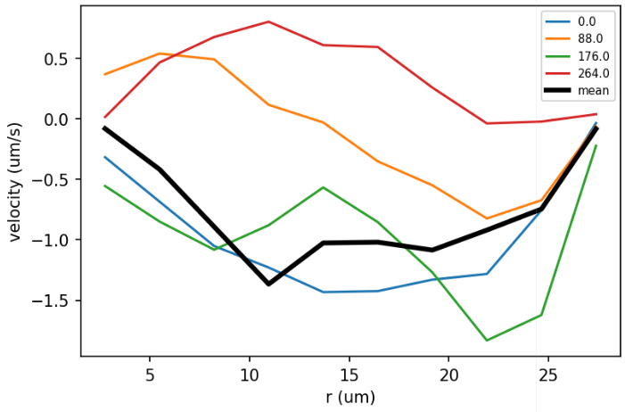
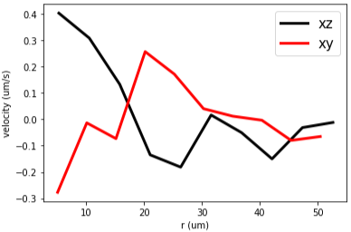

# Analysis of Collective Motions in Droplets

In this note, I summarize the analysis on the collective motions of bacteria in droplets. There are some potentially interesting physics to look at, such as the anisotropy with respect to gravity, confinement effect on the collective motions and the interactions between different droplets.

As of Jan 12, 2021, I have done approximately 15 days of experiments (definitely need to do more, but with more concrete idea of what to do...). Although I have got videos of active turbulence that seem to be OK, the significant activity decay in my experiment needs to be addressed carefully.

After discussed with Eric, we identified that oxygen and laser are the two major factors that can lead to the activity decay. To

## I. Mean velocity

We know that after a couple of hours, most bacteria in droplets stop moving and droplets look like "frozen". Such process has a time scale which depends on various factors, such as bacterial strain, droplet size, laser exposure, etc. Some of these factors may be more important, and some may be less. Knowing the _leading cause_ as well as the _precise time scale_ for this "freezing" process will be very beneficial for my experiment. **Here we examine bacterial activity over time in several different settings, hoping to answer the questions raised above, and to set a reasonable protocol to study active turbulence in droplets.**

### A. Data 01: 12092021/21-24

This data set comprises **4 10-minute videos of the same droplet** whose diameter is 55 um (snapshots can be found in the following figure 21-24). 21 and 23 are bright field images, 22 and 24 are confocal images. Images were taken in order from 21 to 24, and the time delay between two videos was less than one minute and should be _negligible_.
19-20 are also bright field and confocal images of the same droplet with smaller size. The size of the droplet is comparable to PIV box size and may detoriote the PIV quality. Therefore, we only use 21-24 for the analysis.


Below is the mean velocity of PIV velocities in videos 21-24.


We note a few things from this measurement:
1. **Velocity keeps decreasing.** The velocity decay in the first 10 min is the most pronounced.
2. **Confocal measures a higher mean velocity.**
3. Confocal laser **does not** seem to harm bacterial activity
4. the **sudden drop of velocity** in the middle of yellow curve is not expected, watch video to find out why.

### B. Data 02: 01052022/12-17

A new set of data, taken in the same sample, with time stamps and xy-xz comparisons.


Remarks:
- Velocity is higher in large droplets. This is consistent with what Ref. 9 reports.
- **Velocity in XZ plane is always larger than in XY plane for the same sample. It does not matter which is measured first.**


#### 1. Difference between XY and XZ planes


1. In XY plane, droplets are more spread out, while in XZ plane, droplets are compacted more closely. So in XZ plane, the flow in one droplet is more likely to be affected by other droplets.
2. In XY plane, bottom substrate is the only one relevant boundary, while in XZ plane, both bottom and side walls are close enough to the droplets _to affect the flow_.
3. The flow may be anisotropic, with respect to gravity.

## II. Velocity profiles

**Velocity profiles provide a different degree of averaging of velocity fields.** It's more detailed compared to the average over the whole velocity field, but is less detailed compared to the velocity field. In a 2D image of droplets, we can compute velocity profiles along two directions: radial and azimuthal. On top of directions, we can look at both velocity magnitude and velocity azimuthal component.

### A. Flow profile
The radial profile of velocity considers velocity distribution in radial direction, as illustrated below. Formally, the mean velocity $\bar v$ at radial position $r$ can be expressed as the following.

$$
\bar{v}(r) = \left< |\bm{v}(x, y)| \right>_{r<\sqrt{x^2+y^2}<r+\Delta r}
$$


#### 1. Instantaneous velocity profiles

The following curves show the radial velocity profiles from 5 instantaneous velocity fields.


#### 2. Temporal evolution and averaged profile

To see the activity decrease with in the same video, I measure the temporal evolution of radial velocity profile. Velocity profiles of each time point is averaged from 5 adjacent PIV data and time points are sampled every 88 second.

12092021/22


### B. Azimuthal flow profile
In Hamby et al. 2018 (Ref. 9), the velocities are predominately in azimuthal direction, which come together to form oscillatory circulations in droplets. We expect to see similar preference in our system, so we also compute the profiles of the azimuthal component. The formal definition of the _radial profile of azimuthal velocity_ is given below.

$$
\bar{v}(r) = \left< \bm{v}(x, y)\cdot\bm{t}(x, y) \right>_{r<\sqrt{x^2+y^2}<r+\Delta r}
$$

#### 1. Instantaneous azimuthal velocity profiles

Below are velocity profiles of some instantaneous frames.


#### 2. Temporal evolution and averaged profile

Average over the whole video _again_. Although the velocities are not completely averaged out, the magnitudes of the averaged velocities are already ~3 orders of magnitude lower than the highest instantaneous velocity. **Thus, the small average velocity can be considered as 0, i.e. there is no preferred circulation direction over long time.** The circulation, if exists, has too be reversing all the time.



### C. Azimuthal profile of velocity

Instead of a familiar Cartesian curve plot, I use a polar chart to visualize the azimuthal velocity profile. The idea is to put data into a geometry that is similar to where the original data comes from (i.e. a 2D circle). The heights of the portions represent the velocity magnitudes in the angle ranges. A formal definition of the angular average velocity is given below:
$$
\bar{v}(\theta) = \left< |\bm{v}(x, y)| \right>_{\theta<\arctan{\frac{y}{x}}<\theta+\Delta\theta}
$$
Below is a snapshot of azimuthal velocity profile from a certain frame.


We notice a strong azimuthal velocity inhomogeneity in the velocity profile above. Does this distribution (where velocity at 0$\degree$ is largest) persist throughout the whole experiment? To answer this question, I average the azimuthal velocity profiles over 15000 PIV data _again_, and obtain the following _averaged_ velocity profile. **Although the velocity profile from an instantaneous velocity field shows strong inhomogeneity, it can be averaged out over a long time.**


### D. Azimuthal profile of azimuthal velocity
Formal definition:
$$
\bar{v}(\theta) = \left< \bm{v}(x, y)\cdot\bm{t}(x, y) \right>_{\theta<\arctan{\frac{y}{x}}<\theta+\Delta\theta}
$$
Here I only plot the averaged velocity profile for long time.


To conclude the velocity profile measurement, I make the following tentative points:

- Radially, the velocity magnitudes have a robust and nonmonotonic distribution, with a peak near the edge of droplets
- Azimuthally, the velocity magnitude at the bottom half seems to be larger than that at the top half.
- No constant circulation (in a single direction) is detected. However, this does not exclude the possibilities of oscillatory circulation or completely chaotic motion.


## III. Order parameters

### A. Technical: generate azimuthal unit vector field
#### 1. Compute tangent unit vecotr field
To compute the order parameter above, we first need to compute the tangent unit vector $t_i$. Let $x$, $y$ be the point of interest, $x_1$, $y_1$ be the tangent unit vector, we know that $x_1$ and $y_1$ should satisfy
$$
xx_1 + yy_1 = 0 \\
x_1^2 + y_1^2 = 1
$$
We can set $x_1$ arbitrarily and $y_1$ can be calculated. Then $x_1$ and $y_1$ can be rescaled to meet the unit vector requirement. For example, we have $(x, y)=(1, 1)$. Set $x_1=1$, we get $y_1=-1$. Then rescale $x_1$ and $y_1$ by the length of $(x_1, y_1)$, $l=\sqrt{x_1^2+y_1^2}$ to get the unit vector. This is illustrated in the following figure.


Here I notice that it's important to set the sign of $x_1$. For example, if we set $x_1=-1$ in the first place, the arrow in the above figure would be in the opposite direction (the red arrow). If we set all $x_1$'s to $-1$ for example, we end up with a vector field like the following, which is not coherent and is clearly wrong.


To make the arrow direction coherent through out the whole droplet, roughly speaking, we need to set half of the $x_1$'s positive and the rest negative. In my code, this is taken care of by the following lines:
```python
ind = np.logical_or(r[1] > 0, np.logical_and(r[1] == 0, r[0] < 0))
x1 = -1 * np.ones(len(point[0]))
x1[ind] = 1
```
**numpy logical functions** help determines the signs of each $x_1$ in batch. With this modification, we get the correct vector field.


On a mesh grid (like PIV data), the tangent unit vector field is the following


**As illustrated above, CW direction is defined as the positive direction.**

#### 2. Pay attention to coordinate system inconsistency

When I plot the tangent unit vectors on top of an image, they no longer look like circulation, but rather and extension flow.


Red is the tangent unit vector we just computed. Yellow arrows are the PIV data. **This is clearly an error caused by coordinates inconsistency**.
To understand this inconsistency, see the sketch of coordinate systems below


The conversion between these two systems is not a simple rotation, but consists a mirror reflection. This makes the $x_1$ initiation rule opposite.
```python
ind = np.logical_or(r[1] > 0, np.logical_and(r[1] == 0, r[0] > 0))
x1 = np.ones(point.shape[1:])
x1[ind] = -1
```
---
Here is an investigation of the coordinate system inconsistency using simpler synthetic data.

First, we synthesize a 3x3 velocity field with clockwise circulation.


The corresponding PIV data is


When we use `quiver(x, y, u, v)` to show the velocity field, we get


While the positive directions are correct, the velocity field I get is opposite from my design in y direction. There are two possible mistakes: i) x, y are reversed, i.e. x is vertical and y is horizontal, ii) y velocity is plotted in the opposite way, i.e. (0, 1) is plotted as an upward vector in `quiver`.

To test, we make a small change in the `v` matrix: replace the upper right 1 by -1:


then `quiver(x, y, u, v)`, we get


The upper right arrow points to the opposite direction. Now it's clear that hypothesis (ii) is right. y velocity is plotted in the opposite way, i.e. (0, 1) is plotted as an upward vector in `quiver`.

From the manual velocity measurement, we know that OpenPIV returns velocity field that is consistent with this convention. I need to make my azimuthal unit vector generator function consistent with this convention, too. To do it, I simply reverse the output y-component. As a result, the azimuthal unit vector field displays correctly on images, as shown below.


<font color="blue">The divided by 0 handling in function `tangent_unit()` deserves a note, because the problem solved is of broader interest.</font>

### B. Compute order parameter from my PIV data

#### 1. Wioland 2013 (Ref. 3)
##### i. Definition
> 

But note that this order parameter does not reflect any information about the oscillatory motion. By taking the absolute value of $v_i \cdot t_i$, no matter $v_i$ is parallel or antiparallel to $t_i$, the outcome is the same.

##### ii. Computation

Below I plot together the azimuthal unit vector field (red) and the velocity field measured by PIV.


Using the formula given in definition, we get an order parameter for the PIV data in the example $\phi=0.26$. _Although I feel the alignment is very good already._ According to Wioland 2013, $\phi>0$ indicates the **existence of a coherent circulation**. <font color="red">Note that the OP is calculated based on PIV with finer grid (20/10). For illustration purpose, however, I keep the grid above. The OP's from two PIV's turn out to be very close (0.23 vs. 0.26).</font>

The whole video No.22 shows noisy order parameter oscillation between -0.4 and 0.4. The positivity is not pronounced compared to the noise.


<font color="red">When looking at the oscillation of OP, a shorter time scale is desired. According to Hamby 2018, the period of the circulation is several seconds.</font>
#### 2. Hamby 2018 (Ref. 9)
##### i. Definition
> 

According to the description, the formal definition of the order parameter ($\psi$) should be

$$
\psi = \frac{\sum_i \bm{v}_i\cdot \bm{t}_i}{\sum_i|\bm{v}_i|}
$$

where $\bm{v}_i$ is the local velocity of bacterial suspensions in droplets (PIV data), $\bm{t}_i$ is the azimuthal unit vector at the same point of $\bm{n}_i$. In this definition, if all the velocities align perfectly with the positive azimuthal direction, forming a clockwise (CW) circulation, $\psi=1$. If all the velocities are antiparallel to the positive azimuthal direction, forming a counter clockwise (CCW) circulation, $\psi=-1$. In cases where uniform circulations are not pronounced, i.e. chaotic flows, $\psi \approx 0$.

##### ii. Computation

The example we use here is the velocity field shown below, still from 12092021/22 data. The wider yellow arrows are the velocity field from PIV, $\bm{v}$, and the thinner red arrows are the corresponding azimuthal unit vector, $\bm{t}$. In this snapshot, the order parameter is -0.54. Indeed, the circulation in this snapshot is CCW. _Remember that we define CW circulation as positive order parameters._


We can calculate the order parameter for many frames now and look at its temporal evolution. For this specific sample, we can see some oscillatory circulation, not as strong as in Hamby 2018 though. The time scale for the period is indeed on the order of 1 second.


In a longer time scale (minutes), such oscillation could have repeated for too many times, hence is not easily resolved from the curve.


<font color="red">This OP better reveals the circulation directions of the flow. Although in this example, perfect oscillatory circulation is not observed, we can use this OP as a single number metric to percept other data.</font>

## IV. Spatial and temporal correlation

We see collective motions in bulk and under confinement. Are they the same or different in any aspects? Let us try to understand this by looking at the spatial and temporal correlation functions.

From the plot, the first intuition to get is: noisy motion has autocorrelations that decay faster. The most active bacterial sample in the 12092021 experiment is sample 4. The VACF of all the videos from sample 4 is shown below.


```
Sample 4: OD=130, no MB, 2400 xg centrifuge, room temp
19. sample 4, BF
20. fluo 19 :: small drop
21. sample 4, BF, xz, DE :: small inner, good image qual and activity
22. fluo 21
23. Same DE as 21, 22, BF :: Take videos of this DE until it's dead
24. fluo 23
```

The VACF curves roughly fall into two groups for two different droplets, whereas bright field and confocal images remain mostly indistinguishable. This is indicative of the validity of using bright field images for PIV analysis. Of course, the comparison between bright field and confocal PIV needs more data, such as mean velocity, velocity distribution and most importantly, a direct visual inspection to make sure the two imaging technique can give same PIV results.

The interpretation of long correlation time can be two-fold. One the one hand, strong collective motion (high activity) leads to long correlation times than random motions. One the other hand, a slower but still collective motion can exhibit even longer temporal correlations. Therefore, in a dense bacterial suspension, if we make a plot of correlation time vs. bacterial activity, the curve would be nonmonotonic, but shows a peak with two decaying tails, as illustrated below.


The peak may diverge. I observed similar thing in the GNF study. In a droplet, the measurement could be done in a easier and more convincing way, since we can always image the same batch of bacteria, and their activity decays with time.

## VI. Compare XY and XZ

Out of curiosity, I want to know if the flow profiles are the when looking from different perspective.

### A. Velocity profile

#### 1. Mean velocity
01052022-12, 13


#### 2. Mean azimuthal velocity
The magnitude of mean azimuthal velocity is significantly lower because the flow is reversing and opposite velocities cancel each other over time.

01052022-12, 13




## References

1. Wioland, H., Lushi, E. & Goldstein, R. E. Directed collective motion of bacteria under channel confinement. New J. Phys. 18, 075002 (2016).
2. Wioland, H., Woodhouse, F. G., Dunkel, J. & Goldstein, R. E. Ferromagnetic and antiferromagnetic order in bacterial vortex lattices. Nature Phys 12, 341–345 (2016).
3. Wioland, H., Woodhouse, F. G., Dunkel, J., Kessler, J. O. & Goldstein, R. E. Confinement Stabilizes a Bacterial Suspension into a Spiral Vortex. Phys. Rev. Lett. 110, 268102 (2013).
4. Wensink, H. H. et al. Meso-scale turbulence in living fluids. Proceedings of the National Academy of Sciences 109, 14308–14313 (2012).
5. Sokolov, A., Aranson, I. S., Kessler, J. O. & Goldstein, R. E. Concentration Dependence of the Collective Dynamics of Swimming Bacteria. Phys. Rev. Lett. 98, 158102 (2007).
6. Lushi, E., Wioland, H. & Goldstein, R. E. Fluid flows created by swimming bacteria drive self-organization in confined suspensions. Proc Natl Acad Sci USA 111, 9733–9738 (2014).
7. Cisneros, L. H., Kessler, J. O., Ganguly, S. & Goldstein, R. E. Dynamics of swimming bacteria: Transition to directional order at high concentration. Phys. Rev. E 83, 061907 (2011).
8. Cisneros, L. H., Cortez, R., Dombrowski, C., Goldstein, R. E. & Kessler, J. O. Fluid dynamics of self-propelled microorganisms, from individuals to concentrated populations. Exp Fluids 43, 737–753 (2007).
9. Hamby, A. E., Vig, D. K., Safonova, S. & Wolgemuth, C. W. Swimming bacteria power microspin cycles. Sci. Adv. 4, eaau0125 (2018).
